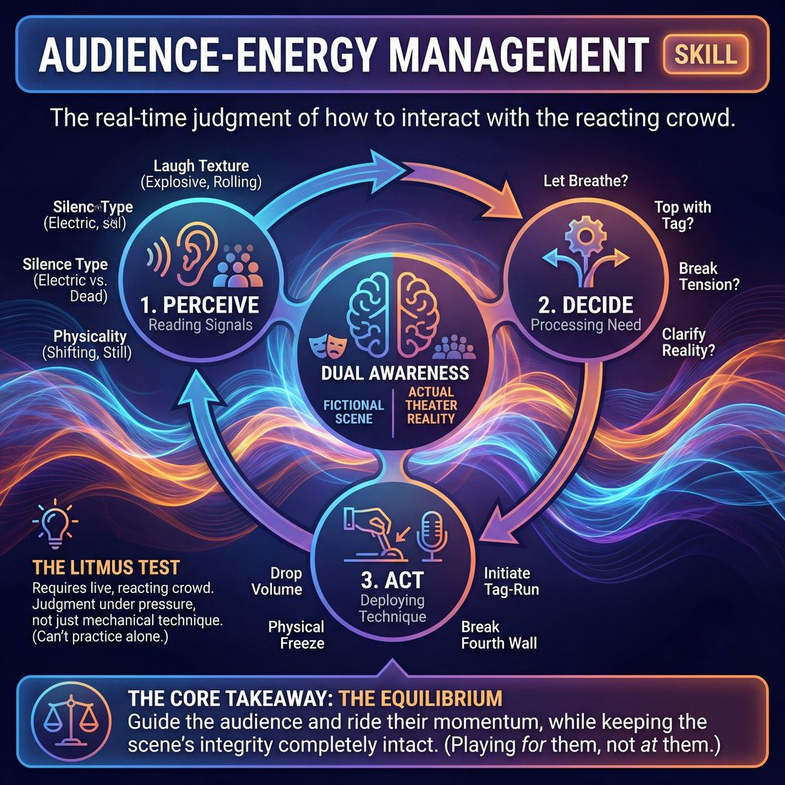

# Week 07 — The Audience Contract

> *An audience tells you where they are; it does not tell you what to do about it.*

| Course | Week | Domain | Focus | Stage | Length | Class |
|---|---|---|---|---|---|---|
| The Piece — Long-Form & Audience | 7/8 | D5 | `D5.S2` — Audience-Energy Management | Competent → Proficient | 180 min | 10–20 |

!!! note "Builds on"
    Week 6 gave them control over pace from the inside; this week adds the outside pressure of people watching and the temptation to obey them.

## 🎬 The arc of this session

They arrive knowing the form and the date, which turns curiosity into nerves and makes everyone slightly louder than they need to be. The middle of the session separates two things they have been fusing: what the room is feeling, and what they think the room is demanding. They leave having played the whole piece in front of strangers, having survived at least one flat patch without begging for it back.

!!! tip "Watch for"
    The moment the guests sit down. Watch for volume creeping up, eyelines drifting to the chairs, and scenes getting faster and jokier than anything they played all day. Name it once, early, then coach it through the work rather than repeating it.

## ⏱️ Session flow (180 minutes)

| Time | Block | Activity |
|---|---|---|
| **0:00–0:05** | 🧊 Ice-breaker | *Call Me For* |
| **0:05–0:10** | 😄 Laughter Blast | *Stadium Lungs* |
| **0:10–0:25** | 🔥 Warm-up cluster | *Tide and Rock*, *Barometer*, *Tail End* |
| **0:25–0:45** | 🧠 Theory | — |
| **0:45–1:05** | 🎲 Drill A — isolation | *Architects of the Wall* |
| **1:05–1:15** | ☕ Break | — |
| **1:15–1:35** | 🎲 Drill B — under load | *The Audience Resonance Conductor* |
| **1:35–2:10** | 🎯 Scene Lab | *The Resonance Dial* |
| **2:10–2:50** | 🏟️ Showcase round | *Borrowed Memories* |
| **2:50–3:00** | 💭 Reflection & homework | — |

## 🎒 Before you start

- Set the room as a real venue: chairs in a shallow arc for the invited audience, a clear playing space, a marked backline. Do this before anyone arrives so the space, not your speech, announces that tonight is different.
- Confirm the invited audience — aim for 6-12 people, told to arrive at the 2h05 mark, not earlier. Give one student the job of letting them in and seating them so you are not doing it mid-block.
- Review Week 6 homework aloud in one minute: their notes on pace from the inside. Ask for two examples only. Do not let it become a discussion.
- Warm-up cluster includes shoulder-to-shoulder work in Tide and Rock. Run the consent line before you start: contact is shoulder and upper back only, anyone can say 'no contact' and work with a hands-off partner, and you will pair them without comment.
- Have water, a visible clock the performers can see from the backline, and a notebook. You will take showcase notes silently — no calling out during the dress run.
- Decide now which three notes you will give after the dress run. You will be tempted to give twelve.

## 1. 🧊 Ice-breaker (5 min)

*Shoes off if you want, phones down, come into the middle. Nothing hard for five minutes.*

**Why here:** They walk in carrying the date. This puts them in the room and in their bodies before anything is at stake.

### Call Me For

> Each person names one thing they can genuinely be relied on for, and the room steps in if they need it this week.

`Players 10–20` · `~5 min` · `Complexity 1/5` · `Energy medium` · `Contact none` · `Props: none`

**How to play**

1. Circle everyone up, standing, no chairs. Say the frame: one sentence each, "Call me for ___" — something you are genuinely reliable for. Practical or trivial both count.
2. Give your own example first, out loud, and keep it small and true. Something like "Call me for jump leads" beats anything impressive.
3. Go clockwise. After each claim, anyone who actually needs that thing this week steps forward once, then back. No talking, no explaining, no thanks.
4. Run a second lap, same direction, faster: "Don't call me for ___", two or three words only. No step-ins. Cut anyone who starts a story.
5. Ask for two hands: who heard a claim they'll use this week? Ten seconds each — name the person and the thing, nothing more.
6. Close by naming out loud that the room now knows things it didn't thirty seconds ago. Move straight into the warm-up. Do not lecture.

📄 **[Full teaching notes »](week-07/advanced_w07__b1_1.md)**

**Side-coach:** *“Lower your centre — you are trying to be difficult to move, not trying to win.”*

## 2. 😄 Laughter Blast (5 min)

*Big lungs, no jokes required. On my count, and it is going to sound ridiculous.*

**Why here:** Forced volume now, in a safe frame, so they meet their loud voice before nerves hand it to them tonight.

### Stadium Lungs

> The whole room becomes a football crowd — gasps, groans and a rolling roar of laughter with nothing on the pitch.

`Players 8–20` · `~5 min` · `Complexity 1/5` · `Energy high` · `Contact none` · `Props: none`

**How to play**

1. Stand everyone in one circle. Tell them: we are sixty thousand people in a stadium watching an empty pitch. Nothing happens on the grass. All of it happens in the stands.
2. Demonstrate the near-miss 'ooooOOOH' yourself first, at full volume. Loud, ugly, fully committed. Do not apologise for it. Then put your hands up to bring them in.
3. Call four crowd sounds and lead each one twice: the near-miss 'ooooh', the flat disappointed groan, the sharp collective gasp, the slow rising 'aaaaay'.
4. Start the laughter wave. Everyone laughs out loud continuously. Point around the circle; whoever your hand passes goes loudest, then drops to a background chuckle. Two full laps.
5. Build the full terrace: everyone roars, laughs, bounces on the spot, arms overhead. Grow it for sixty seconds. Then throw both hands down and cut to total silence.
6. Hold the silence for thirty seconds. Let them feel the drop. Do not fill it with talk.
7. Keep them in the circle. Ask one question. Take one or two answers. Move straight on to the next block.

📄 **[Full teaching notes »](week-07/advanced_w07__b2_1.md)**

**Side-coach:** *“From the belly, not the throat — you need this voice at nine tonight.”*

## 3. 🔥 Warm-up cluster (15 min)

*Three quick things. Each one is about noticing something outside your own head.*

**Why here:** Three warm-ups that each rehearse one half of today's skill: sensing a partner's state, reading a group's temperature, and finishing cleanly under attention.

### Tide and Rock

> Half the room surges like a house full of people while the other half keeps its own tempo, reading the surge out loud without obeying it.

`Players 10–20` · `~5 min` · `Complexity 3/5` · `Energy high` · `Contact none` · `Props: none`

**How to play**

1. Split the room into two facing lines with a wide gap. Line A is the house — the crowd. Line B are the players. Nobody crosses the gap; nobody touches anyone.
2. Drill the house on three calls: SURGE — lean in, stamp, low roar. LIFT — arms up, big cheer. DROP — fold arms, step back, dead silence. Full-bodied.
3. Give the players one repeating full-body action each — chopping, reaching, marching on the spot — at a tempo they choose and keep.
4. Call surges at random. Players hold their own tempo and say aloud what they read: 'they've gone', 'they want more', 'they're waiting'.
5. Call 'ride once'. Each player makes one deliberate change — bigger, slower, sharper — then returns to their own tempo. A decision, not a reflex.
6. Swap the lines. Run the same sequence for the new players: actions, random surges, spoken readings, one ride.
7. Bring both lines together. Stamp in unison for five counts, then stop dead. Say the cue: their energy is information, not instruction.

📄 **[Full teaching notes »](week-07/advanced_w07__b3_1.md)**

### Barometer

> In pairs, one person silently holds a room-state while the other names it out loud and chooses a response that isn't obedience.

`Players 10–20` · `~5 min` · `Complexity 3/5` · `Energy medium` · `Contact none` · `Props: none`

**How to play**

1. Pair everyone off. Odd number, make one trio: two barometers, one reader.
2. Tell the As they are the room. They hold one house-state — warm, restless, wary, flat, buzzing — with breath, posture and face only. No mime, no words.
3. Tell the Bs to watch five seconds, then speak a two-part sentence aloud: what's true, then what they'll do about it. "You're flat — so I'm going to drop my volume."
4. Bar matching. The response must not simply copy the state. Three or four sentences per round.
5. Swap roles. B holds the state, A reads and chooses, same two-part sentence.
6. Run a third round where the barometer changes state without warning. The reader catches it and updates mid-sentence, then chooses again.
7. Stop. Ask two readers what their partner did that they did not predict. Say the cue and move on.

📄 **[Full teaching notes »](week-07/advanced_w07__b3_2.md)**

### Tail End

> The room makes a wave of noise, and one player places a flat line in its fade — not too early, not too late.

`Players 10–20` · `~5 min` · `Complexity 3/5` · `Energy low` · `Contact none` · `Props: none`

**How to play**

1. Stand the group in a horseshoe facing you. Tell them you will raise a hand to start a wave of laughter-noise and drop it to let the noise fade.
2. Practise the wave alone. Hand up: everyone builds a 'ha-ha' rumble. Hand down: let it decay over about three seconds. Nobody cuts off sharply.
3. Explain the task. One player drops a single flat, unfunny line into the fade — after the peak, before silence. Content should be dull on purpose.
4. Demonstrate once. Run a wave, land 'Anyway, the rent's due Friday' in the tail. Then show one line too early, over the peak, and one after silence.
5. Give the room three signals: flat palm for landed in the tail, thumb forward for too early, thumb back for too late. Signal after each attempt, no talking.
6. Go round the horseshoe. Each player gets one wave and one line. Signal, move on. No re-runs, no commentary.
7. Run a last pass where the speaker may say nothing and let the wave die. Room signals whether the silence was the right call.
8. Ask one debrief question. Take sentence-length answers. Stop on time.

📄 **[Full teaching notes »](week-07/advanced_w07__b3_3.md)**

**Side-coach:** *“Tide and Rock: read the pressure, do not predict it. Barometer: say the number you actually feel, not the number you think is correct. Tail End: land it and stop — no extra syllable.”*

## 4. 🧠 Theory — Audience-Energy Management (20 min)

{ .infographic }

- **The big idea:** An audience broadcasts its state continuously. That signal is data about clarity and pace. It is not a set of instructions, and it is not a verdict on you.
- **Where you are on the path:** Proficient looks like a performer who notices a flat patch, thinks 'they lost the who' or 'we are going too fast', and adjusts one variable. Competent looks like a performer who notices the same flat patch and adds a joke. The gap is roughly one second of thinking, and that second is what you are training today.
- **The one cue to coach:** *“Their energy is information — not instruction.”*

**The three beats**

1. **Say it.** Say: 'Tonight strangers will sit there and make noise, or not make noise. Every one of those sounds is information about whether we are clear and whether the pace fits. None of it is a request. If they go quiet, the most likely cause is that they cannot tell who these two people are to each other — not that we were insufficiently funny. So the response to silence is clarity, not volume.' Then give the cue: their energy is information, not instruction.
2. **Show it.** Grab one confident student. Play a 40-second scene where you deliberately go vague — no relationship, no place. Ask the class to hum quietly when they lose the thread. They will hum within fifteen seconds. Stop. Replay the same opening, but this time state who the other person is to you in the first line. Ask them to hum again. It takes much longer. Say: 'Same audience, same performers. The signal was about clarity.'
3. **Try it.** Split into pairs. One plays, one is the audience of one, seated, allowed only to breathe audibly, shift in the chair, or go still. Ninety seconds each way. The player's only job is to say out loud, once, mid-scene, what they think the signal means — 'they're lost', 'that landed', 'too slow'. No fixing yet. Just naming. Swap. Then take three names from the room, no discussion.

!!! warning "The misunderstanding that always comes up"
    placeholder

!!! abstract "📖 Go deeper"
    Read the full write-up: [Audience-Energy Management](../../../theory/05_the-audience/05_S2__audience-energy-management.md)

## 5. 🎲 Drill A — isolation (20 min)

*Half of you are building, half of you are watching and reporting. The building half has one job: be understandable from the back row.*

**Why here:** Isolates clarity. Before they can respond to audience signal, they need something legible enough for a signal to be about.

### Architects of the Wall

> Master the invisible boundary by deliberately building, softening, and breaking the fourth wall with your audience.

`Players 6–99` · `~20 min` · `Complexity 4/5` · `Energy medium` · `Contact none` · `Props: none`

**How to play**

1. Stand at the back of the room, behind the audience's sightline to the stage, where the seated group can see your hands and the two performers cannot.
2. Teach three audience signals: flat palm up means high engagement, leaning in and still. Wobbling hand means moderate — fidget, murmur. Palm down means low — look away, whisper to a neighbour.
3. Add a fourth: both hands raised means erupt in laughter and hold it.
4. Take a low-stakes location suggestion and start a two-person scene. Keep the stakes domestic. Nobody needs to be funny.
5. Change the audience signal every twenty to forty seconds. Performers must read the shift and respond in character — adjust volume, staging, physical distance, emotional intensity.
6. Tell performers that on the low signal only, they may break the wall with a direct address that stays in character, then steer back into the scene's reality.
7. On the laughter signal, performers freeze their positions and wait. They speak the next line only after the sound has crested and started to drop.
8. Rotate after every ninety seconds to two minutes so everyone plays onstage and plays audience at least once.

📄 **[Full teaching notes »](week-07/advanced_w07__b5_1.md)**

**Side-coach:** *“Watchers — tell them what you know, not what you liked.”*

## ☕ Break — 10 minutes

Water, notes, informal talk. Non-negotiable at three hours — do not let it collapse into a working discussion.

## 6. 🎲 Drill B — under load (20 min)

*Same skill, but now we are going to push at you on purpose. Your job is not to obey us.*

**Why here:** Adds the load. Now the room is deliberately generating energy at the players, and the players must sort information from instruction in real time.

### The Audience Resonance Conductor

> Direct the room's emotional current by treating the audience as your primary scene partner.

`Players 3–99` · `~20 min` · `Complexity 4/5` · `Energy medium` · `Contact none` · `Props: required`

**How to play**

1. Make four state cards: NEUTRAL, TENSE, WARM, PENSIVE. Write big. Place them face-down by the Conductor's chair at the side of the playing space.
2. Brief the audience: react honestly, do not perform reactions. No courtesy laughs, no fake gasps. Their real state is the material.
3. Send two or three players up. Take a one-word suggestion. Ask for a grounded scene with characters who want something.
4. Appoint one Conductor. They sit in the audience's sightline but in the players' periphery, holding up the card that names the room's actual state right now.
5. Once the scene has a footing, have the Conductor raise a second card: the target state. Players steer towards it using voice, pace, distance and stillness.
6. Tell players direct address is allowed to make a hard shift, but only if their character genuinely needs to say it out loud. No winking at the room.
7. Have the Conductor keep updating the current-state card as the room truly changes — posture, breath, silence, laughter. Not as the scene intends, as the room is.
8. Cut the scene after three to five minutes and two or three completed shifts. Swap the Conductor and cast, run again.

📄 **[Full teaching notes »](week-07/advanced_w07__b7_1.md)**

**Side-coach:** *“They went quiet — name the cause out loud, then fix that one thing. Do not get louder.”*

## 7. 🎯 Scene Lab (35 min)

*Scenes now, proper length. Somebody is going to be turning the room's temperature up and down while you play.*

**Why here:** Puts the whole thing into scene work at length, so they practise adjusting a dial rather than throwing a switch.

### The Resonance Dial

> Treat the audience's collective energy as your primary scene partner using a real-time visual feedback dial.

`Players 6–99` · `~35 min` · `Complexity 4/5` · `Energy medium` · `Contact none` · `Props: required`

**How to play**

1. Post five cards in a row on the floor or wall: Blue disengaged, Yellow neutral, Green engaged, Orange excited, Red confused or resistant. That row is the dial.
2. Split the room. One to three performers on stage. Three to five on the Resonance Council standing at the dial with a large paper arrow. Everyone else is the live audience.
3. Draw a challenge card. Read out three things: the starting zone, the target zone, and a simple audience-facing scenario — a pitch, a confession, a demonstration.
4. Place the arrow on the starting zone. Tell the audience to genuinely hold that energy from the first second — posture, breath, where their eyes go.
5. Start the scene. Performers look at the dial, look at the actual room, and work to close the gap between where the audience is and the target zone.
6. Tell the Council to watch the real audience only — laughter, leaning, eye contact, fidgeting — and move the arrow whenever the room shifts. They report the room, not the scene's quality.
7. Performers steer with volume, physical size, eye contact and direct address. No pleading with the audience. No commenting on how the room is doing.
8. End the round at three minutes, or earlier if the arrow holds in the target zone for a full fifteen seconds. Rotate performers, Council and audience.

📄 **[Full teaching notes »](week-07/advanced_w07__b8_1.md)**

**Side-coach:** *“Ride it — match the room's energy for one beat, then go back to the scene you were in.”*

## 8. 🏟️ Showcase round (40 min)

*Backline. Full form, straight through, no stops, no restarts. Whatever happens, you play the next honest thing.*

**Why here:** The dress run in front of strangers. Everything today only counts if it survives real eyes.

### Borrowed Memories

> The audience writes down small true things that happened to them; the cohort turns two of them into scenes and then shoots one as a short film.

`Players 10–20` · `~40 min` · `Complexity 4/5` · `Energy medium` · `Contact incidental` · `Props: required`

**How to play**

1. Give everyone a card. Ask for one small true thing that happened to them: under sixty words, no names, nothing they would mind hearing read aloud.
2. Collect the cards face down, shuffle them in a bowl, and tell the room nobody names an author, then or later.
3. Pick a Teller. They draw a card, read it aloud exactly as written, add one smell and one sound out loud, then sit. No jokes, no commentary.
4. Run a reel of three scenes. Each player steps out on an image or a feeling from the card, never on the plot. Edit by sweep or tap.
5. Pick a Director. They name one thread from the reel — a character, a place or a want — and name a genre out loud. That is the feature.
6. Teach four calls. WIDE: everyone builds the location and holds. CLOSE-UP: named player freezes the rest and speaks a private thought. CUT TO: new location, same people. FLASHBACK: play an earlier moment.
7. Shoot the feature. The Director calls from the side; players obey inside two seconds. End on CREDITS: freeze one final picture and drop the lights.
8. Take notes. Name one thing that came from the card and stayed honest, and one moment that slid into re-enactment. No general praise.

📄 **[Full teaching notes »](week-07/advanced_w07__b9_1.md)**

**Side-coach:** *“No coaching during the run — take notes silently and let the flat patches happen.”*

## 9. 💭 Reflection & homework (10 min)

**Deepen your improv**
1. Name the moment tonight when the room went quiet on you. What did you actually do in the next three seconds — and what would clarity have looked like instead of speed?
2. Where did you catch yourself playing to the chairs? What was your tell — volume, eyeline, pace, or reaching for a joke?

**Beyond the stage**
3. Think of a conversation this week where someone went quiet on you. Did you treat that silence as information about clarity, or as a verdict on you — and what changed because of which one you chose?

➡️ **[This week's homework](../homework/HW-ADVW07.md)**

??? note "🎓 Facilitator notes"

    **Timing risks**
    - Guests arriving early. If they turn up during Drill B, seat them quietly and carry on — do not stop to welcome them, or the class will switch into performance mode twenty minutes ahead of schedule.
    - The dress run overrunning. Their chosen form will likely stretch under nerves. Give a hard 30-minute cap on the piece so you keep ten minutes for three notes and the audience leaves on time.
    - Scene Lab eating the break. Protect the ten minutes — they need it before performing.

    **Failure modes this week**
    - Chasing the first laugh. One line lands, and the next ten minutes are attempts to repeat it. Coach 'return to the scene you were in'.
    - Reading silence as failure and going bigger. This is the week's central error. Expect it in the dress run even after they got it right in drills.
    - Guests being too kind. Friendly audiences laugh at everything, which teaches nothing. If that happens, say so in the notes: 'They were generous — do not read that as clarity.'
    - Over-noting afterwards. Nerves make people hungry for feedback and unable to absorb it. Three notes, specific, then stop.

    **What good looks like by the end:** At least one performer hits a dead patch mid-scene, visibly does not panic, makes one clear choice about who they are to the other person, and the scene recovers without a single joke being reached for. The rest of the cast does not rescue them by entering.

    **Carry into next week:** Bring the two or three flat patches from tonight into next week as material — not as failures, but as places where the piece was unclear. Next week is about repairing in performance rather than surviving it.
