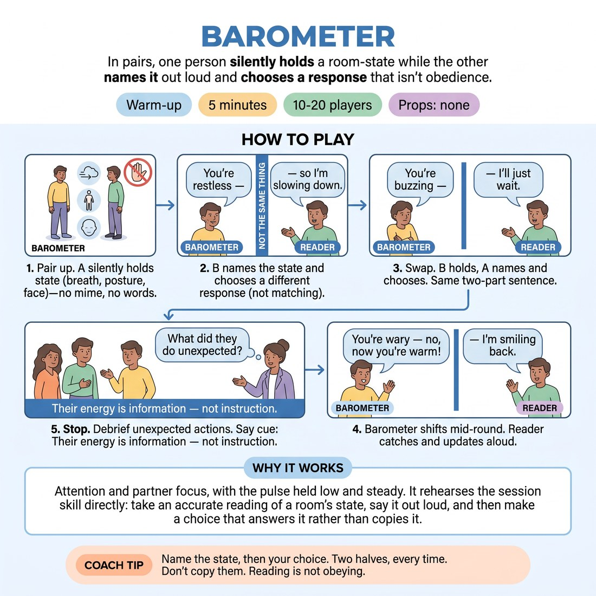

# 🔥 Warm-up cluster — Barometer

{ .infographic }

> In pairs, one person silently holds a room-state while the other names it out loud and chooses a response that isn't obedience.

`Players 10–20` · `~5 min` · `Complexity 3/5` · `Energy medium` · `Contact none` · `Props: none`

⬅️ [Back to the Week 07 run-sheet](../week-07.md)

## Why this activity, here

Week 7 opens the audience contract. Before anyone plays a set in front of a watching room, they need to feel a room-state land on them and not be pushed around by it. This warm-up isolates that in miniature — one body as the whole house. It feeds the longer audience-facing work later in the session, where a real audience will go quiet, laugh late, or shift in their seats mid-scene.

## What students actually learn

- They notice they were already reading the room, unconsciously, and can now say what they're reading out loud.
- They stop treating a flat room as a verdict on them and start treating it as one fact among several.
- They discover a response can be a choice rather than a reflex — slowing down when the room is restless, rather than speeding up to chase it.

## Setup

No props. Clear floor space so pairs can stand facing each other with room to move. Write the five state words somewhere visible: warm, restless, wary, flat, buzzing. Have the cue ready to say at the end. Works standing; seated pairs are fine if anyone needs to sit.

## How to run it — 5 minutes

| Min | What you do |
|---:|---|
| 1 | Pair them off. Name the two roles. Point at the five state words. Demonstrate the sentence once yourself: "You're wary — so I'm going to be very specific." Say the no-matching rule. Go. |
| 1 | Round one. As hold, Bs read and choose, three or four sentences. Walk the room. Cut anyone doing mime back to breath, posture, face. |
| 1 | Swap. Bs hold, As read. Same two-part sentence. Push for a different choice each time rather than the same response repeated. |
| 1 | Round three. Barometers shift state mid-round, unannounced. Readers catch the change and update aloud mid-sentence, then choose again. |
| 1 | Stop the room. Ask two readers what their partner did that they didn't expect. Take short answers only. Say the cue. Move straight on. |

## Side-coaching script

| When | Say |
|---|---|
| First thirty seconds of round one, when barometers start gesturing | *"Breath and posture only. Nothing acted."* |
| When readers hesitate before speaking | *"Say what's true first. The choice comes second."* |
| When a reader matches the state — going flat at a flat partner | *"Don't obey it. Choose against it."* |
| Mid round two, when sentences get long | *"Two parts. Eight words. Next one."* |
| Start of round three | *"Barometers — change it now. No warning."* |
| When a reader misses the shift | *"It moved. Catch it mid-sentence."* |
| Last fifteen seconds | *"One more each, then stop."* |

!!! success "What good looks like"
    Short, quick, slightly overlapping sentences all over the room. Barometers doing almost nothing visible — a held breath, a dropped shoulder — and readers still getting it. Readers naming states confidently and picking responses that surprise their partner. In round three you can hear the catch: a sentence turning halfway through. The room is talking, not performing.

## When it goes wrong

| You see | What's causing it | The fix |
|---|---|---|
| Barometers acting out little scenes — checking a watch for restless, shivering for wary. | They've heard "hold a state" as "play a character". | Stop them. Say "breath, posture, face". Have them close their eyes for five seconds, find the state internally, then open them and hold it still. |
| Readers say the state and then simply mirror it — "you're buzzing, so I'm buzzing too". | Matching is the default social instinct and it feels cooperative. | Call "choose against it" from the side. If it persists, tell that pair the response must be the opposite temperature for the next two sentences. |
| Long pauses; readers staring, unsure they've read it right. | They're trying to be correct rather than responsive. | Say "there's no right answer — name what you get and move". Speed fixes accuracy anxiety faster than reassurance does. |
| Round three collapses; nobody notices the shift. | Readers are talking, not watching, by the third round. | Call "eyes up" and have barometers make the first shift large. Shrink it after that. |

## Scaling

| Class size | What changes |
|---|---|
| **10–13** | Straight pairs, all five rounds as written. One trio if odd — two barometers holding different states, reader names both and picks one. You can hear individual pairs, so side-coach by name. |
| **14–17** | Straight pairs. The room gets loud; raise your calls and use a hand clap to mark round changes rather than talking over it. Keep all three rounds; don't extend the debrief. |
| **18–20** | Straight pairs, but split the floor into two halves and stand between them so you can sweep both. Cut round one to three sentences to protect time. Take one debrief answer instead of two. |

## Variations

**Named states** — Give barometers a slip with their state written on it rather than letting them choose. Readers still name what they see.  
*Easier — removes the barometer's decision and makes the signal cleaner to read.*

**Silent choice** — Reader names the state aloud, then enacts the chosen response physically without saying what it is. Barometer guesses the choice afterwards.  
*Harder — the response has to be legible in the body, not explained in words.*

**Three-body house** — Groups of four: three barometers holding different states, one reader who must name the dominant one and choose.  
*Different emphasis — shifts the work from reading a signal to weighing conflicting signals, which is closer to a real audience.*

## Debrief

1. **What did your partner do that you didn't predict?**
   > *A good answer sounds like:* Something concrete about the choice, not the state — "I went wary and she got slower and kinder, I expected her to get careful". If they only describe the state, ask what the response was.

2. **Which was harder — reading it, or not obeying it?**
   > *A good answer sounds like:* Most say not obeying. A good answer names the pull: "I could feel myself wanting to match the buzz." That's the whole point; take it and move on.

!!! warning "Safety & inclusion"
    No contact. Pairs stand at conversational distance; anyone who wants more space takes it. Seated participation works throughout — the state lives in breath and face. Nobody has to be funny or clever; the sentence is fixed and short by design. If someone finds sustained eye contact difficult, they can read their partner's shoulders and hands instead. Let anyone opt to be barometer both rounds if speaking aloud is the harder ask today.

## Why it works

D5.S2 rests on separating perception from compliance. An audience gives you data continuously, and untrained performers convert that data straight into behaviour — the room goes quiet, so they push; the room laughs, so they repeat. The two-part sentence physically splits those two moves apart. Naming the state out loud makes perception explicit and completed before any response is available. Then the no-matching rule forces the second half to be a decision rather than a reflex. Round three adds the thing that actually happens in performance: the state changes while you're mid-sentence, and you have to revise without stopping. Practised at pair-scale, in five minutes, the gap between reading and reacting becomes something they can feel and hold open later, in front of an actual house.

[Open the full activity card »](../../library/warmups/WU__barometer.md){target=_blank rel=noopener}
