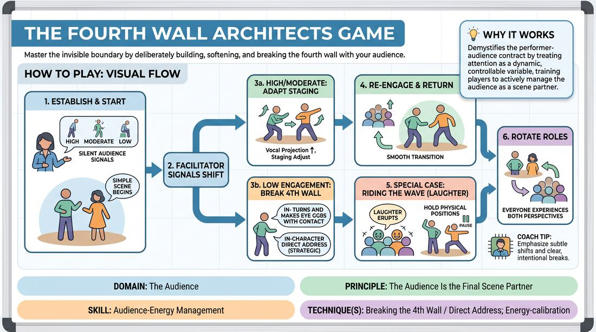

# 🎲 Drill A — isolation — Architects of the Wall

{ .infographic }

> Master the invisible boundary by deliberately building, softening, and breaking the fourth wall with your audience.

`Players 6–99` · `~20 min` · `Complexity 4/5` · `Energy medium` · `Contact none` · `Props: none`

⬅️ [Back to the Week 07 run-sheet](../week-07.md)

## Why this activity, here

Week 7 opens the audience contract. This is the isolation drill: it strips audience-reading out of a full piece and makes it a single repeatable skill with a visible dial. It comes after the group has built long-form scenes that assumed a neutral, silent room. It feeds the later blocks this session, where the same reading happens inside a running piece with a real audience whose energy nobody controls.

## What students actually learn

- They stop treating a quiet room as a verdict on their work and start treating it as a signal to change something concrete.
- They discover they already have three levers — volume, distance, intensity — and can pull them without stopping the scene.
- They learn to wait out a laugh instead of talking over it, which most improvisers only learn by losing lines.
- They feel how a direct address costs something, so they stop spending it casually.

## Setup

Playing space at one end, chairs in a loose arc facing it. You stand at the back behind the chairs, in the audience's eyeline and out of the performers' peripheral vision. No props. Have the four signals written on a flipchart or whiteboard where the seated group can glance at them for the first few rounds. Two chairs onstage if you want them. Nothing else.

## How to run it — 20 minutes

| Min | What you do |
|---:|---|
| 3 | Show the four signals. Drill the audience on them cold, without performers — call each one twice, watch them commit. Tell them low engagement is a job, not an opinion. Name the consent point. |
| 4 | Round one. Two pairs, two minutes each. Suggestion is a location only. Shift the signal every thirty seconds. No fourth-wall breaks allowed yet — performers adapt inside the scene only. |
| 4 | Round two. Two new pairs, two minutes each. Same shifts, but now the low signal permits one in-character direct address. They must land back in the scene within two lines. |
| 4 | Laughter wave. Two pairs, two minutes each. Add the both-hands signal at unpredictable moments. Performers freeze and hold until the sound drops. Call 'hold' if they rush it. |
| 3 | Fast rotation. Ninety seconds a pair, all four signals live, no warning. Prioritise anyone who has not been onstage yet. Keep it moving; do not stop to give notes. |
| 2 | Stop. Ask the room for one thing they saw a performer do that pulled the audience back. Take three answers. Hold the rest for the debrief. |

## Side-coaching script

| When | Say |
|---|---|
| First signal shift of any round | *"Read it. Don't fix it yet."* |
| Performer speeds up or gets louder as their only response | *"Try smaller. Try closer."* |
| Low signal, performers pushing harder in-scene | *"You may open the wall. One line."* |
| After a direct address | *"Close it. Back in the room."* |
| Laughter signal, performer keeps talking | *"Hold the beat."* |
| Laughter starting to drop | *"Now."* |
| Performers visibly rattled by the low signal | *"It's a dial, not a review."* |
| Last thirty seconds of a rotation | *"Finish the thought. Swap."* |

!!! success "What good looks like"
    Performers change something within about five seconds of a signal shift, and the change is specific — they move closer to each other, drop to a near-whisper, raise the stakes of the object they're holding. Direct address is used once or twice across the whole drill, not every round, and it sounds like the character talking rather than the improviser apologising. On the laughter signal you see genuine stillness — two people frozen mid-gesture, eyes still in the scene, waiting. The seated group plays disengagement with commitment and drops it instantly when the signal changes. Nobody is trying to be funny.

## When it goes wrong

| You see | What's causing it | The fix |
|---|---|---|
| Performers get louder and faster on every signal, whatever it is. | Volume is the only lever they know. They read all audience feedback as 'do more'. | Ban raising volume for one round. Force them to use proximity and stillness instead. Most find the quiet response works better and it surprises them. |
| Direct address every thirty seconds; the scene never re-forms. | Breaking the wall feels safer than staying in the fiction, so they keep escaping to it. | Cap it at one break per two-minute turn and count out loud. Add the rule that they must return to the last line spoken before the break. |
| The seated group half-plays the low signal — polite, embarrassed, not really disengaged. | They don't want to hurt the performers, or they weren't drilled hard enough at the start. | Stop and re-drill the signals for thirty seconds with no scene running. Tell them under-playing it makes the drill useless for the person onstage. |
| A performer visibly deflates after a low-engagement stretch and stays flat afterwards. | They've taken the fake signal as real judgement, which happens more often than people admit. | Rotate them out early, put them in the audience for a round, and name it in the debrief. Say the cue aloud: their energy is information. |

## Scaling

| Class size | What changes |
|---|---|
| **10–13** | One stage, one audience. Six pairs across the drill — everyone gets onstage once with two or three people doubling. Keep turns at two minutes. Rotation is quick because the room is small. |
| **14–17** | One stage, one audience. Cut turns to ninety seconds from round two onward so eight or nine pairs cycle through. Accept that two or three people will only play audience; tell them at the start and give them first slot next time. |
| **18–20** | Split into two rooms or two ends of the space, each with its own signaller — you take one, a confident participant takes the other with the signal card in hand. Nine to ten people per group, ninety-second turns. Reconvene for the last two minutes. |

## Variations

**Signal Called Aloud** — Instead of silent hand signals, say the level out loud — 'moderate', 'low'. Performers hear it coming and have a second to plan.  
*Easier. Removes the reading task and isolates the responding task. Use if the room freezes in round one.*

**Two Audiences** — Split the seated group down the middle. Signal each half separately, so one side leans in while the other looks away.  
*Harder. The room stops giving a single clean reading and performers have to choose who they're playing to.*

**Silent Adjustment Only** — Remove the direct-address permission entirely for the whole drill. Also ban dialogue changes — performers may only alter physicality, distance and tempo.  
*Different emphasis. Shifts the work from verbal rescue to physical staging, which is where most of the real adjustment lives anyway.*

## Debrief

1. **What did you actually change when the room went cold?**
   > *A good answer sounds like:* Something physical and specific — 'I stopped moving', 'I got closer to her', 'I dropped my voice so they had to lean in'. If the answer is 'I tried harder', push for the concrete action underneath it.

2. **How did the low signal feel, knowing it was fake?**
   > *A good answer sounds like:* Honest admission that it still stung, followed by noticing that the sting is separate from the useful information. Someone saying 'I knew it wasn't real and I still panicked' is the answer you want in the room.

3. **What happened when you waited out the laugh?**
   > *A good answer sounds like:* They describe the line landing better, or the pause itself getting a response. Someone should mention how long two seconds feels onstage. Move on once the room agrees waiting is a choice, not a stall.

4. **When is breaking the wall worth it?**
   > *A good answer sounds like:* A cost-benefit answer, not a rule. Something like 'when the scene has genuinely lost them and there's nothing left to lose' rather than 'whenever it gets quiet'.

!!! warning "Safety & inclusion"
    No physical contact in this drill. The real exposure is emotional: you are asking a group to deliberately withdraw attention from someone standing in front of them, which lands harder than people expect. Say so before you start. Tell the seated group that low engagement is an assignment they've been given, and tell performers the same thing in the same breath, so both sides hear it. Anyone may decline an onstage turn without a reason — say 'pass' and you move to the next name. If someone looks genuinely knocked by a cold stretch, rotate them out and put them in the audience for a round rather than pushing through. Direct address must stay in character; it is not an invitation to comment on classmates.

## Why it works

The session cue is that audience energy is information, not instruction. In a real show the two are impossible to separate, because the energy is genuine and the performer's read of it is tangled up with self-judgement. This drill separates them artificially: the energy is manufactured on a signal, so everyone in the room knows it carries no verdict, and what's left is the pure reading-and-responding loop. Repeating that loop six or eight times in twenty minutes builds the response as a reflex rather than a decision. The laughter hold works on the same principle — by making the laugh arrive on cue rather than on merit, it removes the ego reward and leaves only the timing problem. Performers stop hearing a laugh as a score and start hearing it as a wave with a shape and a length.

[Open the full activity card »](../../../../games/D5_P1_S2_T3_G004__the-fourth-wall-architects-game.md){target=_blank rel=noopener}
