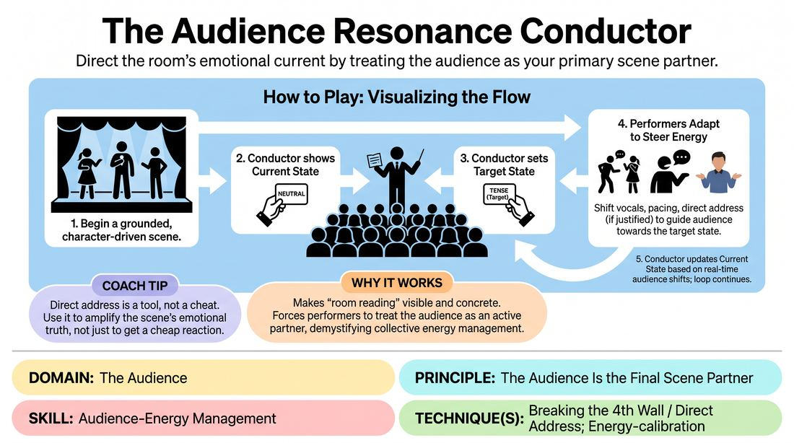

# 🎲 Drill B — under load — The Audience Resonance Conductor

{ .infographic }

> Direct the room's emotional current by treating the audience as your primary scene partner.

`Players 3–99` · `~20 min` · `Complexity 4/5` · `Energy medium` · `Contact none` · `Props: required`

⬅️ [Back to the Week 07 run-sheet](../week-07.md)

## Why this activity, here

Week 7 has already named the contract: the audience is a partner, not a judge. The first drill let them notice the room. This one puts noticing under load — play a scene and read the room at once. It feeds the Week 7 set piece, where nobody holds a card and the reading has to be internal.

## What students actually learn

- They stop treating a quiet room as failure and start treating it as a reading.
- They discover they can change a room's temperature with pace and proximity, without changing the story.
- They learn the difference between serving the audience and obeying it.
- They find out how much of their own performance is running on autopilot until something interrupts it.

## Setup

Chairs in a shallow arc facing an open playing area. Four A4 cards, marker-written: NEUTRAL, TENSE, WARM, PENSIVE. One chair to the side, angled so the Conductor can be seen by players without turning the audience's heads. Nothing else.

## How to run it — 20 minutes

| Min | What you do |
|---:|---|
| 3 | Show the four cards. Brief the audience on honest reaction — no helping. Demonstrate the Conductor's position and how a card enters the players' periphery. No practice scene. |
| 4 | Round one. Take a suggestion, three players up, one Conductor. Current-state card from the start. Introduce one target shift only. Cut at four minutes. |
| 2 | Fast note. Ask the audience only: did the room actually move, or did the players just announce the mood? Twenty seconds per answer. No discussion. |
| 4 | Round two. Fresh cast and Conductor. Two shifts this round. Allow direct address if justified. Cut cleanly on your call. |
| 4 | Round three. Fresh cast and Conductor. Conductor updates the current card freely and can chase a shift the players are already causing. Two or three shifts. |
| 3 | Debrief seated. Two questions. Land the cue: their energy is information, not instruction. |

## Side-coaching script

| When | Say |
|---|---|
| Players glance repeatedly at the card | *"Peripheral. Play the scene."* |
| A player announces the mood instead of building it | *"Change your pace, not your words."* |
| The shift is stalling | *"Move closer. Or move away."* |
| Direct address arrives as a joke to the room | *"Only if the character needs to say it."* |
| Conductor is holding the target too early | *"Read the room first. Card second."* |
| The room goes quiet and players start pushing | *"Quiet is a state. Use it."* |
| Twenty seconds before the cut | *"Land it where you are."* |

!!! success "What good looks like"
    Players keep the scene coherent while the temperature changes underneath it. You see pace drop and voices soften before anyone says a sad word. The Conductor's current-state card moves because the room moved, not because the scene said it should. Silences hold. Nobody breaks to check whether it worked.

## When it goes wrong

| You see | What's causing it | The fix |
|---|---|---|
| Players state the new mood out loud — "Well, this just got tense." | They are treating the card as a line prompt rather than a target for how they play. | Ban mood words for the next round. Only pace, volume, proximity and stillness are available. |
| The Conductor's card never changes. | They are watching the scene, not the room, or they are afraid to make a call. | Turn the Conductor's chair thirty degrees towards the audience. Tell them to change the card at least twice, even on a small reading. |
| Direct address every thirty seconds, all of it a knowing aside. | Breaking the wall is easier than doing the work inside the scene. | Cap it at one direct address per player per scene. Ask afterwards whether the character needed it. |
| Audience laughing generously at everything, so no state is readable. | They are being kind, which flattens the signal the drill runs on. | Re-brief in one sentence: the honest reaction is the gift. Restart the round. |

## Scaling

| Class size | What changes |
|---|---|
| **10–13** | One playing area, three rounds of four minutes, casts of two. Everyone Conducts or plays at least once; the remainder are the audience and that is a working role, not waiting. |
| **14–17** | One playing area, three rounds, casts of three. Not everyone gets on stage — say so at the top. Rotate so anyone who did not play becomes Conductor. |
| **18–20** | Split into two groups in opposite corners, each with its own cards and Conductor, running simultaneously. Three rounds of three minutes each, then reconvene. Audiences are eight to ten per group, which is enough signal. Debrief together. |

## Variations

**Two cards, no Conductor** — Give the players the current and target states before they start. No live updating.  
*easier — removes the real-time reading and leaves only the steering*

**Blind Conductor** — The Conductor sits behind the audience and may only use sound cues — one clap for hold, two for shift — with the target never named.  
*harder — players must infer the target from where the room already is*

**Conductor names the tell** — After each round, the Conductor states the physical evidence for every card change: breath, lean, a specific silence.  
*different emphasis — trains observation of the room rather than control of it*

## Debrief

1. **When the room actually moved, what did the players change?**
   > *A good answer sounds like:* Something concrete and small: they slowed down, they stopped moving, one of them sat. Not "they got more emotional." If answers stay abstract, ask the audience instead.

2. **Was there a moment the room told you something you did not want to hear?**
   > *A good answer sounds like:* Someone admits they felt the room go flat and pushed harder — and can name what pushing looked like. The useful version ends with what they would do instead, which is usually less.

3. **Where is the line between reading the room and obeying it?**
   > *A good answer sounds like:* They can point to a moment where the honest scene choice went against the room's mood and was still right. If everyone says "always give them what they want", press once more.

!!! warning "Safety & inclusion"
    No contact in this drill; if a scene drifts towards touch, the usual class consent applies — ask in character or don't. Direct address to the audience means individuals can be looked at; tell players to address the room, not a person, and tell anyone who would rather not be looked at to sit at the arc's edge. Conducting is a full role for anyone not wanting to perform. Emotional states here are craft targets, not personal disclosure — cut any scene mining a real grief in the room.

## Why it works

Audience-energy management fails when performers treat reaction as a verdict on them. The card separates the two: the Conductor names the room's state as a neutral fact, external to any player's worth, so it becomes data to work with. Adding a target state converts vague sensitivity into an actionable task with a testable outcome — you either moved the room or you did not. Running it under scene load is the point. Reading the room is easy when that is all you are doing; the skill only exists if it survives while you are also listening to a partner and holding a character.

[Open the full activity card »](../../../../games/D5_P1_S2_T3_G033__the-audience-resonance-conductor.md){target=_blank rel=noopener}
