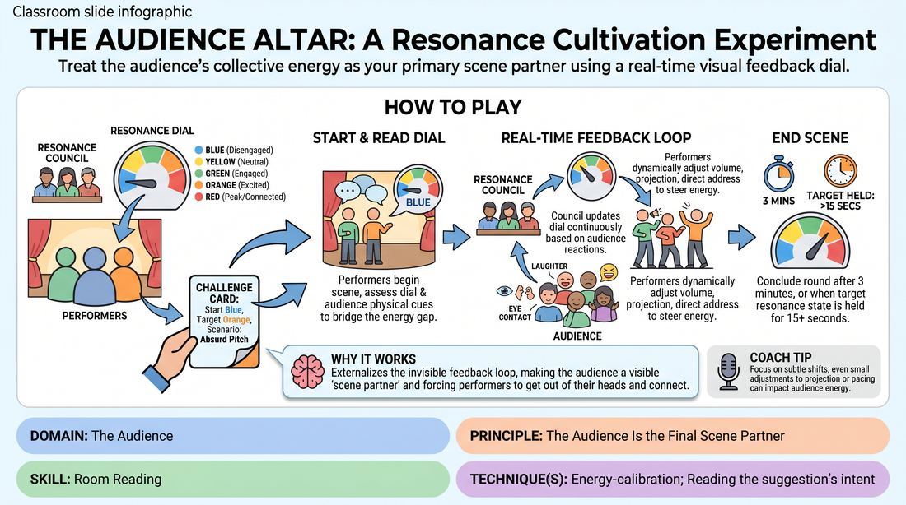

# 🎯 Scene Lab — The Resonance Dial

{ .infographic }

> Treat the audience's collective energy as your primary scene partner using a real-time visual feedback dial.

`Players 6–99` · `~35 min` · `Complexity 4/5` · `Energy medium` · `Contact none` · `Props: required`

⬅️ [Back to the Week 07 run-sheet](../week-07.md)

## Why this activity, here

Week 7 has already established that the audience is a party to the show, not a jury. Earlier blocks taught them to notice the room. This block makes noticing measurable and puts a hand on the wheel. It feeds directly into the run-out and into any long-form set where a scene lands flat and the instinct is to panic. Later in the session they'll play without the dial and be asked to name the room's state out loud from memory.

## What students actually learn

- They stop reading a quiet room as a verdict on them and start reading it as a state they can act on.
- They discover which of their own levers actually move a room — usually specificity and eye contact, rarely volume.
- They learn that energy lags. What they do now shows up in the room ten seconds later, so they stop over-correcting.
- They can name the room's temperature out loud without it destabilising the scene.

## Setup

Five A4 cards, one per zone, in a row on the floor or taped low on a wall where performers can see them: Blue (disengaged), Yellow (neutral), Green (engaged), Orange (excited), Red (confused or resistant). Note that Red sits next to Orange deliberately — high energy pointed the wrong way. One large paper or card arrow the Council can move by hand. Twelve to fifteen challenge cards written before the session: each gives a starting zone, a target zone and a one-line scenario. Keep scenarios light and inventable — pitch a product nobody needs, explain a rule of a sport you made up, describe the worst holiday. Chairs for the audience in a loose arc facing the stage, with a clear sightline from the stage to the dial. Nothing else.

## How to run it — 35 minutes

| Min | What you do |
|---:|---|
| 4 | Walk the five zones aloud, standing in each one and showing the body that goes with it. Split the room into performers, Council and audience. Read the cue: their energy is information, not instruction. |
| 3 | Calibration only, no scene. Call a zone. The whole audience embodies it for fifteen seconds. Call another. Council practises moving the arrow to match what they actually see, not what you called. |
| 6 | Round one. Draw a card, set the arrow, run the scene to three minutes or a held target. Take thirty seconds of notes from the Council, then rotate all three roles. |
| 6 | Round two. Same shape. Side-coach hard on specificity over volume. After the scene, ask the performers what they thought the room was doing, then ask the Council what it was doing. |
| 6 | Round three. Same shape. This time tell the Council to move the arrow only when they see two or more audience members shift. Rotate everyone who has not yet performed onto the stage. |
| 5 | Round four, short. Two-and-a-half-minute scene, immediate rotation. Give the performers a card with a Red starting zone so they must handle confusion rather than boredom. |
| 5 | Sit the room down where they are. Run the debrief questions. Close by naming what you saw move rooms today and what you saw fail. |

## Side-coaching script

| When | Say |
|---|---|
| First ten seconds of any scene | *"Look at the dial. Now look at the actual people."* |
| Performer gets louder and nothing changes | *"Louder isn't clearer. Get more specific."* |
| Performer starts apologising to or teasing the room | *"Don't beg. Invite."* |
| Council is moving the arrow to be kind | *"Council — report the room, not the scene."* |
| Audience is mugging boredom rather than feeling it | *"Audience, honest — not polite, not performing."* |
| Arrow enters the target zone | *"You're there. Hold it. Don't celebrate."* |
| Arrow drops back out immediately | *"Same tactic, more of it. Give it ten seconds."* |
| Last thirty seconds of a round | *"Finish the thought. Land it on someone's face."* |

!!! success "What good looks like"
    Performers glance at the dial once every twenty seconds or so, not constantly. Their adjustments are visible from the back — they slow down, they pick one audience member, they get concrete. The arrow moves in steps rather than jumping, and the Council can point at the person whose posture triggered each move. The audience forgets it is performing a zone and starts genuinely occupying it. At least twice in the block a room goes from Blue to Green and the performers can afterwards say roughly what did it.

## When it goes wrong

| You see | What's causing it | The fix |
|---|---|---|
| The arrow sits in Green all block and never moves. | The Council is grading the performers' effort instead of watching the audience, or is reluctant to look unkind. | Stop the round. Tell the Council to name three specific bodies out loud — 'phone, leaning back, arms crossed' — before touching the arrow. Swap in a new Council if it persists. |
| Performers shouting and gesturing bigger, dial unmoved. | They have one lever and it's volume. Very common in the first two rounds. | Side-coach 'quieter and more specific'. If needed, ban volume changes for one round entirely and see what else they find. |
| Audience over-acting Blue — sighing, theatrical yawning, laughing at their own bit. | They've turned the audience role into a scene of its own, which makes the read useless. | Reset with ten seconds of genuine Blue: eyes down, breathing normally, thinking about something else. Tell them Blue is boring to play. That's the point. |
| Performers start commenting on the dial mid-scene. | The mechanism has become the game, which kills the scenario. | Rule it out loud: the dial is peripheral vision only, never dialogue. Move the cards slightly further to the side. |

## Scaling

| Class size | What changes |
|---|---|
| **10–13** | One dial. Council of three, two performers per round, everyone else audience. Four rounds gets nearly everyone on stage once — check names off. Keep the full three-minute scenes; a small audience shifts slower, so give the arrow time. |
| **14–17** | One dial. Council of four, three performers per round, four rounds. Twelve stage slots, so a handful will only play Council and audience — tell them at the start and give those people first refusal on the next block's stage time. |
| **18–20** | One dial, Council of five, three performers. Cut the calibration to two minutes and each scene to two and a half with a hard thirty-second rotation, giving you five rounds inside the same window. Rotate two Council seats every round so the reading job spreads. |

## Variations

**Two-zone dial** — Use only Blue and Green. Council moves the arrow between two cards. Target is always Green.  
*Easier — removes the discrimination problem and lets beginners focus purely on cause and effect.*

**Moving target** — Halfway through each scene, silently hand the Council a new target card. They announce it by tapping the zone.  
*Harder — performers must abandon a working tactic and find another under time pressure.*

**Blind dial** — Turn the dial away so performers can't see it. They must read the room directly, then guess the arrow's position at the end.  
*Different emphasis — trains direct perception rather than instrument reading, and exposes who is guessing.*

## Debrief

1. **What actually moved the room today?**
   > *A good answer sounds like:* Concrete tactics, not qualities. 'When I stopped and looked at one person for three seconds.' 'When I named a real detail instead of a general one.' Push back gently on 'I committed more'.

2. **Performers — how close was your read of the room to the Council's?**
   > *A good answer sounds like:* An honest gap. 'I thought they hated it and the arrow was in Green the whole time.' The useful admission is that panic distorts the read downward.

3. **Where's the line between steering a room and pandering to it?**
   > *A good answer sounds like:* Something about direction of pull. Steering changes how you deliver the thing you're doing. Pandering changes what you're doing to whatever gets the noise. They should be able to point at a moment where someone crossed it.

!!! warning "Safety & inclusion"
    No physical contact in this activity. Flag one thing before you start: being deliberately ignored by a room is unpleasant, and the audience is acting. Say it plainly. Red is confusion or resistance, never hostility — no heckling, no personal comments, no comments on anyone's body or accent. Anyone can step off stage mid-scene by simply walking to the side; the round continues without comment. Scenarios stay invented — if a card mentions a memory, tell them to make one up rather than disclose a real one. Council members who don't want to speak can move the arrow silently. Anyone who prefers not to perform can hold a Council seat for the whole block, and that is a real job, not a sideline.

## Why it works

The cue says the audience's energy is information, not instruction. The problem is that performers can't hold that distinction under stress — a quiet room reads as a verdict and they either escalate or shrink. The dial externalises the reading. Someone else does the measuring, out loud and in public, which strips the performer's private catastrophising out of the loop and leaves only the data. Because the arrow moves in visible steps and lags behind the performer's action, they experience directly that energy has latency: the thing they did ten seconds ago is arriving now. That single observation is what stops over-correction. Rotating the Council role means every student spends time as the instrument, which is where they learn how coarse the real signals are — a handful of shifted postures, not a referendum.

[Open the full activity card »](../../../../games/D5_P1_S1_T1_G044__the-audience-altar-a-resonance-cultivation-experiment.md){target=_blank rel=noopener}
