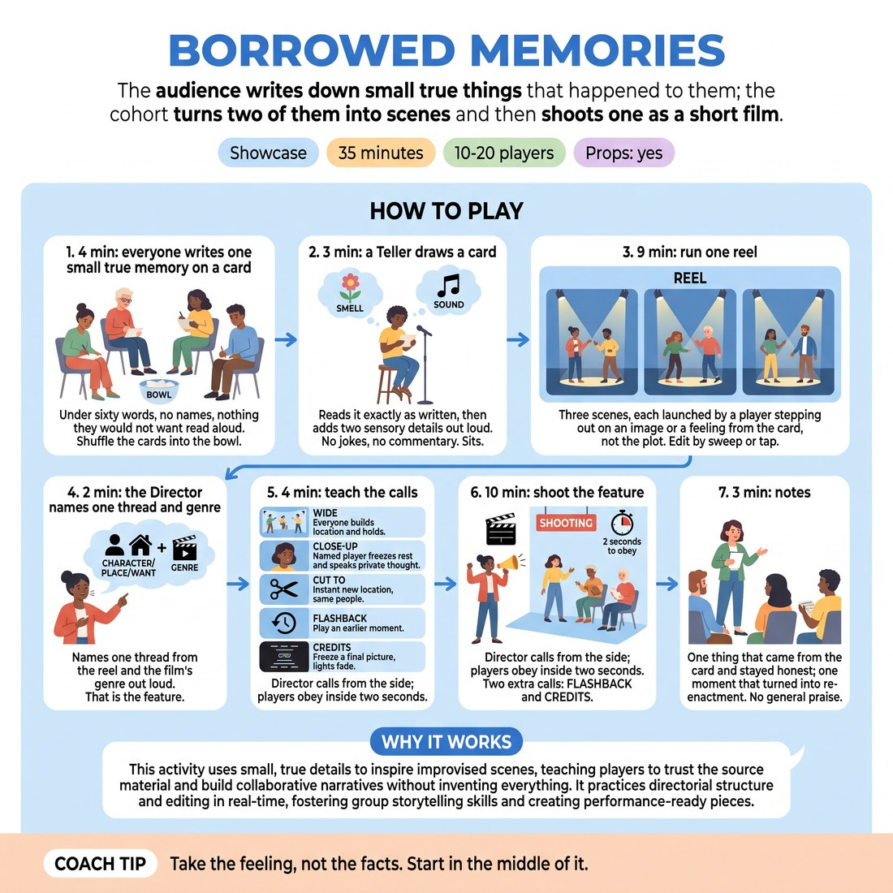

# 🏟️ Showcase round — Borrowed Memories

{ .infographic }

> The audience writes down small true things that happened to them; the cohort turns two of them into scenes and then shoots one as a short film.

`Players 10–20` · `~40 min` · `Complexity 4/5` · `Energy medium` · `Contact incidental` · `Props: required`

⬅️ [Back to the Week 07 run-sheet](../week-07.md)

## Why this activity, here

Week 7 has already separated the audience's noise from the audience's meaning. This is the showcase round where that separation gets tested with real stakes: the material belongs to somebody in the room. Laughter now carries obligation, and the players have to hear it as information rather than an order. It feeds the final weeks, where the cohort runs a full piece in front of guests and has to hold a shape while the room reacts.

## What students actually learn

- They stop treating a quiet room as a failing room. Silence around a true detail reads as attention, not as a note to escalate.
- They learn to hold borrowed material with care and still play it — respect and boldness stop feeling like opposites.
- They can take a director's call inside two seconds without arguing with it in their body.
- They notice the difference between playing an image and reciting a plot, in themselves, live.

## Setup

Chairs in a wide arc facing an open playing space, backstage line along one side. One bowl or hat, index cards and pens for everyone plus a few spares. A clear side position for the Director where the whole company can hear them. If you have lights, set a fade you can hit on the CREDITS call; if not, agree a spoken 'lights' and everyone holds three seconds. Nothing else on the floor.

## How to run it — 40 minutes

| Min | What you do |
|---:|---|
| 5 | Frame it. The material comes from the room, so nothing is a punchline at the writer's expense. Say the cue: their energy is information, not instruction. Hand out cards and pens. |
| 4 | Everyone writes one small true memory, under sixty words, no names, nothing they would not want read aloud. Fold and drop into the bowl. Shuffle it in front of them. |
| 3 | Teller draws, stands, reads the card exactly as written. Then adds one smell and one sound out loud. No jokes, no framing, no apology. Sits back down. |
| 9 | Run the reel: three scenes, roughly three minutes each. Players step out on an image or a feeling from the card, not the events. You edit by sweep or tap. |
| 2 | Director steps forward, names one thread from the reel — character, place or want — and names the genre out loud. Say it back so the whole company has heard it. |
| 4 | Teach the calls. Demonstrate WIDE, CLOSE-UP, CUT TO with four volunteers, thirty seconds each. Then drill: call all three at random, company responds inside two seconds. |
| 10 | Shoot the feature. Director calls from the side and may add FLASHBACK. At around nine minutes signal the Director; they call CREDITS and the company freezes a final picture. |
| 3 | Notes, standing. One thing that came from the card and stayed honest. One moment that turned into re-enactment. Nobody names or thanks the author. Close the block. |

## Side-coaching script

| When | Say |
|---|---|
| While cards are being written and someone is chewing the pen | *"Small and true beats big and true. A Tuesday will do."* |
| As the Teller finishes reading | *"Let it sit. Don't rescue it."* |
| First scene of the reel, if players are retelling the card's events | *"Play the image, not the plot."* |
| When a laugh arrives and a player starts chasing it | *"Take the laugh. Don't take orders from it."* |
| During the drill on the camera calls | *"Two seconds. Move first, understand after."* |
| Mid-feature, when WIDE goes silent and static | *"Wide is a place. Do something in it."* |
| When a CLOSE-UP turns into a speech | *"One thought. The private one."* |
| Approaching the CREDITS call | *"Find the picture you want them to leave with."* |

!!! success "What good looks like"
    The card gets read and nobody laughs to relieve the pressure. The first scene starts from a smell or a doorway rather than from the story. Nobody says the card's own sentences back. Calls land and bodies move before anyone has decided what the call means. The room goes quiet in places and the players keep going at the same pitch. The CREDITS freeze arrives on purpose rather than because time ran out. In notes, somebody names a specific moment they nearly turned into a re-enactment and stopped.

## When it goes wrong

| You see | What's causing it | The fix |
|---|---|---|
| Players narrating the memory back, adding dialogue to the exact events the Teller described. | They think the card is a script and fidelity is the job. | Stop the reel, take one noun from the card, and restart the scene in a different year with that noun in it. Call 'play the image, not the plot' for the rest. |
| The room laughs hard at the card's most vulnerable line, then the scene starts mocking it. | Nervous laughter got read as an instruction to go broader. | Sweep the scene. Say the cue aloud. Restart with the same players, same location, and one rule: play it straight for sixty seconds. |
| WIDE produces a frozen tableau with nobody speaking, and the energy drops off a cliff. | Players heard WIDE as 'hold still' rather than 'build the place'. | Call 'wide is a place, do something in it' while it runs. In the drill, always follow WIDE with a named CLOSE-UP so someone has to speak. |
| The Director hesitates, calls nothing for ninety seconds, and the feature turns into one long scene. | They are waiting for a moment that deserves a call. | Stand next to them. Whisper a call every twenty seconds until they take over. Tell them a bad call cut cleanly is better than a good scene left to sag. |

## Scaling

| Class size | What changes |
|---|---|
| **10–13** | One bowl, one card, one Teller, one Director. Everyone else is the company. Reel scenes carry two to three players; the rest hold the backstage line and can join a WIDE. Keep the timings as written. |
| **14–17** | One card, one Teller, two Directors who split the feature at the five-minute mark — swap on a FLASHBACK call. Company of ten on the floor; the other four to seven sit as the audience bench for the reel, then join for WIDE calls only. Cut the drill to three minutes and give the feature eleven. |
| **18–20** | Draw two cards; the Teller reads both, sensory details on the second only. Split into two companies of nine or ten. Company A runs the reel while B watches; B shoots the feature while A is the audience and calls nothing. Reel drops to two scenes of four minutes; feature stays at ten. Notes go to thirty seconds per group. |

## Variations

**Read and hold** — After the Teller sits, give the company sixty seconds of silence to stand in the space before the first scene starts. No talking, just moving to where the image puts them.  
*Easier — it kills the rush to be first out and stops the plot-retelling before it starts.*

**No plot words** — Ban every proper noun and every concrete event mentioned in the card. Players may use only the mood, the weather, the objects and the want.  
*Harder — forces genuine transposition and removes the safety of quoting the source.*

**Company camera** — Drop the single Director. Any player may make one call during the feature and must then hand off; nobody calls twice in a row.  
*Different emphasis — shifts the load from taking direction to reading collective timing and sharing authorship of the edit.*

## Debrief

1. **What did the room do when the card was read, and what did you do with that?**
   > *A good answer sounds like:* Someone describes a specific sound — a laugh that arrived late, a held breath — and says whether they matched it or ignored it. Not 'it felt good'. Move on when two people have named a concrete moment.

2. **Where did the scene stop being the memory and start being its own thing?**
   > *A good answer sounds like:* A named beat: 'when the umbrella turned up in the wrong decade'. They can point to the switch rather than describing it in general terms.

3. **Which call was hardest to obey, and what were you doing instead?**
   > *A good answer sounds like:* An honest admission of finishing a line, or checking a scene partner's face, before moving. Not 'they were all fine'.

!!! warning "Safety & inclusion"
    Say the card rules before pens move: under sixty words, no names, nothing they would mind hearing read to strangers. An ordinary small moment is a complete answer — nobody owes the bowl anything difficult. Anyone may write a blank card and drop it in; blanks get redrawn without comment. Nobody names an author, and nobody thanks the author afterwards, in the room or at the bar. If a card lands badly on the floor, sweep the scene and draw again — you do not owe the exercise a finished scene. No contact is required at any point; if a WIDE or a CREDITS freeze tempts anyone into leaning, lifting or holding, ask first and accept a shake of the head. Standing is not required; a seated player can hold a WIDE from a chair.

## Why it works

D5.S2 asks players to treat the audience's response as data about what has landed, rather than as a command to change course. Most exercises can't create the pressure, because invented material carries no obligation. Here the material is real and belongs to someone present, so a laugh, a silence or a sharp intake of breath all arrive loaded. The players feel the pull to obey it — to go broader, to apologise, to reassure — and the ban on commentary and re-enactment removes every one of those escapes. What's left is to keep playing at the same pitch and let the response inform the next choice. The camera calls add a second constraint: a two-second obedience window means there is no time to poll the room before moving. Reading and reacting get separated in the body, which is the whole skill.

[Open the full activity card »](../../library/showcase-formats/SF__borrowed-memories.md){target=_blank rel=noopener}
