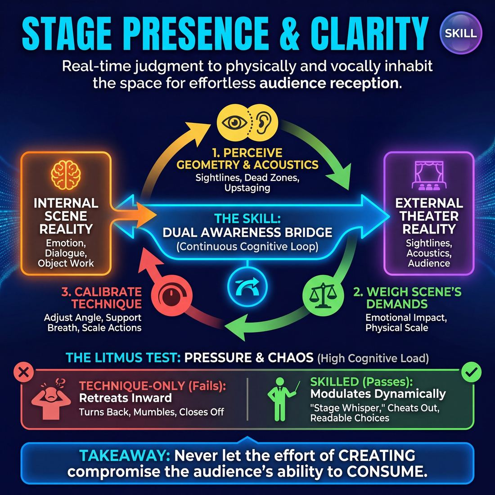

# Week 08 — The Public Set

> *Everything you have learned is in service of the piece, not of your place in it.*

| Course | Week | Domain | Focus | Stage | Length | Class |
|---|---|---|---|---|---|---|
| The Piece — Long-Form & Audience | 8/8 | D5 | `D5.S3` — Stage Presence & Clarity | Competent → Proficient | 180 min | 10–20 |

!!! note "Builds on"
    Seven weeks of building material, shape, pace and nerve now go out in one uninterrupted forty minutes in front of people who owe them nothing.

## 🎬 The arc of this session

They arrive keyed up, quietly superstitious, and privately rehearsing openings that will not happen. The morning takes the charge down rather than up — bodies, voices, one technical pass on presence and clarity, a real break — so that by the time the audience is seated the company is calm rather than braced. They leave having held forty uninterrupted minutes in front of strangers, and having talked about the piece afterwards instead of about themselves.

!!! tip "Watch for"
    The company treating warm-ups as a final rehearsal — pitching openings, agreeing characters, deciding what the callbacks will be. Name it once, kindly, and move them on. Pre-planned material is the main thing that will make the set look steered.

## ⏱️ Session flow (180 minutes)

| Time | Block | Activity |
|---|---|---|
| **0:00–0:05** | 🧊 Ice-breaker | *Pocket Contents* |
| **0:05–0:10** | 😄 Laughter Blast | *Bubble Wrap Floor* |
| **0:10–0:25** | 🔥 Warm-up cluster | *Twenty Paces*, *Clear the Sightline*, *Land and Leave* |
| **0:25–0:45** | 🧠 Theory | — |
| **0:45–1:05** | 🎲 Drill A — isolation | *The Feedback Agreement* |
| **1:05–1:15** | ☕ Break | — |
| **1:15–1:35** | 🎲 Drill B — under load | *The Fourth Wall Dial* |
| **1:35–2:10** | 🎯 Scene Lab | *Permeable Currents* |
| **2:10–2:50** | 🏟️ Showcase round | *One Word, Three Waves* |
| **2:50–3:00** | 💭 Reflection & homework | — |

## 🎒 Before you start

- Set the room as a venue before anyone arrives: playing space marked, backline chairs set upstage, audience seating in a shallow arc, house lights and stage lights separated and tested.
- Walk the sightlines from the two worst audience seats. Mark with tape any spot where a performer disappears.
- Put water at the back of the backline, not in the playing space. Bin liner for the bubble wrap. Bubble wrap laid and taped down before the first person walks in.
- Print the running order and the audience-word prompt card. Decide now who takes the word from the audience and who says the closing line.
- Re-read last week's homework notes on returns and callbacks. Have two examples of their own material ready to name in theory.
- Confirm door time, who greets, and who counts the house. Nobody performing should also be doing front of house in the last ten minutes.

## 1. 🧊 Ice-breaker (5 min)

*Circle up. Nothing to do with the show yet — one thing out of your pocket or bag, one sentence about it.*

**Why here:** Gets them talking about something ordinary and true before the day acquires any weight; at 18-20 run two circles so nobody waits more than four minutes for a turn.

### Pocket Contents

> Each person names one thing they are actually carrying today and why it is on them.

`Players 10–20` · `~5 min` · `Complexity 1/5` · `Energy medium` · `Contact none` · `Props: none`

**How to play**

1. Circle everyone up, standing, shoulders loose. Say you want one object each person is physically carrying right now, plus one sentence on why it is on them today.
2. Model it yourself first. Go fast and flat — object, then reason, under eight seconds. Show them the size of the answer, not a good answer.
3. Point to the person on your left to start. Keep your pointing hand moving round the circle so the order never needs explaining.
4. Cap every turn at eight seconds. Cut anecdotes with a hand and move the point on. Nobody explains, nobody apologises for a dull object.
5. Run a silent second lap. Each person holds up or touches their object; the whole group says the object name back together, one word or two.
6. Close by naming two objects out loud that you want to see again later in the set. Move straight into the next block without discussion.

📄 **[Full teaching notes »](week-08/advanced_w08__b1_1.md)**

**Side-coach:** *“Shorter. One sentence, not the story behind it.”*

## 2. 😄 Laughter Blast (5 min)

*Shoes on, everyone to the edge of the wrap. This is loud and it is meant to be.*

**Why here:** Discharges the nervous energy physically so it does not come out sideways in the set; the noise also breaks the reverence that has been building since they walked in.

### Bubble Wrap Floor

> The whole room becomes a sheet of bubble wrap and pops itself for five minutes.

`Players 10–20` · `~5 min` · `Complexity 1/5` · `Energy high` · `Contact none` · `Props: none`

**How to play**

1. Tell the room the floor is bubble wrap and so are they. No skill needed, just noise.
2. Demonstrate first. Small crouch, spring up, loud wet "POP!". Do six yourself, loud and badly, before you invite anyone to join.
3. Send everyone popping at their own speed, continuously, all at once. No pattern, no watching each other. Keep popping yourself the whole time so nobody is loudest.
4. Stamp one foot and call a direction. Pops travel across the room as a wave, each person popping as it reaches them. Send five or six, faster each time.
5. Call one giant bubble. Everyone crouches low, inhales together for five slow seconds, rises, releases one enormous drawn-out "POOOOP". Repeat three times, sillier each round.
6. Call fifteen seconds of frenzy popping, maximum noise. Then call "FLAT". Everyone drops to stillness and silence. Hold three seconds. Repeat the frenzy and the drop once.
7. Ask one question. Take thirty seconds of answers. No discussion. Move straight into the next block.

📄 **[Full teaching notes »](week-08/advanced_w08__b2_1.md)**

**Side-coach:** *“Let the sound out of your mouth, not just your feet.”*

## 3. 🔥 Warm-up cluster (15 min)

*Same energy, more precision. Three short pieces, five minutes each, and then we sit down once.*

**Why here:** Three passes that map directly onto today's skill — distance and volume, sightlines, entering and leaving cleanly — so the technical work is in the body before the theory names it.

### Twenty Paces

> Two lines at opposite walls throw big physical shapes across the room and shout back the one word they read.

`Players 10–20` · `~5 min` · `Complexity 2/5` · `Energy high` · `Contact none` · `Props: none`

**How to play**

1. Split the room into two lines facing each other across the widest gap you have. Aim for twenty paces apart. Even numbers on each side, everyone with someone opposite.
2. Explain the deal: on your count, one line throws a full-body shape; the facing line shouts back the single word they read. Shapes must land from across the room.
3. Count Line A in on 'three'. Line B shouts one word each, loud and overlapping. Run it three times fast. Allow no discussion between goes.
4. Swap. Line B throws three shapes, Line A reads them back. Push for shapes that use floor and ceiling, not just arms.
5. Run both lines throwing at once on your count. Each person reads whoever stands directly opposite. Four rounds, no pause between them.
6. Finish with two held rounds: throw, freeze dead still for five seconds while the far line reads, then drop. Call 'serve the piece' and move on.

📄 **[Full teaching notes »](week-08/advanced_w08__b3_1.md)**

### Clear the Sightline

> In pairs facing an imaginary back row, one person makes a shape and the other moves to make it read.

`Players 10–20` · `~5 min` · `Complexity 3/5` · `Energy medium` · `Contact none` · `Props: none`

**How to play**

1. Pair everyone up and spread them across the room. Point out one spot on the back wall — that is the back row. Everyone faces it.
2. Call silence. No talking from now until you say otherwise. Tell them all pairs share one imaginary audience.
3. Tell A to freeze into one shape with a clear intention. B does not copy. B repositions — angle, height, distance — so A's shape reads from the back row.
4. Hold three seconds, then drop. Keep going silently, swapping shaper each time. Aim for about six exchanges. Shaper commits fast; adjuster serves the shape, not themselves.
5. Add one short sentence, spoken by the shaper to the back row. The adjuster stays silent and gives focus with their body. Four exchanges, swapping.
6. Join pairs into fours. One shapes and speaks; the other three arrange around them so the speaker is the clearest thing in the picture. Rotate the speaker.
7. Stop everyone where they stand. Drop the shapes. One breath in, one out. Say the cue: serve the piece.

📄 **[Full teaching notes »](week-08/advanced_w08__b3_2.md)**

### Land and Leave

> One at a time, people step into an empty space, hold one readable shape for a breath, and leave without decorating it.

`Players 10–20` · `~5 min` · `Complexity 2/5` · `Energy low` · `Contact none` · `Props: none`

**How to play**

1. Set the group in a horseshoe facing an empty patch of floor. Tell them this space is the stage and nobody speaks once it starts.
2. Explain the shape: step in, stop, take one breath, make one clear physical shape, hold it for that breath, walk out.
3. Ban words, faces pulled for laughs, and exit gags. Say it plainly: no decoration on the way in, none on the way out.
4. Demo once cleanly. Demo once badly — fidget in, change your mind twice, shrug as you leave — so they see the difference.
5. Run round one in horseshoe order, no gaps between people. Watchers stay silent. Keep the line moving.
6. Run round two the same, but each player fixes their eyeline on the far wall before shaping. After each shape, point at one watcher for a one-word read.
7. Finish with pairs. Two enter together; the second does less and stands where they make the first easier to read. Take four or five pairs, then stop.

📄 **[Full teaching notes »](week-08/advanced_w08__b3_3.md)**

**Side-coach:** *“Land, then speak. Not at the same time.”*

## 4. 🧠 Theory — Stage Presence & Clarity (20 min)

{ .infographic }

- **The big idea:** Presence is not visibility. The piece needs some people seen and some people held back, and knowing which one you are right now is the whole skill.
- **Where you are on the path:** They can already build and shape. What they still do under pressure is protect their own position in the show — entering to be included, holding a scene past its end, taking the edit personally. Proficiency here looks like a performer who steps out cleanly because the piece is better without them for ninety seconds.
- **The one cue to coach:** *“Serve the piece.”*

**The three beats**

1. **Say it.** Say: everything from seven weeks is in service of the piece, not of your place in it. Give them the cue — serve the piece — and define it plainly. Serving the piece means being fully readable when you are on, and fully out of the way when you are not. Clarity is a gift to the audience: face out, land your first line, let your body finish before your mouth starts. Presence is not volume, and it is not being interesting.
2. **Show it.** Take two volunteers. Run thirty seconds of a two-hander with both of them fighting for the front: overlapping, drifting upstage, adding. Stop it. Run the same thirty seconds with one of them making a single clear choice and the other supporting from a fixed position. Ask the room which one they could follow. Do not analyse it. Move on.
3. **Try it.** Everyone up, in pairs, one minute each way. A starts a simple activity in silence with a clear body shape. B enters, supports it with one action, and leaves. Swap. Then run it once more with the instruction: make your entrance readable from the back row. Five minutes total, no scenes longer than thirty seconds.

!!! warning "The misunderstanding that always comes up"
    They hear "serve the piece" as "do less" and go passive, waiting to be useful. Correct it on the spot: serving the piece includes being the one who commits hardest, takes the top of a wave, or makes the edit nobody else will. It means the piece decides, not your comfort.

!!! abstract "📖 Go deeper"
    Read the full write-up: [Stage Presence & Clarity](../../../theory/05_the-audience/05_S3__stage-presence-and-clarity.md)

## 5. 🎲 Drill A — isolation (20 min)

*Sit where you can see everyone. We are going to agree now how we talk about the set afterwards, because after the set we will not want to.*

**Why here:** Sets the terms for the debrief tonight before anyone has anything to defend, so the post-show conversation is already agreed when it is hardest to have.

### The Feedback Agreement

> Transform your audience into a living dashboard of real-time performance feedback.

`Players 7–99` · `~20 min` · `Complexity 4/5` · `Energy medium` · `Contact none` · `Props: none`

**How to play**

1. Split the room: two or three performers on the floor, everyone else seated in three clear rows — Front, Middle, Back. Physical separation matters, so leave a gap between rows.
2. Give the Front Row one job: watch eye contact and direct address. Lean forward when included, lean back when ignored, flat palm up if the performers are pushing too hard at them.
3. Give the Middle Row one job: watch stakes and comic momentum. Soft approving hum for a clear choice, quiet whisper to a neighbour when energy sags, chuckle to feed a comic run.
4. Give the Back Row one job: watch projection and physical readability. Slow nod when clear, hand cupped to ear when too quiet, shrug when a big choice is unreadable from that distance.
5. Rehearse all nine signals once with the whole room. Insist they stay small and instant — no heckling, no commentary, nothing that stops the scene.
6. State the contract out loud: performers treat every audience signal as a stage direction and adjust on the spot. Correct the negative, amplify the positive, keep playing.
7. Take a one-word suggestion and start the scene. Performers hold half their attention on their partner, half on the three rows.
8. Freeze the scene once or twice mid-run. Ask each performer what they are currently receiving and what they will change. Unfreeze and watch them do it.

📄 **[Full teaching notes »](week-08/advanced_w08__b5_1.md)**

**Side-coach:** *“Describe what happened in the piece. Leave the name out of it.”*

## ☕ Break — 10 minutes

Water, notes, informal talk. Non-negotiable at three hours — do not let it collapse into a working discussion.

## 6. 🎲 Drill B — under load (20 min)

*Back up. Chairs where the audience will be — a few of you sit there each round. Same scenes, different dial settings.*

**Why here:** The only pass under load: calibrating how much of the audience to acknowledge, which is the specific pressure of a public room rather than a studio one.

### The Fourth Wall Dial

> Dynamically shift the boundary between stage and spectator to co-create with your audience in real time.

`Players 5–99` · `~20 min` · `Complexity 4/5` · `Energy medium` · `Contact none` · `Props: none`

**How to play**

1. Set two or three players in a scene with a clear relationship, location and activity. Tell them to start on Solid Wall: no audience acknowledgement, full projection, clean physical shapes.
2. Call a new setting every 30 to 60 seconds. Players adopt it instantly and stay in character. Never let them stop the scene to change.
3. Call 'Acknowledge Presence' for open bodies and cheated-out positions. The scene stays private; the audience simply gets to see and hear all of it.
4. Call 'Allies' for brief looks or gestures to the house that share a secret about the other character. No lines to the audience yet.
5. Call 'Direct Query' for one player to ask the house a short in-character question, then take whatever noise comes back as the fuel for the next line.
6. Call 'Direct Commentary' for a player to step forward, say a few sentences to the house about the scene, then step back into the action.
7. Call 'Amplify Energy' when the room has a tone. Players name it silently and lean in: ride the laugh, stretch the pause, hold the tension.
8. Freeze the scene after a few minutes. Ask the audience to name one collective reaction they had — a gasp, a laugh, a silence.
9. Restart the scene and require the players to make that reaction literal: a character notices it, names it, or lets it change what happens next.

📄 **[Full teaching notes »](week-08/advanced_w08__b7_1.md)**

**Side-coach:** *“Dial it up one notch. Now back to where you were.”*

## 7. 🎯 Scene Lab (35 min)

*One word from me, thirty-five minutes, no stopping unless I stop it. Treat it as the set.*

**Why here:** The last shared pass on the form itself, run as flow rather than as fixed scenes, so returns and edits happen without anyone visibly steering.

### Permeable Currents

> Navigate real-time audience feedback by dynamically breaking, reinforcing, or calibrating the fourth wall.

`Players 2–99` · `~35 min` · `Complexity 4/5` · `Energy medium` · `Contact none` · `Props: required`

**How to play**

1. Hand every non-performer three cards: red, green, yellow. If you are short, share one set between two people who signal together.
2. Teach the three meanings out loud. Red means break out. Green means go deeper in. Yellow means change tempo. Demonstrate each one yourself in ten seconds.
3. Tell the audience to signal from their own experience — lost, gripped, or flat — not to catch the performers out. One card at a time, then lower it.
4. Bring two to four performers up. Take a location or a relationship from the room. Start the scene with the fourth wall solid: character, place, stakes.
5. On red, performers turn out, address the audience directly, clarify or comment on the scene, then step back in and rebuild the reality fast.
6. On green, performers stay inside the world. Raise commitment, detail and emotional stakes. They never acknowledge the room while green is up.
7. On yellow, performers shift physical and vocal energy up or down immediately, and stay in character while they do it.
8. Police the signals. Stop card spam. Insist every transition reads clearly to the back row — body turned out, voice up, or the opposite.
9. Run each scene six to eight minutes, then end it on a beat that feels like an ending rather than a cut.

📄 **[Full teaching notes »](week-08/advanced_w08__b8_1.md)**

**Side-coach:** *“Somebody edit. Nobody is coming to rescue that.”*

## 8. 🏟️ Showcase round (40 min)

*House is open. Backline, take your seats now and stay there. We start on the word.*

**Why here:** The public set: forty uninterrupted minutes of the form from one audience word, in front of people who owe them nothing.

### One Word, Three Waves

> A structured long-form set built from a single audience word: three waves of scenes, two group pieces, one shared ending.

`Players 10–20` · `~40 min` · `Complexity 4/5` · `Energy medium` · `Contact negotiated` · `Props: none`

**How to play**

1. Set the cast in a visible back line before you start. Host greets the audience, asks for one ordinary word, repeats it twice, steps off. Cast holds three seconds of stillness before moving.
2. Run a three-minute opening off the word: spoken images, short physical tableaux, overheard lines. No scenes yet. The opening ends the moment someone steps out and starts one.
3. Wave one: three two-person scenes, unrelated to each other. Each takes its starting material from something the opening threw up.
4. End every scene with a clean edit — sweep across the stage, or tag a player out. Anyone standing in the line may edit.
5. Group piece one: the whole cast builds a three-minute moving picture of one place, idea or ritual already seen. Anyone may start it; everyone joins within ten seconds.
6. Wave two: revisit the same three scenes later in time. Same characters, changed situation. Do not restart them from the top.
7. Group piece two: run it exactly like the first, but build it from a different thread than the one you used before.
8. Wave three: three scenes that collide the earlier threads. Characters from different scenes meet, or one scene's rule invades another. Keep beats shorter and faster.
9. Close: the cast finds one final image or line referencing the opening word. Host calls the cast forward. Hold the line, bow together, exit.

📄 **[Full teaching notes »](week-08/advanced_w08__b9_1.md)**

**Side-coach:** *“Silently from the wings if needed: hold. Do not give notes between waves.”*

## 9. 💭 Reflection & homework (10 min)

**Deepen your improv**
1. Name one moment tonight when you stayed out of something the piece did not need you in. What did it cost you, and what did it buy the show?
2. Where did the set steer itself, and where could the audience see a hand on the wheel?

**Beyond the stage**
3. Think of a meeting or a family conversation where you spoke to secure your place in it rather than to move it forward. What would serving the piece have looked like there?

➡️ **[This week's homework](../homework/HW-ADVW08.md)**

??? note "🎓 Facilitator notes"

    **Timing risks**
    - The house rarely opens on time. Build the door time into the break, not into the scene lab, and hold the scene lab to thirty-five minutes even if the room begs for one more run.
    - Drill A overruns because someone wants to pre-agree an exception to the feedback terms. Take the point, write it down, park it for the debrief.
    - The set runs long. Agree a hard visual signal for the forty-minute mark before the audience arrives, and agree who takes it.

    **Failure modes this week**
    - Warm-ups turn into a last rehearsal. Characters get pitched, callbacks get promised, and the set then plays as a recital of decisions made at 10am.
    - Nerves read as generosity: everybody offers, nobody commits, and the first ten minutes are polite mush. Side-coach hard in the scene lab, not during the set.
    - One or two performers take the front for the whole forty minutes while the rest thin out to a backline of spectators. Address it in the scene lab by naming who has not been on.
    - The debrief turns into a laugh audit. Redirect once to the agreement made in Drill A; if it slips twice, close the debrief early and pick it up next week.

    **What good looks like by the end:** Forty minutes that holds without a visible driver. Edits land at reasonable moments, at least two returns come back without being announced, and no scene dies on stage while everyone waits. Afterwards the company talks about shape, pace and what the piece was about, and the word "funny" barely comes up.

    **Carry into next week:** Note two moments where the piece was served at someone's personal cost, and two where it was not. Bring both to next week. Also note anything they parked during Drill A — that is the first item on the next agenda.
