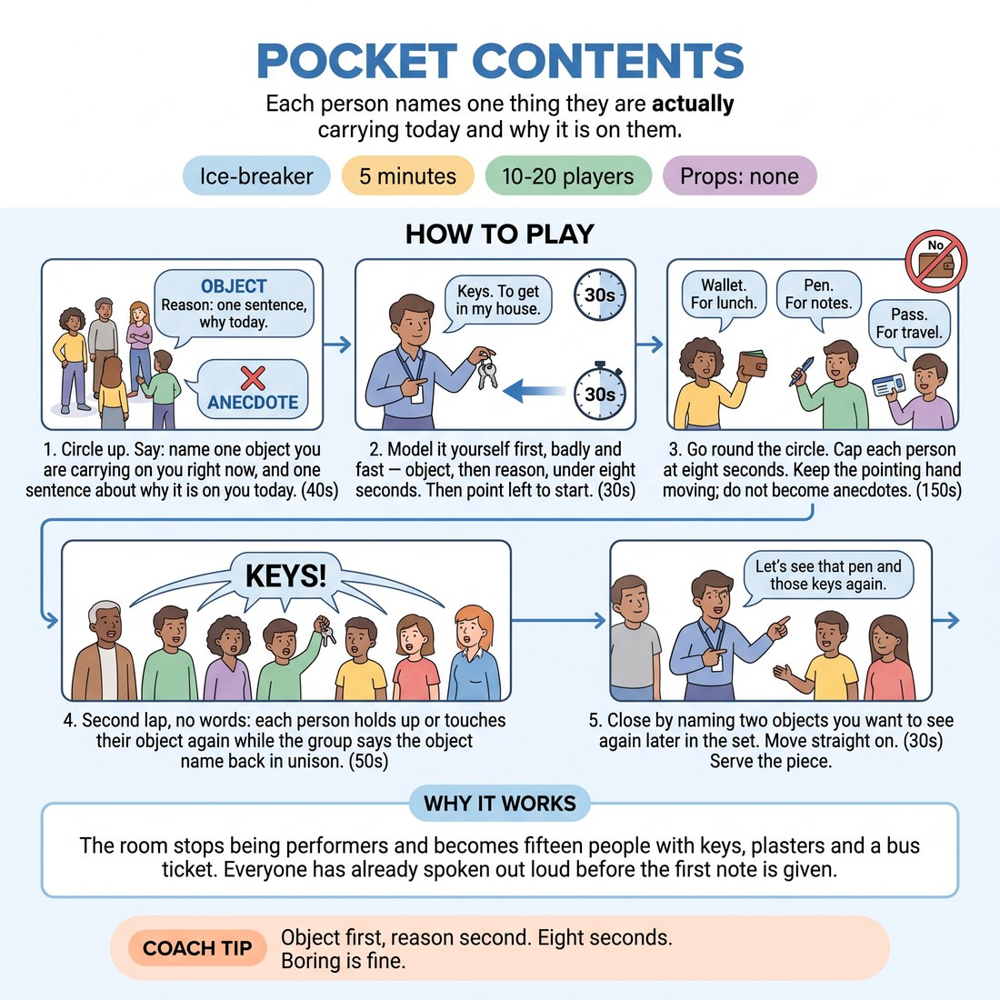

# 🧊 Ice-breaker — Pocket Contents

{ .infographic }

> Each person names one thing they are actually carrying today and why it is on them.

`Players 10–20` · `~5 min` · `Complexity 1/5` · `Energy medium` · `Contact none` · `Props: none`

⬅️ [Back to the Week 08 run-sheet](../week-08.md)

## Why this activity, here

Week 8 is the public set. The room arrives self-conscious and internally noisy. This lands attention on real, present, physical detail before anyone has to invent anything, and it seeds a shared pool of concrete objects the set can reach for. It feeds directly into the presence and clarity work: a clear offer is one the room can see.

## What students actually learn

- That a plain fact said clearly reads better from a stage than a clever line said hedged.
- That the group is already holding dozens of specifics — nothing needs inventing under pressure.
- That eight seconds is enough to be understood, which lowers the cost of speaking first.

## Setup

No props, no chairs. Clear enough floor for one standing circle of everyone including you. Check the circle is actually round before you start — gaps and clumps make the pointing hand ambiguous. Have a way to keep a rough eight-count in your head; no timer needed.

## How to run it — 5 minutes

| Min | What you do |
|---:|---|
| 1 | Circle up. Give the instruction: one object you are carrying, one sentence why. Model it yourself, badly and under eight seconds. Point left. |
| 2 | First lap. Everyone gives object plus reason. Cap at eight seconds each. Keep the pointing hand moving. Cut anecdotes mid-sentence, kindly. |
| 1 | Finish the lap if the group is large, then run the silent second lap: each person shows the object, group says its name back in unison. |
| 1 | Name two objects you want to see again later in the set. Do not debrief. Move straight on. |

## Side-coaching script

| When | Say |
|---|---|
| Before you model | *"Boring is fine. Say the thing."* |
| First person hesitates | *"Object first. Reason second."* |
| Someone starts a story | *"One sentence. Point moves."* |
| The lap drags around person six | *"Faster. Trust the object."* |
| Someone apologises for their object | *"No apologies. Next."* |
| Starting the silent lap | *"Hold it up. Let us see it."* |
| The unison callback is thin | *"All of you. Say it back."* |
| Closing | *"Keep those two in your pocket."* |

!!! success "What good looks like"
    The lap moves at a clip. Answers are short and unglamorous — a bus pass, a chipped lighter, someone's kid's hair tie. Nobody is performing the reason. On the silent lap the unison callback is loud and slightly ragged, and two or three people grin at hearing their own object named by fifteen voices. The room is standing taller than it was four minutes ago.

## When it goes wrong

| You see | What's causing it | The fix |
|---|---|---|
| The third or fourth person tells a two-minute story about a keyring and the lap stalls. | You modelled too well, or too long, so the group read the exercise as a storytelling turn. | Cut with a raised hand and move the point immediately. Say 'one sentence' out loud once. Re-model in three seconds if needed. |
| People pat their pockets, find nothing, and freeze apologetically. | Some people genuinely carry nothing — no bag, no coat, empty pockets. | Name it in advance: shoes, a ring, a watch, a hair tie, a plaster all count. Anything on their body qualifies. |
| The silent lap is mumbled and half the room does not join the callback. | They cannot see the object, or they are unsure of the word to say. | Ask the holder to lift it higher and say the word once themselves, then the group echoes. Take the volume up with your own voice. |
| Turns are clean but flat, and the room feels colder than before. | You policed the time so hard nobody risked a real reason. | Let two or three answers breathe one extra beat. Repeat one back yourself — 'the second phone, right' — then move on. |

## Scaling

| Class size | What changes |
|---|---|
| **10–13** | One circle. Full first lap plus full silent lap fits comfortably. You can allow ten seconds per turn instead of eight. |
| **14–17** | One circle, strict eight seconds. Skip your own second modelling if the first lap is running long. Silent lap goes at a brisk pace, no pauses between people. |
| **18–20** | Split into two circles of nine or ten, each with a named starter you brief in ten seconds. Run both laps simultaneously. You float. Do the closing 'two objects' call to the whole room, taking one object from each circle. |

## Variations

**Object only** — Drop the reason. Each person names just the object, one word, round the circle at speed. Then do the silent unison lap.  
*Easier — removes disclosure entirely and halves the time. Use with a nervous room or when you are behind schedule.*

**Someone else's reason** — After the first lap, point at random and ask a second person to guess why that object is on the first person today. One sentence, no checking if it was right.  
*Harder — adds invention and public wrongness on top of the naming.*

**Weight and place** — Each person names the object and where on their body it sits, then adjusts their stance so the group can see it. Hold the adjusted stance for three seconds.  
*Different emphasis — shifts from verbal clarity to physical clarity and being looked at, which is the presence half of the session skill.*

## Debrief

1. **Which object do you still remember from someone else?**
   > *A good answer sounds like:* They name a specific object and its owner without hesitating, and often the reason too — evidence that concrete detail sticks without effort.

2. **What happened when you had eight seconds instead of as long as you liked?**
   > *A good answer sounds like:* 'I said the true thing because I did not have time to pick a better one.' Something about the edit being made for them, not the pressure being unpleasant.

!!! warning "Safety & inclusion"
    No contact between participants. Nobody reaches into anyone else's pockets or bag. Say clearly that people choose what to name — if the honest reason is private, they name the object and say 'just because'. That is a full turn, not a pass. Anyone who does not want to speak can hold up an object silently and let the group name it on the second lap. Standing is optional; seated circles work identically.

## Why it works

Stage presence and clarity fail when attention runs inward. This forces attention onto something real, external and already present — the thing in the pocket — so there is nothing to invent and nothing to defend. The eight-second cap removes the editing window where people swap a true answer for an impressive one, which is exactly the swap that reads as hedging from a stage. The unison callback then does the second job: everyone hears their own detail returned by the room, so being clearly received stops feeling like exposure. That is the cue in miniature — the object serves the set, not the speaker.

[Open the full activity card »](../../library/icebreakers/IB__pocket-contents.md){target=_blank rel=noopener}
