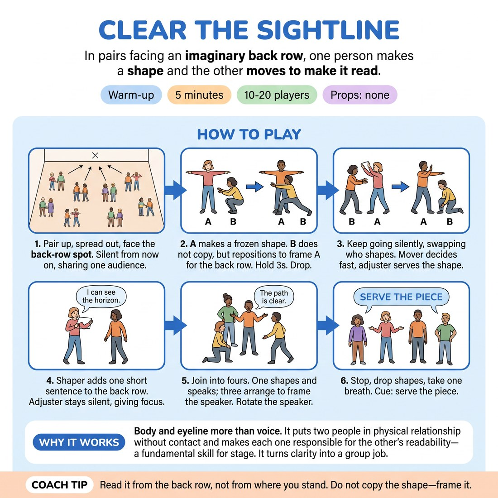

# 🔥 Warm-up cluster — Clear the Sightline

{ .infographic }

> In pairs facing an imaginary back row, one person makes a shape and the other moves to make it read.

`Players 10–20` · `~5 min` · `Complexity 3/5` · `Energy medium` · `Contact none` · `Props: none`

⬅️ [Back to the Week 08 run-sheet](../week-08.md)

## Why this activity, here

Week 8 is the public set. They have spent seven weeks learning to listen to each other; tonight strangers watch. This warm-up moves attention outward to the back row before anyone speaks a word of content. It feeds every scene in the set — the habit of adjusting so someone else reads.

## What students actually learn

- That being seen is a group job, not a solo one — someone else's angle decides whether your shape lands.
- That giving focus is an action you take with your body, not a mood.
- That the back row is a real place, and you can aim at it without shouting.

## Setup

Clear floor. Choose one fixed spot high on the back wall and point at it. No chairs, no props. Even numbers preferred; make one three if odd. Timer visible to you.

## How to run it — 5 minutes

| Min | What you do |
|---:|---|
| 1 | Pair up, spread out, all face the back-row spot. Call silence. Demonstrate once with a volunteer: you freeze, they reposition. Run the first silent exchanges — A shapes, B adjusts, hold three, drop. |
| 1 | Keep going silently, swapping shaper each time. Roughly six exchanges. Side-coach for speed of decision and for adjusters moving further than they think they need to. |
| 1 | Shaper now adds one short sentence to the back row. Adjuster stays silent, gives focus with the body. Four exchanges, swapping. |
| 1 | Join pairs into fours. One shapes and speaks; the other three arrange so the speaker is clearest in the picture. Rotate the speaker twice. |
| 1 | Stop where they stand. Drop shapes. One breath in, one out. Give the cue: serve the piece. Ask one question, take two answers, move on. |

## Side-coaching script

| When | Say |
|---|---|
| As pairs begin | *"Back row. Aim everything there."* |
| When adjusters hesitate | *"Move further. Half a step does nothing."* |
| When shapers keep fiddling | *"Commit the shape. Freeze it."* |
| When adjusters start copying | *"Don't match. Frame."* |
| On the spoken round | *"Sentence to the wall, not to your partner."* |
| In fours, when the picture crowds | *"Give the speaker air."* |
| Final ten seconds | *"Drop. Breathe. Serve the piece."* |

!!! success "What good looks like"
    Quick, unfussy repositioning. Adjusters travelling real distance — kneeling, stepping wide, dropping behind. Shapes that are legible from your position at the back. In the fours, three people angling in without blocking, and a speaker whose sentence carries to the wall without strain.

## When it goes wrong

| You see | What's causing it | The fix |
|---|---|---|
| Pairs whispering and negotiating the shape. | They want to agree before committing, which is the habit the exercise removes. | Reset the silence rule out loud. Tell them the shaper decides alone and the adjuster answers with the body. |
| Adjusters shuffling six inches and stopping. | Politeness — they don't want to take up space or turn their back on their partner. | Call "move further" and demonstrate one big adjustment yourself: floor level, or three steps out. |
| Everyone facing their partner, nobody facing the wall. | Pair instinct beats the audience instruction within about twenty seconds. | Point at the back-row spot again mid-round. Say it out loud: one audience, that wall. |
| In fours, the three arrangers pile in and hide the speaker. | They read "arrange around" as "get close". | Call "give the speaker air". Suggest one low, one wide, one behind. |

## Scaling

| Class size | What changes |
|---|---|
| **10–13** | Five or six pairs, one group of three if odd. Run the fours as one four and the rest threes. Full timings as written. |
| **14–17** | Seven or eight pairs. Space is tighter — use two back-row spots on the same wall, half the room to each. Keep all rounds. |
| **18–20** | Nine or ten pairs. Trim the silent exchanges to about four and the spoken round to three, so the fours round still gets its full minute. Two back-row spots. |

## Variations

**Adjuster calls it** — Let the adjuster say one word — "lower", "open", "turn" — instead of moving themselves.  
*easier; removes the spatial problem and lets nervous groups start with language*

**Moving shape** — The shaper repeats a small looping action instead of freezing. The adjuster must find a position that keeps it readable throughout.  
*harder; the target won't hold still, so the adjuster commits to a choice under change*

**Two speakers** — In the fours, two people shape and speak. The other two must make both read without either winning.  
*different emphasis; shifts from serving one focus to balancing a picture*

## Debrief

1. **When you were adjusting — what told you it wasn't reading yet?**
   > *A good answer sounds like:* Something concrete and visual: "I was blocking their face", "their hand disappeared against my body", "I could tell from the wall's point of view". Not "it just felt wrong".

2. **What is the cost of moving to serve someone else's shape?**
   > *A good answer sounds like:* They name giving something up — the good angle, the front, being seen — and say it was fine. If someone says "nothing, I liked it more", that's the point landing. Move on.

!!! warning "Safety & inclusion"
    No contact required at any point. Say so before you start: adjust around each other, never touch. Anyone who does not want to go to the floor stays standing and uses angle and distance instead. Anyone uncomfortable speaking aloud can mouth the sentence or stay in the silent rounds throughout. Watching from the side and calling one adjustment per pair is a full role.

## Why it works

Stage presence and clarity get taught as things the performer does alone. They aren't. A shape reads or doesn't depending on what surrounds it. By splitting the job — one person makes, one person makes it visible — the exercise makes the audience's sightline the only measure that counts. The silence removes negotiation, so the adjuster has to read the picture rather than ask about it. By the time they play the set, giving focus is a physical reflex rather than a note.

[Open the full activity card »](../../library/warmups/WU__clear-the-sightline.md){target=_blank rel=noopener}
