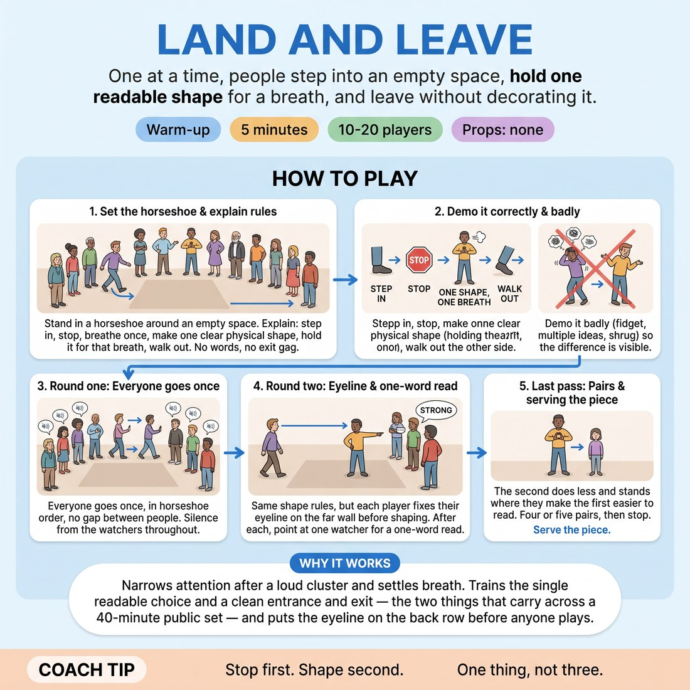

# 🔥 Warm-up cluster — Land and Leave

{ .infographic }

> One at a time, people step into an empty space, hold one readable shape for a breath, and leave without decorating it.

`Players 10–20` · `~5 min` · `Complexity 2/5` · `Energy low` · `Contact none` · `Props: none`

⬅️ [Back to the Week 08 run-sheet](../week-08.md)

## Why this activity, here

Week 8 is the public set. Everything after this block is long-form in front of watchers. This is the first thing the body does in the room: enter, be readable, leave. It feeds the cue 'serve the piece' by making the smallest possible offer — one shape — and proving it is enough. The pair pass sets up the whole session's habit of the second person supporting rather than competing.

## What students actually learn

- They feel the difference between committing to one shape and hedging across three.
- They notice how much of their stage habit is apology — the shrug, the fidget, the look back at the group.
- They see that a second body can make the first clearer by doing less.
- They get read out loud by a watcher, so 'clear' stops being a private opinion.

## Setup

Clear a patch of floor roughly three metres square. Chairs or standing bodies in a horseshoe around it, open side towards you. No props, no music. Know the order of the horseshoe so round one flows without you calling names.

## How to run it — 5 minutes

| Min | What you do |
|---:|---|
| 1 | Set the horseshoe. Give the rules in three sentences: step in, one shape, one breath, walk out. Demo it clean, then demo it badly. Do not explain the bad demo — let them see it. |
| 2 | Round one. Everyone goes once in horseshoe order. No gap between players — as one walks out the next steps in. Watchers silent throughout. You say nothing except side-coaching calls. |
| 1 | Round two. Same rules, plus eyeline on the far wall before shaping. After each shape, point at one watcher who says one word for what they saw. Keep it fast — the word, then the next player. |
| 1 | Pairs. Two enter together. The second person does less and places themselves to make the first readable. Four or five pairs, then stop on time and move on. |

## Side-coaching script

| When | Say |
|---|---|
| As the first few people step in | *"Stop. Then shape."* |
| Someone starts adjusting mid-hold | *"First idea. Keep it."* |
| A player shrugs or grins on the way out | *"Leave the way you came in."* |
| Round one is dragging between players | *"No gap. Next."* |
| Start of round two | *"Far wall first."* |
| A watcher hesitates on their one word | *"First word."* |
| The second player in a pair starts adding business | *"Do less. Frame them."* |
| Last pair | *"Land it. Out."* |

!!! success "What good looks like"
    The line moves without prompting. People stop before they shape rather than shaping as they walk. Shapes are held long enough for a watcher to name them. The one-word reads come fast and mostly match what the player intended. In the pairs, the second body sits still and slightly off-centre, and the room's eye goes to the first person. Nobody laughs on the way out.

## When it goes wrong

| You see | What's causing it | The fix |
|---|---|---|
| People walk in, make a shape, and immediately change it into a second, funnier one. | They read the silence as failure and try to rescue it. | Call 'first idea, keep it' during the round. If it persists, run three volunteers in front of the group and hold each shape for a count of three out loud. |
| Exit shrugs, apologetic smiles, hands raised in a 'that was rubbish' gesture. | Habit. They are managing the group's opinion of them rather than making an offer. | Name it once, briefly, without shaming: 'the shrug is the only thing that reads as a mistake.' Then run those people again immediately. |
| Shapes are tiny and low-contrast — a slight lean, hands in pockets. | Self-consciousness plus no reference for scale. | Demo a big shape and a small one yourself. Say 'the back row is four metres away.' Do not ask for bigger emotion, just bigger geometry. |
| Watchers' one-word reads keep missing what the player meant. | The shape is generic, or the eyeline is on the floor. | Push the eyeline rule harder. Where the eyes go tells the room what the shape is about. |

## Scaling

| Class size | What changes |
|---|---|
| **10–13** | One horseshoe. Everyone goes in round one and round two. Five pairs at the end. You will finish with a few seconds spare — use them for one extra pair. |
| **14–17** | One horseshoe. Everyone goes in round one. In round two take only the first ten, and take one-word reads on every second person to save time. Four pairs at the end. |
| **18–20** | Split into two horseshoes at opposite ends of the room, each running its own line simultaneously. You move between them. Round two: each circle takes ten, no one-word reads from you — the circle nominates. Bring both circles together for three pairs at the end. |

## Variations

**Named shape** — Before stepping in, the player says one word out loud — 'waiting', 'winning', 'cold' — then makes the shape silently.  
*Easier. The word gives them a target so they are not hunting for an idea in the doorway.*

**Hold for two** — The shape is held for two breaths instead of one, and watchers must stay silent for both.  
*Harder. The second breath is where people crack, decorate, or start playing to the room.*

**Answer the shape** — Player one lands a shape and holds. Player two enters and makes a shape that responds to it. Both leave together.  
*Different emphasis. Shifts from solo clarity to reading someone else's picture before adding to it.*

## Debrief

1. **What was harder — going in or coming out?**
   > *A good answer sounds like:* Someone says coming out, because there is nothing to do and no way to check whether it worked. That is the honest answer and it names the habit the exercise is trying to break.

2. **When you were watching, what made a shape easy to read?**
   > *A good answer sounds like:* Concrete answers about stillness, size, and where the eyes were pointed — not 'they committed' or 'they were confident'.

3. **In the pairs, what did the second person do that helped?**
   > *A good answer sounds like:* They stayed still, they stood where they didn't block, they matched the tone without copying. Someone should notice that doing less made them more useful, not less present.

!!! warning "Safety & inclusion"
    No contact in this activity. In the pairs, tell people to leave a clear arm's length. Anyone who does not want to stand in the middle can take the watcher role for round one and join in round two, or stay a watcher throughout — say this at the start so it is not a request they have to make. Shapes can be made seated or with minimal movement; a still figure in a chair reads perfectly well. Do not ask for shapes on the floor unless you have checked the group is happy going down and getting up.

## Why it works

Stage presence and clarity are usually taught as feelings, which cannot be practised. This makes them mechanical: one shape, one breath, no decoration. Because there is only one variable, the player cannot hide a weak choice behind three others, and the watchers can name what they saw in a single word — immediate, non-judgemental feedback on legibility rather than quality. The exit rule is the load-bearing part. Most people's stage habit is a small act of self-commentary on the way out, which tells the audience the offer was not meant. Removing it, once, in front of everyone, makes the habit visible for the rest of the session. The pair pass then converts the same idea into ensemble terms: the cue 'serve the piece' means the second body's job is to make the first one readable, not to add.

[Open the full activity card »](../../library/warmups/WU__land-and-leave.md){target=_blank rel=noopener}
