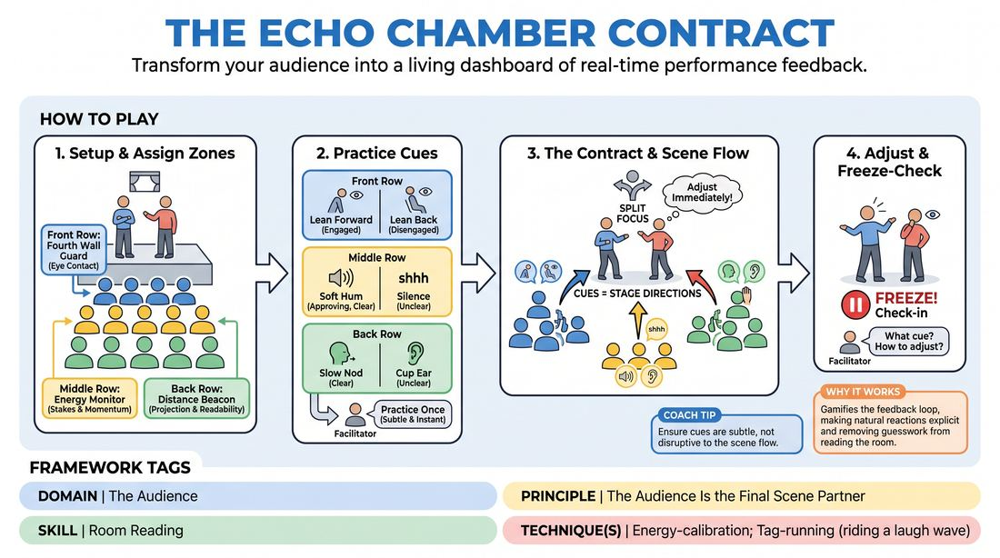

# 🎲 Drill A — isolation — The Feedback Agreement

{ .infographic }

> Transform your audience into a living dashboard of real-time performance feedback.

`Players 7–99` · `~20 min` · `Complexity 4/5` · `Energy medium` · `Contact none` · `Props: none`

⬅️ [Back to the Week 08 run-sheet](../week-08.md)

## Why this activity, here

Week 8 is the public set. Everything before this has trained scene-work with the audience as an abstraction. This drill makes the audience a concrete, readable object so performers learn to take information from the room without playing to it. It feeds the longer form work later in the session, where reading a real audience mid-piece decides whether a scene lands or dies.

## What students actually learn

- They stop treating the audience as a wall and start treating it as a source of information they can act on mid-scene.
- They discover their default volume and physicality are calibrated for their partner, not for row twelve.
- They find they can split attention two ways without dropping the scene — it feels impossible for about ninety seconds, then it doesn't.

## Setup

Chairs in three shallow rows facing an open playing area, with a visible gap between each row. Back Row genuinely at the back of the space — if the room is small, push them against the far wall. Have a few one-word suggestions ready so you never wait for the room to offer one. No props needed.

## How to run it — 20 minutes

| Min | What you do |
|---:|---|
| 3 | Seat the room in three rows. Assign and explain the three jobs and their nine signals. Keep it brisk — demonstrate each signal rather than describing it. |
| 2 | Rehearse. Stand in the playing area and deliberately mumble, ignore the front row, then over-address them. Let each row fire its signals. Correct anything loud or theatrical. |
| 5 | First scene. Two or three performers, one-word suggestion. Freeze twice: ask what they are receiving, what they will change, then unfreeze immediately. |
| 4 | Second scene, new performers. Freeze once only. Push for faster adjustment — the gap between signal and change should shrink. |
| 4 | Third scene, new performers. No freezes. Let them run and adjust unaided. |
| 2 | Rotate rows if time allows, or go straight to two debrief questions with the whole room seated. |

## Side-coaching script

| When | Say |
|---|---|
| During the cue rehearsal, if signals are too big | *"Smaller. They should feel it, not see a performance."* |
| Early in the first scene, when performers face front and freeze up | *"Back to your partner. The room is peripheral."* |
| When the Back Row is cupping ears | *"Fill the back wall."* |
| When the Front Row leans back en masse | *"Let us in. One look, then carry on."* |
| When performers over-correct and start playing to the audience | *"Serve the piece, not the room."* |
| At a freeze | *"Name what you're getting. One sentence. Go."* |
| When the Middle Row hums and performers ignore it | *"That's a yes. Do more of that."* |
| Last ninety seconds of the final scene | *"Stop checking. Just play bigger."* |

!!! success "What good looks like"
    The scene keeps its own life — two people doing something to each other — while the performers' volume, physical size and openness to the room shift visibly within a few seconds of a signal. The audience signals are small and quick; you can hear the scene over them. At the freezes, performers can name a specific signal from a specific row rather than saying "I felt like it was going okay".

## When it goes wrong

| You see | What's causing it | The fix |
|---|---|---|
| Performers stop the scene dead and stare at the audience whenever a signal fires. | They are treating the drill as an obedience test rather than an information stream. | Call "back to your partner" and tell them the adjustment happens inside the next line, not instead of it. Model it yourself for thirty seconds. |
| The audience escalates — signals turn into laughter, groans and commentary. | Rows enjoying the power. The rehearsal step was rushed. | Stop and re-run the signal rehearsal for sixty seconds. Say plainly: any signal loud enough to be a joke is out of contract. |
| Everything is nods and hums; nobody signals a problem. | Politeness. Adults dislike telling classmates they cannot be heard. | Tell the rows their job is accuracy, not kindness, and that a hidden problem is the one that kills the public set. Give explicit permission to cup ears. |
| Performers get louder and bigger but the scene becomes shouty and thin. | They are reading projection notes as energy notes. | Side-coach "volume up, stakes the same". Remind them clarity is a delivery adjustment, not a character change. |

## Scaling

| Class size | What changes |
|---|---|
| **10–13** | Two performers per scene, three or four per row. Run three scenes as written. With rows this thin, ask each row to signal as a group — one person moving is easy to miss. |
| **14–17** | Two or three performers per scene, five or six per row. Three scenes as written. Rotate the rows once at the end so at least some people sit in a second seat. |
| **18–20** | Three performers per scene and six or seven per row. Cut the third scene to two performers and trim each freeze to one question, or run two scenes of five minutes instead of three shorter ones so everyone who wants to play, plays. |

## Variations

**One row at a time** — Only the Back Row signals in scene one, only the Middle in scene two, only the Front in scene three.  
*Easier — removes the split-attention load so performers can isolate one adjustment before combining them.*

**Silent contract** — Remove all audible signals. Rows use posture and hands only, and you run no freezes.  
*Harder — performers must scan visually while staying in the scene, with no auditory prompt to lean on.*

**Reverse the flow** — Performers may hold a hand behind their back to request feedback; rows only signal when asked.  
*Different emphasis — moves the skill from receiving information to knowing when you need it.*

## Debrief

1. **What did you change, and what signal made you change it?**
   > *A good answer sounds like:* A specific pairing: "Back Row cupped ears during the argument, so I turned out and pitched to the wall." Move on once two or three people can name a signal and an action.

2. **When did the audience read something you did not intend?**
   > *A good answer sounds like:* Recognition that a choice which felt clear to them was invisible from ten feet away — a small gesture, a turned back, a mumbled decision. Not self-criticism, just the gap being named.

3. **What does this change about how you'll play the public set?**
   > *A good answer sounds like:* Something concrete about baseline — starting louder, opening the body, giving the room a look early — rather than a general intention to be more aware.

!!! warning "Safety & inclusion"
    No contact in this drill. Tell the room that signals report on clarity and audibility only, never on whether someone is funny or good. If anyone finds being watched-and-rated uncomfortable, let them sit in a row for the whole drill without performing — rows do real work, so this is not sitting out. Anyone with hearing differences should sit Front or Middle and can swap jobs freely. Performers with quieter voices should be told plainly that a cupped ear is information about the room's acoustics, not a judgement on them.

## Why it works

Stage presence and clarity usually get taught as notes after the fact, which means the performer learns the problem long after the moment that caused it. This closes the loop to a few seconds. The three rows separate three distinct variables — inclusion, stakes, readability — so a signal points at one adjustment rather than a vague sense of failure. Because the audience has a defined, limited vocabulary, performers can act on the information without abandoning the scene, which is exactly the split attention the cue asks for: serve the piece, and use the room to tell you whether the piece is arriving.

[Open the full activity card »](../../../../games/D5_P1_S1_T1_G061__the-echo-chamber-contract.md){target=_blank rel=noopener}
