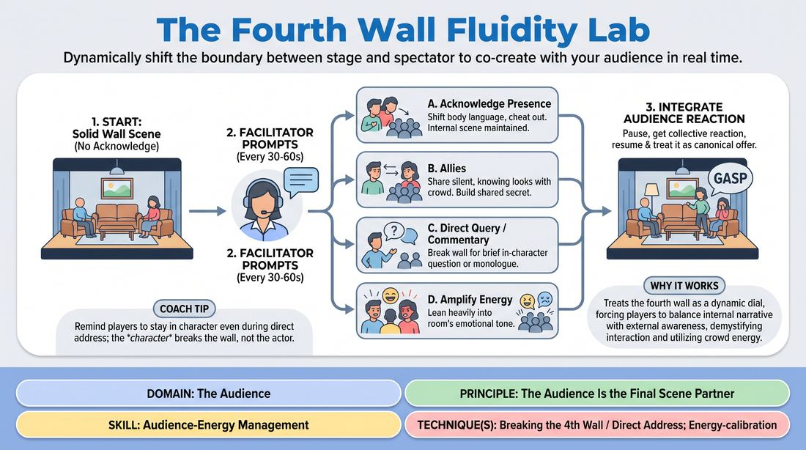

# 🎲 Drill B — under load — The Fourth Wall Dial

{ .infographic }

> Dynamically shift the boundary between stage and spectator to co-create with your audience in real time.

`Players 5–99` · `~20 min` · `Complexity 4/5` · `Energy medium` · `Contact none` · `Props: none`

⬅️ [Back to the Week 08 run-sheet](../week-08.md)

## Why this activity, here

Week 8 is the public set. Earlier blocks built the piece as a closed system between players. This drill opens the wall in graded steps so the audience becomes a scene partner rather than a distraction. It feeds the run-through in Drill C and the set itself, where players need to hear the room without abandoning the story.

## What students actually learn

- They stop treating the audience as a jury and start treating it as a presence they can dial up or down.
- They find out that breaking the wall is a choice with degrees, not a switch between 'scene' and 'stand-up'.
- They can take a laugh or a silence and turn it into material instead of freezing or apologising.

## Setup

Clear playing space with a defined front. Seat everyone else in a tight block facing it — audience close, not scattered. Write the five settings large where players can glance at them: SOLID WALL / ACKNOWLEDGE / ALLIES / DIRECT QUERY / COMMENTARY / AMPLIFY. Stand at the side where players can hear you without turning.

## How to run it — 20 minutes

| Min | What you do |
|---:|---|
| 3 | Name the six settings and show each one in five seconds with a volunteer. Then have the whole room, standing, adopt each posture as you call it. No dialogue, bodies only. |
| 4 | First scene, three players. Start Solid Wall. Call a new setting roughly every 40 seconds. Freeze at 3 minutes, take one audience reaction, restart, make it literal. |
| 4 | Second scene, new players. Same pattern. Push earlier into Direct Query so they get more time using the crowd's noise. |
| 4 | Third scene, new players. Hold Solid Wall longer this time so the first break lands harder. Same freeze-and-integrate at the end. |
| 3 | Fourth scene, shortened. Let the players choose their own settings and say them aloud as they take them. You only call the freeze. |
| 2 | Land it. Two debrief questions, standing. Then give the cue: serve the piece. |

## Side-coaching script

| When | Say |
|---|---|
| First thirty seconds of any scene | *"Solid wall. Full voice, no eye contact with the house."* |
| Bodies close off or players play in profile | *"Cheat out. Let them see the face."* |
| Calling the middle setting | *"Allies. One look, no words."* |
| A player asks the house something and ploughs on | *"Take the answer. Use it in the next line."* |
| Commentary drifts into a joke about the exercise | *"Still in character. Talk about the scene, not the class."* |
| The room laughs and the players talk over it | *"Ride it. Wait for the top."* |
| After the freeze and the named reaction | *"Make it real. Someone in the scene noticed that."* |
| Last thirty seconds of every scene | *"Back to the story. Serve the piece."* |

!!! success "What good looks like"
    The scene keeps its spine through every setting change. You can see the dial move — postures open, a look lands, a question gets a genuine noise back, and the next line is different because of it. Players return to the story without a bump. When the audience reaction is named and folded back in, it feels like the scene absorbed it rather than being interrupted by it.

## When it goes wrong

| You see | What's causing it | The fix |
|---|---|---|
| On Direct Query, a player asks the house something and the house says nothing. | The question was open-ended, quiet, or asked over their shoulder. | Coach the ask: face front, raise the voice, make it answerable with yes, no, or a noise. If silence comes anyway, tell the player to play the silence as the answer. |
| Once the wall breaks, it never goes back up — players comment on everything and the scene evaporates. | Commentary feels safer and gets a quicker laugh than the relationship. | Call Solid Wall immediately and hold it for a full minute. Say the setting names out loud as a sequence so they feel the dial going both ways. |
| Players address the audience with a change of voice — brighter, presentational, out of character. | They think breaking the wall means becoming themselves. | Freeze. Ask who is talking. Restart the line in the character's voice at the same volume, facing front. |
| Amplify Energy turns into shouting. | They read 'amplify' as volume rather than tone. | Name the tone yourself — 'this is tense' — and coach the stretch: slower, quieter, longer pause. Volume is only one of the tools. |

## Scaling

| Class size | What changes |
|---|---|
| **10–13** | Four scenes of three players covers twelve. Everyone plays once. Keep the timings as written. |
| **14–17** | Run five scenes: cut the demo to 2 minutes and take one minute off the final debrief, giving each scene roughly 3 minutes. Use trios throughout; anyone left over joins a scene as a fourth with a walk-on entrance. |
| **18–20** | Split the room into two houses on opposite sides, each with its own playing area, and run them in parallel for the middle three rounds. Brief a confident student to call settings for the second house from your written list. Bring both houses together for the final short scene and the debrief. |

## Variations

**Two settings only** — Use just Solid Wall and Acknowledge Presence for the whole drill. Call the switch every thirty seconds.  
*Easier. Removes the pressure of speaking to the house and isolates the physical skill of staying open.*

**Player's hand on the dial** — No calls from you. Each player announces their own setting by touching a marked spot on the floor as they move.  
*Harder. They must read the room themselves and justify the change inside the scene.*

**Silent house** — Instruct the audience to give no vocal reaction at all — no laughs, no noise. Players still play every setting.  
*Different emphasis. Forces players to read stillness and breath rather than fishing for laughs.*

## Debrief

1. **Which setting made the scene stronger, and which one cost you something?**
   > *A good answer sounds like:* A specific trade named out loud — 'Commentary got the laugh but I lost track of what my sister wanted' — rather than a general preference.

2. **What did the audience give you that you couldn't have written?**
   > *A good answer sounds like:* They point to a real moment: a groan, a laugh in an odd place, a silence that changed the temperature, and say what they did with it.

3. **When you came back to Solid Wall, what did you have to rebuild?**
   > *A good answer sounds like:* Recognition that the relationship or the location went soft during the break, and a plan for holding the platform while talking to the house.

!!! warning "Safety & inclusion"
    No physical contact with the audience and no leaving the playing area. Never single out an individual spectator by appearance, name, or pointing — Direct Query goes to the whole house. Anyone who does not want to address the audience directly may hand the query to their scene partner with a look; say this out loud before the first scene. Audience members are not obliged to answer. If a spectator volunteers a line and it lands badly, take it on yourself in the moment and move the scene on.

## Why it works

Stage presence and clarity fail when players treat the audience as a binary: ignore them or perform at them. The dial breaks that binary into six graded positions, so the body learns that openness has degrees. Because the settings are called mid-scene and must be adopted without stopping, players cannot plan the shift — they have to keep the relationship running while the frame moves around it. The freeze-and-integrate step closes the loop: the room's reaction becomes scene material, which is the concrete meaning of serving the piece rather than serving the laugh.

[Open the full activity card »](../../../../games/D5_P1_S2_T3_G093__the-fourth-wall-fluidity-lab.md){target=_blank rel=noopener}
