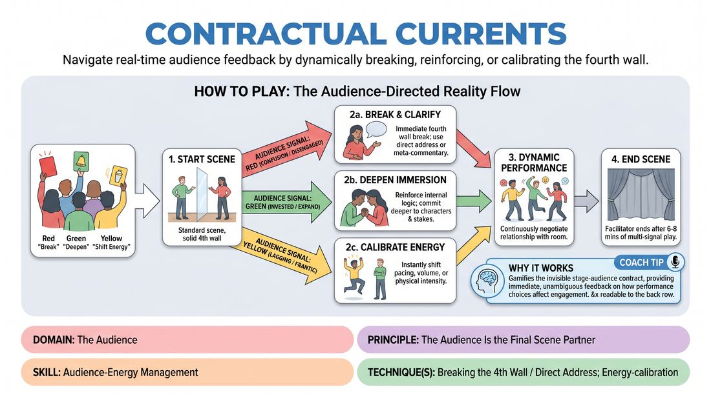

# 🎯 Scene Lab — Permeable Currents

{ .infographic }

> Navigate real-time audience feedback by dynamically breaking, reinforcing, or calibrating the fourth wall.

`Players 2–99` · `~35 min` · `Complexity 4/5` · `Energy medium` · `Contact none` · `Props: required`

⬅️ [Back to the Week 08 run-sheet](../week-08.md)

## Why this activity, here

Week 8 is the public set. Earlier blocks built the piece from the inside — openings, callbacks, group shape. This block turns the performers outward for the first time and makes the audience a live instrument rather than a wall to play at. It feeds directly into the set itself, where the room will give the same signals without cards and the cast has to read them.

## What students actually learn

- The fourth wall stops being a fixed rule and becomes something they can set, hold and drop on purpose.
- They can feel confusion in a room before it becomes silence, and they stop guessing whether they are landing.
- Breaking out and going back in is a craft move with a technique — turn out, project, then rebuild — not a collapse of the scene.
- Tempo is a choice they can make at any moment without abandoning the character.

## Setup

Chairs in a shallow arc facing a clear playing space, so performers can see faces. Three coloured cards per audience member — red, green, yellow — A5 or bigger, printed or hand-coloured. Twenty sets is plenty; make them the night before. Keep bells and buzzers out of it unless the room is large; cards are quieter and less startling. Have a stool or two on stage. Know your suggestion prompts in advance: a location, a relationship. Nothing else needed.

## How to run it — 35 minutes

| Min | What you do |
|---:|---|
| 4 | Hand out the card sets. Teach the three signals. Demonstrate each yourself: stand, break out on red, deepen on green, drop tempo on yellow. Say the rule about one signal at a time. |
| 5 | First scene. Two performers, location suggestion. Tell the audience to use red only for the first two minutes, then open all three. Cut at five. |
| 3 | Note it briefly. Ask the audience what triggered each red. Ask the performers what they felt before the card went up. Do not fix everything — name one thing. |
| 7 | Second scene. Three performers, relationship suggestion. Full card set live from the top. Side-coach for readability of transitions, not for content. |
| 4 | Swap the whole audience-performer split if numbers allow. Reset the cards. Give the incoming performers one instruction each, drawn from what you just saw. |
| 8 | Third scene. Three or four performers. Let it run long. Intervene only if signals are being spammed or ignored. Aim to end it on a landing, not a cut. |
| 4 | Debrief seated, cards down. Two questions, short answers. Close with the cue and move on. |

## Side-coaching script

| When | Say |
|---|---|
| First red of the session, as they turn out | *"Cheat out. Voice up. Talk to the back row."* |
| Immediately after a break-out lands | *"Back in. Rebuild the room."* |
| Green is up and performers keep glancing at the audience | *"Nobody out there exists. Deeper."* |
| Yellow is up and the change is invisible | *"Bigger shift. Same person."* |
| Three or four cards go up at once | *"House — one signal. Choose."* |
| A break-out turns into apologising or commenting on the game | *"Comment on the scene, not on yourselves."* |
| Scene has been running five minutes with no shape | *"Find the ending. Serve the piece."* |
| Last thirty seconds of the third scene | *"Land it. No new information."* |

!!! success "What good looks like"
    Cards go up in ones and twos, from genuine reactions, not from people wanting to see what happens. Performers change register within a second of seeing a card, and the change is obvious from the back of the room. Break-outs are brief, useful and get folded back in without a seam. On green the scene visibly thickens — slower, more specific, more at stake. The audience stops watching each other's cards and starts watching the stage. The third scene needs fewer signals than the first because the performers are reading the room before it asks.

## When it goes wrong

| You see | What's causing it | The fix |
|---|---|---|
| A forest of cards, changing every few seconds, performers whiplashing between modes. | The audience has turned the cards into a toy. Signalling for effect, not from experience. | Stop the scene. Take the cards back for thirty seconds. Reissue with a hard rule: one card each per minute, and you must be able to say why. Enforce it once and it holds. |
| Green goes up and nothing changes on stage. | Performers do not know what 'deeper' means physically, so they default to more talking. | Side-coach a concrete action: slow down, touch one object in the environment, say the thing the character has been avoiding. Give them a verb, not an adjective. |
| Break-outs become stand-up — performers step out and try to be funny at the audience. | Direct address reads as a licence to abandon the character. | Call 'the character breaks out, not the actor.' Have the performer step out, say one clarifying line about the situation, and step straight back. Rerun the moment if needed. |
| The audience sits frozen, nobody signals at all. | They are afraid of judging their classmates, or unsure they are allowed to. | Name it. Say the cards are information, not criticism, and that a scene with no reds is a scene nobody watched. Then hold up a red yourself to break the seal. |

## Scaling

| Class size | What changes |
|---|---|
| **10–13** | Three scenes, two performers each, so nearly everyone plays once. Everyone in the house gets their own card set. Keep the timings as written; the third scene can take four performers to catch stragglers. |
| **14–17** | Three scenes as written but push to three and four performers each so twelve to fifteen people get up. Share card sets between pairs in the back row. Shorten the mid-block swap to three minutes and add a minute to the third scene. |
| **18–20** | Split the house into two halves after the first scene. Half signals while the other half plays and vice versa, so everyone both performs and signals. Run four performers per scene. Cut the mid-block swap to two minutes and hold the third scene at eight; accept that two or three people watch only. |

## Variations

**Caller's chair** — You hold the only set of cards. The audience watches without props. You call red, green and yellow from the side of the room.  
*Easier. Removes the audience-management problem entirely and lets performers learn the three transitions cleanly before the room gets a vote.*

**No reset** — After a red break-out, performers may not return to the same moment. They must rebuild the scene one beat further along, in a different physical configuration.  
*Harder. Forces the break to cost something, so performers stop using direct address as an escape hatch from a difficult beat.*

**Silent house** — Collect the cards. The audience reacts naturally — leaning in, laughing, going still. Performers must name out loud, once per scene, what they think the room is asking for, and act on it.  
*Shifts emphasis from responding to instructions towards reading an unprompted room, which is what the public set actually gives them.*

## Debrief

1. **What did the red card actually feel like from on stage?**
   > *A good answer sounds like:* Something concrete about information — 'I knew we'd lost them and I was relieved to be told' or 'I realised we never said where we were.' Not 'it was scary.' If you get 'scary', ask what the fix was.

2. **Which mode was hardest to switch into, and why?**
   > *A good answer sounds like:* Usually green. A good answer names the technique gap — 'going deeper meant slowing down and I kept adding jokes instead.' Move on once someone names a physical difference, not just a feeling.

3. **In the public set there are no cards. What are you going to watch for instead?**
   > *A good answer sounds like:* Specific observable signals — the sound of the room going flat, people shifting in seats, a laugh that arrives late. If the answers stay abstract, offer one of your own and stop.

!!! warning "Safety & inclusion"
    No physical contact in this activity. If a scene heads towards contact, the usual class agreement applies: ask in character or step out and ask. Use cards rather than buzzers or bells — sudden noise is harder on anyone with sensory sensitivity, and it startles performers into worse choices. Signalling is a full role: anyone who does not want to perform today can stay in the house all block and still be doing the work. Say that out loud at the top. Make clear that a red card means 'I am lost', never 'you are bad'; correct anyone who frames it as scoring. Seat anyone with limited mobility with a clear sightline and let them signal from where they sit; the stage arc should accommodate a chair.

## Why it works

D5.S3 is stage presence and clarity, and both are usually taught as guesswork — perform bigger, hope it reads. This block replaces the guess with a measurement. The red card is direct evidence that the piece is not landing, delivered in the second it stops landing, so the performer builds an association between an internal state and an external result. That association is what lets them read a silent room later. Green does the opposite job: it rewards commitment with permission to go further, which is the only way people learn that depth is a resource rather than a risk. Yellow separates tempo from character, so energy stops being something performers can only get from playing louder. The cue — serve the piece — is the tiebreaker across all three: every signal is the room telling you what the piece needs, and the performer's job is to supply it, not to defend the choice they were already making.

[Open the full activity card »](../../../../games/D5_P1_S2_T3_G105__contractual-currents.md){target=_blank rel=noopener}
