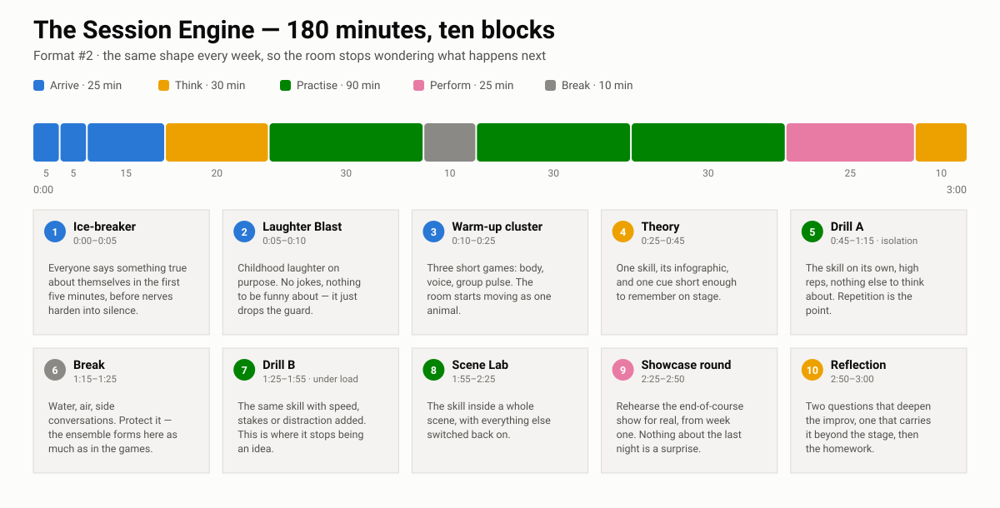
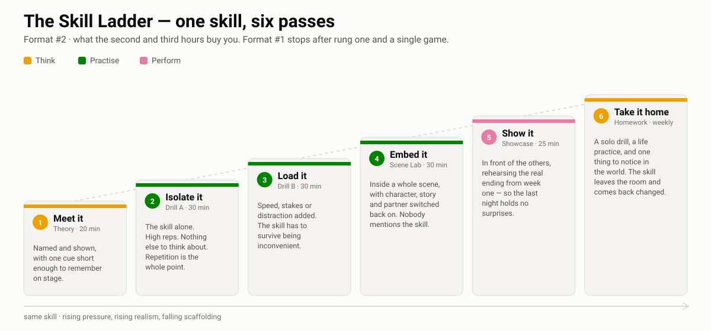

# 🏔️ Format #2 — The 8-Week Deep Dive

> **8 Wks × 3 Hrs/Wk** · three courses · every course ends in a public showcase

A course you run with a fixed cohort of 10–20. Each session takes one skill and drills it three ways — alone, under load, then inside a whole scene — which is what the third hour buys you. If you only have an hour a week, [Format #1](../format-1/index.md) covers the same framework at a different cadence; [how the two compare](../index.md).

| Course | Stage | Weeks | Showcase |
|---|---|---:|---|
| [Foundations — The Brave Beginner](01_beginner/index.md) | Novice → Advanced Beginner | 8 | Two-Chair Night · First Games Night |
| [The Engine — Scene & Ensemble](02_intermediate/index.md) | Advanced Beginner → Competent | 8 | The Match · Genre Night |
| [The Piece — Long-Form & Audience](03_advanced/index.md) | Competent → Proficient | 8 | The Harold · The Movie / Armando |

## Every session is the same ten blocks

Print this one. It answers the question every new cohort asks in week 1 — *what are we actually going to do for three hours?*

{ .diagram }

| | Block | Min |
|---|---|---:|
| 🧊 | Ice-breaker | 5 |
| 😄 | Laughter Blast | 5 |
| 🔥 | Warm-up cluster | 15 |
| 🧠 | Theory | 20 |
| 🎲 | Drill A | 30 |
| ☕ | Break | 10 |
| 🎲 | Drill B | 30 |
| 🎯 | Scene Lab | 30 |
| 🏟️ | Showcase rehearsal | 25 |
| 💭 | Reflection | 10 |

## Why three hours

One hour gets a skill named and played once. Three hours gets it **isolated, loaded, embedded and shown** — and then sent home. That is the whole argument for this format:

{ .diagram }

## Also here

- [Homework packs](homework/index.md) — one per session
- Activity library — [Ice-Breakers](library/icebreakers/index.md) · [Laughter Blasts](library/laughter/index.md) · [Warm-Ups](library/warmups/index.md) · [Drills](library/drills/index.md) · [Showcase Formats](library/showcase-formats/index.md)
- [Sources & Acknowledgements](sources.md)
