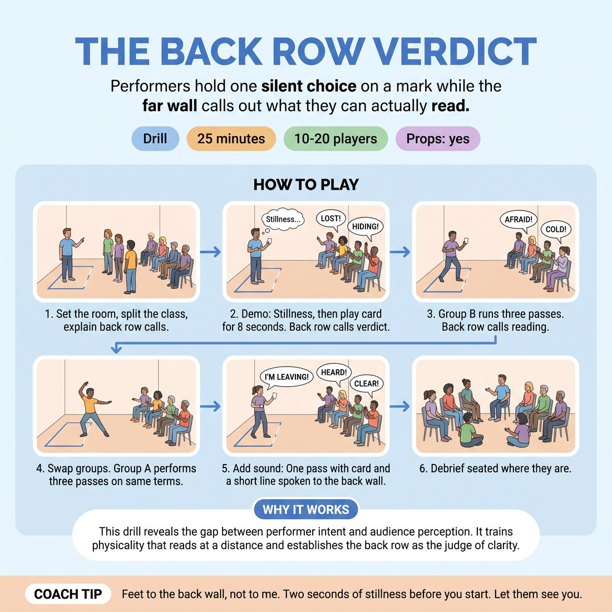

# The Back Row Verdict

{ .infographic }

> Performers hold one silent choice on a mark while the far wall calls out what they can actually read.

`Players 10–20` · `~25 min` · `Complexity 2/5` · `Energy medium` · `Contact none` · `Props: required`

## What it isolates

Making one choice readable from the furthest seat in the room. Dialogue, partners, story and justification are all removed — there is nothing to listen to and nothing to build, so the only variable is whether the body and voice carry the choice across the distance.

**Reps per person:** Three eight-second reps plus one sound rep at 14-17 people. Four plus one at 10-13. At 18-20 it drops to two plus one, which is why the class runs as two parallel stations.

## Setup

Tape a mark on the floor at one end of the room. Put chairs in a row against the opposite wall, as far back as the space allows. Write about twenty simple states on index cards: waiting in the cold, reading bad news, sneaking past a sleeping dog, refusing to cry.

## How to run it

1. Set the room (3 min). Mark on the floor, chairs at the far wall. Split the class in half: Group A on chairs, Group B queueing beside the mark. Explain the back row calls the verdict.
2. Demo it yourself (2 min). Stand on the mark, feet and chest angled out, hold stillness two seconds, then play one card for eight seconds. Back row calls one word each.
3. Group B runs three passes (7 min). Hand a card face down. Performer steps on, stills, plays eight seconds, steps off. Back row calls their reading. Say nothing else. Next.
4. Swap groups (7 min). Group A performs three passes on the same terms. Group B now sits and calls verdicts. Keep the queue moving; no coaching between reps.
5. Add sound (3 min). One more pass each side: same card, same eight seconds, plus one short line spoken to the back wall. Back row calls whether they heard every word.
6. Debrief seated where they are (3 min).

## Side-coach

- *"Feet to the back wall, not to me."*
- *"Two seconds of stillness before you start. Let them see you."*
- *"One choice. Don't add a second idea to rescue the first."*
- *"Take it to your fingers and your jaw, not just your face."*
- *"Back row — one word only. If you can't read it, say unclear."*

## Build it up

- Move the chairs another two metres back, or into the corridor doorway, and repeat the last card.
- Take away the face: performers play the card with their back three-quarters turned, so it must live in the spine and hands.
- Give two performers the same card at once on two marks; the back row calls which one they read first and why.

## The same drill under load

Run the back row as live editors. They hold a thumb down for as long as the choice is unreadable, and the performer must adjust in the moment without leaving the mark. Add a countdown: you call five, four, three, two, one, off. Anyone still under a thumbs-down at zero takes the same card again at the end of the pass.

## If it stalls

- Performers mush three ideas together. Cut the time to five seconds and say: one thing, all the way.
- The back row goes polite and vague. Ban praise. They give a noun or a verb, or they say unclear — that is the most useful word in the room.
- Someone freezes on the mark. Let them stand there for the full eight seconds, then move on. Standing still under eyes is the skill; do not rescue them.

## Ask afterwards

1. Which of your choices got read correctly, and what were you doing physically that the back row could see?
2. What felt overdone from the mark but landed as normal from the chairs?
3. When you sat in the back row, what made someone easy to read?

## Scale

| Class size | What changes |
|---|---|
| 10–13 | Two groups of five or six. Everyone gets four passes plus the sound pass. You will finish early — add a fifth pass rather than lengthening the debrief. |
| 14–17 | Two groups of seven or eight. Three passes each side plus the sound pass. Keep a strict twenty seconds per rep or you will overrun. |
| 18–20 | Split into two separate stations with two marks and two back rows of five, running simultaneously at opposite ends. You float between them. Two passes each plus the sound pass; say so up front, and give the second-station cards to a confident student to hand out. |

## Safety & inclusion

No contact in this drill. Anyone may hand a card back unread and take another, no reason needed. Keep choices standing or seated on a chair — no floor drops, no running at the mark. Warn the group before the sound pass so nobody is startled by a shout.

## Lineage

In the Stage-acting training in projection and playing out, borrowed into improv teaching as readable-choice work. tradition. Common teaching ideas — cheat out, play for the back row, make the choice readable — reworked into a timed reps drill with the audience giving a one-word verdict. The verdict step is the change: students get external data instead of a teacher's note, and 'unclear' is treated as information rather than failure.
