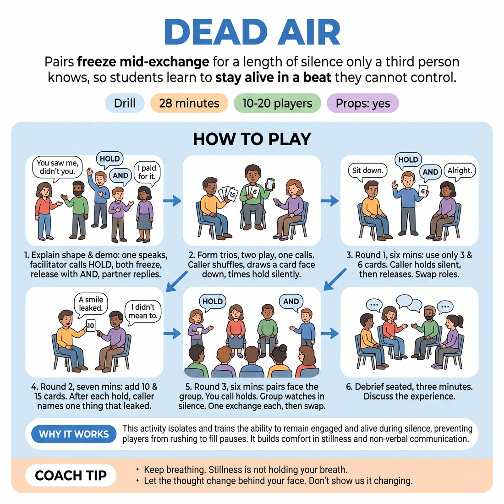

# Dead Air

{ .infographic }

> Pairs freeze mid-exchange for a length of silence only a third person knows, so students learn to stay alive in a beat they cannot control.

`Players 10–20` · `~28 min` · `Complexity 4/5` · `Energy low` · `Contact none` · `Props: required`

## What it isolates

Staying alive and readable inside a silence you did not choose the length of. Line-writing is removed (lines come from the board), movement is removed (both performers freeze), and control of the duration is removed (a third person holds the card). Only the quality of the held moment is left.

**Reps per person:** Roughly ten to twelve holds each at 12-15 people, counting both rounds at the chairs. At 18-20 it drops to about eight, because only four pairs get the front-of-room round; the rest keep working in trios so nobody sits idle.

## Setup

Set out pairs of chairs facing each other around the room, plus a clear playing area at one end with two chairs facing the group. Each trio needs four cards marked 3, 6, 10 and 15, and one phone timer. Write six loaded opening lines on the board, e.g. "You saw me, didn't you." / "Sit down." / "I paid for it."

## How to run it

1. Explain the shape and demo with one volunteer for four minutes: you speak a line, call "hold", both freeze, you release with "and", volunteer replies. Nothing else happens.
2. Form trios and hand out cards and timers, two minutes. Two play, one calls. The caller shuffles, draws a card face down and times the hold silently.
3. Round one, six minutes: use only the 3 and 6 cards. Performer takes a line from the board, caller says "hold", both freeze until "and", partner replies. Swap roles each exchange.
4. Round two, seven minutes: add the 10 and 15 cards, shuffled so nobody knows the length. After each hold the caller names one thing that leaked — a smile, a shift, an eye drop.
5. Round three, six minutes: pairs come to the chairs facing the group. You call the holds. The rest watch in silence. One exchange each, then swap the pair out.
6. Debrief seated, three minutes.

## Side-coach

- *"Keep breathing. Stillness is not holding your breath."*
- *"Let the thought change behind your face. Don't show us it changing."*
- *"Don't decorate the silence. No nodding, no sighing."*
- *"You don't know when it ends. Stay with your partner, not with the clock."*
- *"Release into the line. Don't restart yourself first."*

## Build it up

- Add a 20-second card to every trio's deck mid-round without announcing it.
- Let the caller call a second hold in the middle of the reply, mid-sentence.
- Remove the release cue entirely: the performer chooses their own moment to break, and the caller says only "early", "right" or "late" afterwards.

## The same drill under load

Run round three again with the watchers instructed to react audibly — laugh, cough, shift, murmur. The performer holds anyway and must not acknowledge it. Then add one card marked 25 to the deck without telling them.

## If it stalls

- If trios giggle through every hold, drop back to 3-second cards only and rebuild. Laughter at the start is normal; name it, don't punish it.
- If performers go blank and glassy, give the held moment one concrete internal task: decide whether to tell the truth, and decide it before the release.
- If they invent long conversations instead of holding, cut them to the board lines only for two rounds.

## Ask afterwards

1. Where did the urge to fill the silence show up in your body first?
2. As a watcher, what was different about a fifteen-second hold compared with a three?
3. Which held moment made you lean in, and what was the performer actually doing?

## Scale

| Class size | What changes |
|---|---|
| 10–13 | Four trios, one pair working with you as caller if the number is odd. In round three every pair gets to the chairs — five or six pairs, one exchange each. |
| 14–17 | Five or six trios. Round three: six pairs to the chairs, one exchange each, forty-five seconds a pair. Keep the swap silent so the room stays held. |
| 18–20 | Six or seven trios. In round three only four pairs come up — pick a spread of confident and hesitant. The remaining trios keep running quietly at their chairs for those six minutes, so they lose no reps. |

## Safety & inclusion

No contact in this drill. Prolonged standing stillness can make people light-headed: keep knees soft, keep breathing, and anyone may sit or step out at any point without explaining. Sustained eye contact is optional — offer the alternative of looking at a partner's forehead or a fixed point past their shoulder, and say so before round one.

## Lineage

In the Actor-training stillness work and repetition-style listening exercises tradition. Written from scratch. The common versions let the performer choose when the pause ends, which trains anticipation rather than presence. Handing the clock to a third person, face down, removes that control and makes the not-knowing the whole exercise.
