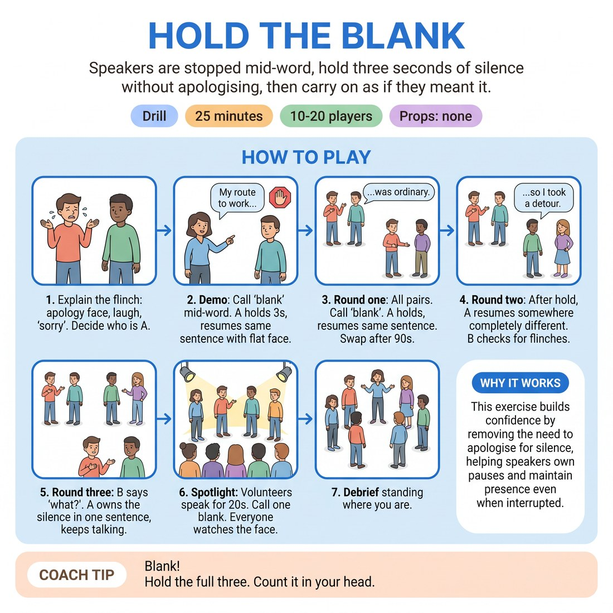

# Hold the Blank

{ .infographic }

> Speakers are stopped mid-word, hold three seconds of silence without apologising, then carry on as if they meant it.

`Players 10–20` · `~25 min` · `Complexity 2/5` · `Energy medium` · `Contact none` · `Props: none`

## What it isolates

The behaviour immediately after losing your thread. Content, wit and scene partners are stripped out: speakers talk about fridges and bus routes, so nothing depends on the material and the only thing on show is what the face and voice do in the three seconds after the stop.

**Reps per person:** About five blanks per round, three rounds, so roughly fifteen recovery reps each in pairs. At 10-13 everyone also gets one spotlight rep; at 18-20 only four to six people do, so protect the pair rounds and treat the spotlight as a sample.

## Setup

Pairs, standing, spread around the room facing each other. No chairs, no props. If numbers are odd, make one trio and rotate the extra person through as observer.

## How to run it

1. Explain the flinch: the apology face, the laugh, the 'sorry', the 'where was I'. That is what we are removing. Pairs decide who is A. (2 min)
2. Demo with one volunteer. They talk about their route to work. Call 'blank'. They stop mid-word, hold three seconds, resume the same sentence, flat face. (2 min)
3. Round one, all pairs at once. A talks about anything ordinary. Call 'blank' roughly every twenty seconds. Hold three, resume the same sentence. Swap after ninety seconds. (6 min)
4. Round two, same shape. After the hold, A resumes somewhere completely different and covers the gap as if the pause was deliberate. B reports any flinch afterwards. Swap. (5 min)
5. Round three. After each hold, B says 'what?' A owns the silence in one sentence and keeps talking. Swap. (5 min)
6. Spotlight: four to six volunteers speak in front of the room for twenty seconds each. Call one blank per speaker. Everyone watches the face, not the words. (3 min)
7. Debrief standing where you are. (2 min)

## Side-coach

- *"Blank!"*
- *"Hold the full three. Count it in your head."*
- *"Face stays neutral. No sorry, no laugh."*
- *"Resume like the silence was punctuation."*
- *"Observers, watch the face, not the words."*

## Build it up

- Lengthen the hold from three seconds to five.
- Call two blanks in quick succession, so the recovery is interrupted by another blank.
- After the hold, the partner says 'what?' and the speaker must own the silence in one sentence and continue.

## The same drill under load

Speaker stands in front of half the room. Caller blanks them unpredictably, sometimes twice within ten seconds. Observers snap their fingers the instant they see a flinch, and the speaker must keep talking through the snapping without addressing it.

## If it stalls

- Speakers dry up before you even call blank. Give a fixed topic per round: contents of your fridge, your route here, the last thing you queued for.
- Everyone laughs through the hold. That is the flinch. Name it, do not scold it, run the round again with the hold at two seconds.
- Someone genuinely cannot restart. For round one only, let them repeat their last three words as an on-ramp, then drop that crutch.

## Ask afterwards

1. What did your face do in the three seconds, and what did you want it to do?
2. Which was harder: resuming the same sentence, or covering the gap as if you meant it?
3. Where in a scene have you already done the apology face without noticing?

## Scale

| Class size | What changes |
|---|---|
| 10–13 | Five or six pairs, one trio if odd; the third person observes and swaps in each round. Spotlight takes four volunteers. Everything runs simultaneously. |
| 14–17 | Seven or eight pairs. Room gets loud, so push pairs to the walls and project your 'blank' call. Spotlight takes six volunteers in two batches of three, half the room watching each. |
| 18–20 | Ten pairs. Split the room into two halves at opposite ends; appoint a caller in each half to clap instead of you calling, and float between them. Spotlight reaches only four to six people, so say so up front and keep it to twenty seconds each. |

## Safety & inclusion

No contact. Speakers choose their own topic and nothing personal is required; ordinary and dull is ideal. Anyone may pass on the spotlight round without explanation and stay as an observer.

## Lineage

Written from scratch. The habit it targets — apologising out loud for a blank — gets named in most beginner classes; the enforced three-second hold, the partner's flinch report and the 'what?' challenge are ours, built to give reps on the recovery beat rather than on the mistake.
