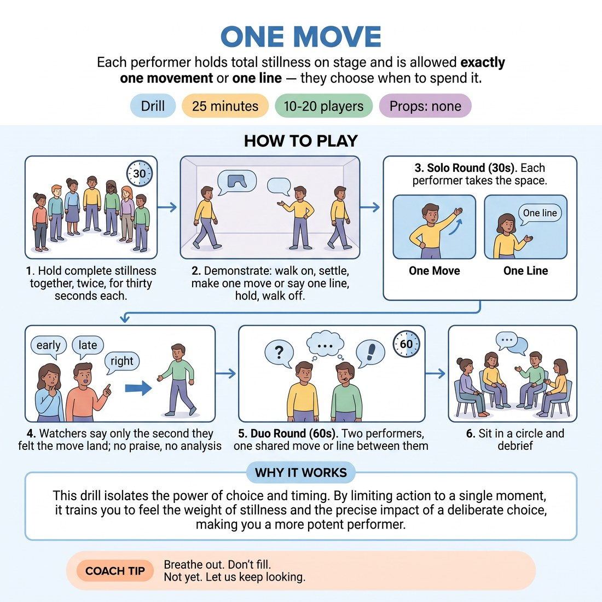

# One Move

{ .infographic }

> Each performer holds total stillness on stage and is allowed exactly one movement or one line — they choose when to spend it.

`Players 10–20` · `~25 min` · `Complexity 4/5` · `Energy low` · `Contact none` · `Props: none`

## What it isolates

Holding stillness under an audience's attention and choosing the exact moment to break it. Dialogue, character, relationship and blocking are all removed — the performer is allowed one movement or one line and nothing else, so the only variable left is timing.

**Reps per person:** At 14-17 people: one solo rep and one duo rep each. At 10-13: two solos and one duo. At 18-20 the solo round runs in two split circles, so each person still gets one solo and one duo but only half the room watches the solo.

## Setup

Chairs in a horseshoe facing a clear playing area, close enough that watchers can see a performer's breathing. You keep time on a phone or by silent count. Nothing else needed.

## How to run it

1. Frame it in one line: stillness is a choice the room can read. Then stand everyone up and hold complete stillness together, twice, thirty seconds each. (3 min)
2. Demonstrate one rep yourself: walk on, settle, hold. Spend your one move or one line somewhere in the middle. Hold again. Walk off. (2 min)
3. Solo round. Each performer takes the space for thirty seconds. They may make exactly one movement or say exactly one line. Everything else is stillness. (10 min)
4. After each solo, watchers say only the second they felt the move land — 'early', 'late', 'right'. No praise, no analysis. Move straight to the next performer. (folded into round)
5. Duo round. Two performers hold stillness together. Between them they get one move total, so they must find it silently. Sixty seconds per pair. (7 min)
6. Sit and debrief. (3 min)

## Side-coach

- *"Breathe out. Don't fill."*
- *"Not yet. Let us keep looking."*
- *"Boring for you is not boring for us."*
- *"Spend it. Then go still again."*
- *"Eyes up, feet planted, back row can see you."*

## Build it up

- Remove speech. Movement only, and it must be readable from the back row.
- Two performers, one move shared between them, negotiated in silence with no eye contact.
- Stack three performers on stage with one move between all three, and add the unpredictable timer from the loaded version.

## The same drill under load

Don't tell performers how long the hold lasts. Start them, then call 'now' at an unpredictable point between twenty and ninety seconds — they must place their one move before you call it, or forfeit the rep. Watchers may shift, cough and whisper as a real room does.

## If it stalls

- If people fidget or giggle through the hold, drop solos to fifteen seconds and build back up in five-second steps.
- If watchers laugh at nerves, give them a job: count the performer's breaths, then report the count instead of an opinion.
- If everyone spends the move in the first two seconds, ban the first ten seconds outright for the next three performers.

## Ask afterwards

1. What happened in your body between second five and second twenty?
2. When someone waited too long, what did you start doing as a watcher?
3. Which was harder — holding still, or choosing the moment to stop holding?

## Scale

| Class size | What changes |
|---|---|
| 10–13 | One horseshoe. Solos run forty seconds and you get two full solo rounds before the duos, so each person banks two solo reps plus one duo. |
| 14–17 | One horseshoe. Solos at thirty seconds, one round. If numbers are odd, run one trio in the duo round with still only one move shared between three. |
| 18–20 | Split into two horseshoes in opposite corners, each with an appointed timekeeper; solos drop to twenty-five seconds and swap timekeepers halfway. Reconvene whole-group for six duos only. Fewer people see each solo — say so. |

## Safety & inclusion

Locked knees and held breath cause light-headedness. Tell people stillness means soft knees and normal breathing, and that sitting down or stepping off mid-rep is a legitimate choice, not a failure. No contact in the duo round.

## Lineage

Written for this course. Studio stillness work usually trains stillness as status or as a warm-up hold; here the whole rep is a budget of one action, so the trainable thing is when you spend it rather than whether you can stay put.
