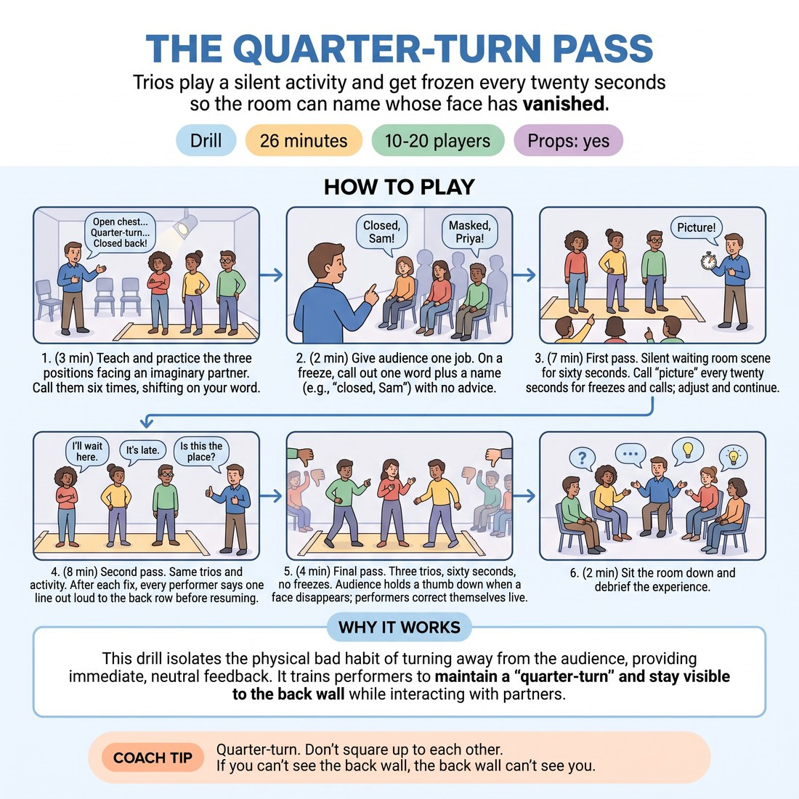

# The Quarter-Turn Pass

{ .infographic }

> Trios play a silent activity and get frozen every twenty seconds so the room can name whose face has vanished.

`Players 10–20` · `~26 min` · `Complexity 2/5` · `Energy medium` · `Contact none` · `Props: required`

## What it isolates

Readable body position on stage — staying open to the audience and not masking a partner. Dialogue, character, story and any need to be interesting are stripped out; the activity is fixed and silent, so the only variable left is where the bodies point.

**Reps per person:** At fifteen people: five trios, two turns each, three freezes per turn. Six corrections and six spoken lines per person, roughly three minutes on stage. At twenty it drops to four corrections each.

## Setup

Seat everyone in one bank of chairs against a single wall — this is the audience and it never moves. Mark a shallow playing strip in front of it with tape or two chairs. Split the rest into groups of three.

## How to run it

1. (3 min) Everyone stands and faces an imaginary partner. Teach three positions: open chest to the wall, quarter-turn, closed back. Call the positions six times. They shift on your word.
2. (2 min) Give the audience its only job. On a freeze, call out one word plus a name: "closed, Sam" or "masked, Priya". No advice, no jokes, no notes on anything else.
3. (7 min) First pass. Each trio plays a silent waiting room on the strip for sixty seconds. Call "picture" every twenty seconds. They freeze, take the calls, adjust, keep going.
4. (8 min) Second pass. Same trios, same activity. After each fix, every performer says one line out loud to the back row before the scene resumes.
5. (4 min) Final pass. Three trios, sixty seconds, no freezes. Audience holds a thumb down whenever a face disappears. Performers correct themselves while still playing.
6. (2 min) Sit the room down and debrief.

## Side-coach

- *"Quarter-turn. Don't square up to each other."*
- *"If you can't see the back wall, the back wall can't see you."*
- *"Fix it inside the activity — take a step, reach for something."*
- *"Stagger yourselves. Nobody stands in a straight line."*
- *"Line to the last chair, not to your partner's shoes."*

## Build it up

- Add a fourth performer to each group. Masking gets much harder with four.
- Put a table or two chairs in the middle of the strip and make them use it.
- Call "picture" at random — sometimes five seconds apart, sometimes thirty.

## The same drill under load

Run the second pass, then move the audience. Halfway through a turn, call "shift" and have the seated bank stand and re-form against a different wall. Performers must re-orient live without stopping the activity.

## If it stalls

- Trios flatten into a row facing front and stop moving. Call for depth: one upstage, one downstage, one to the side.
- The audience is too polite to name anyone. Assign each spotter one specific performer to track for the whole minute.
- Performers freeze up trying to invent content. Remind them the activity is fixed — waiting, nothing else. Position is the only thing being tested.

## Ask afterwards

1. Which correction did you get twice?
2. What did you have to give up to stay open, and did the audience notice you giving it up?
3. When you spotted, how long did a face have to be hidden before you clocked it?

## Scale

| Class size | What changes |
|---|---|
| 10–13 | Four groups of three (one pair is fine). Everyone gets both passes and the final pass. Add a fourth picture per turn. |
| 14–17 | Five or six trios. Keep turns to sixty seconds. Only three volunteer trios get the final pass; the rest stay spotters. |
| 18–20 | Six or seven trios. Cut each turn to forty-five seconds and drop the final pass entirely. Reps fall to two turns and six corrections each — say so up front so nobody waits for a third go. |

## Safety & inclusion

No contact. Watch for backward steps into chairs — keep the strip clear. Spotters name positions only, never bodies, clothing or faces; anyone who would rather not be named aloud can ask spotters to point instead. Anyone can sit out a turn and spot instead.

## Lineage

In the Proscenium stage blocking, borrowed from conventional actor training tradition. Cheating out is standard acting-school blocking, usually taught by a director correcting one actor at a time. We handed the correction to the whole room and put it on a twenty-second clock, so beginners get many small fixes instead of one note.
