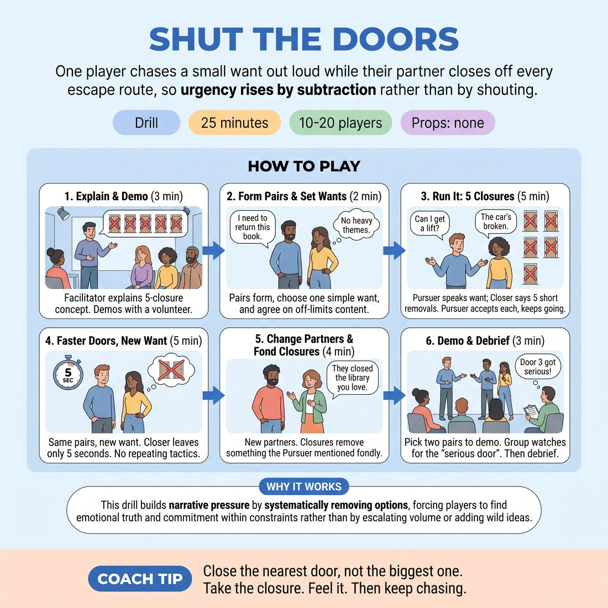

# Shut the Doors

{ .infographic }

> One player chases a small want out loud while their partner closes off every escape route, so urgency rises by subtraction rather than by shouting.

`Players 10–20` · `~25 min` · `Complexity 3/5` · `Energy medium` · `Contact none` · `Props: none`

## What it isolates

Raising stakes by narrowing options. Scene partnership, character, setting and any need to be funny are stripped out — the Closer never plays a person, only the world shutting off exits, so the Pursuer has nothing to do but want the thing harder as routes vanish.

**Reps per person:** Four goes as Pursuer and four as Closer at 10-17 people, since all pairs run at once. At 18-20 you will likely cut one round: three each way, plus one pair watched by the room.

## Setup

Clear floor. Everyone in standing pairs, spread out so pairs can talk over each other without shouting. The Closer stands just behind and to one side of the Pursuer's shoulder.

## How to run it

1. (3 min) Explain: Pursuer talks aloud chasing one dull want. Closer removes one escape route per turn, five in total. Demo one round with a volunteer.
2. (2 min) Pairs form. Each Pursuer says their want in one sentence — return a library book, get a lift home. Both agree what content is off limits.
3. (5 min) Run it. Pursuer speaks; Closer says five short removals — the shop's shut, your card's declined. Pursuer accepts each and keeps going. Finish with what they lose. Swap roles.
4. (5 min) New want, same pairs. Closer now leaves only five seconds between doors. Pursuer must not repeat a tactic already used. Swap roles.
5. (4 min) Change partners. This time each closure takes away something the Pursuer already mentioned fondly. Run once each way.
6. (3 min) Pick two pairs to run one round in front of the group. Watchers note the exact door where the want got serious.
7. (3 min) Debrief seated.

## Side-coach

- *"Close the nearest door, not the biggest one."*
- *"Take the closure. Feel it. Then keep chasing."*
- *"Louder want, not louder voice."*
- *"Name what you lose if this fails."*
- *"Five words per closure — no plot, just removal."*

## Build it up

- Drop the gap between doors from ten seconds to five, then to none.
- Ban the Pursuer from repeating any tactic, phrase or person they have already tried.
- Every closure must take away something the Pursuer mentioned earlier with affection.

## The same drill under load

Put one pair in the middle. The watching group becomes the Closer — anyone can call a door, and they will come fast and overlap. The Pursuer takes every one, cannot pause, and has sixty seconds before the facilitator calls time, at which point they must land one final line naming exactly what they have lost.

## If it stalls

- Closers inventing story instead of removing options: make every closure start with 'gone', 'already' or 'no longer'.
- Pursuers arguing with closures or finding a loophole every time: tell them the door is locked, and their job is only to want it more.
- Wants too big to start with: reset to something boringly small. Stakes rise better from a low floor.

## Ask afterwards

1. Which door made you actually want it, and what was different about that one?
2. Did your urgency come from the situation or from performing urgency? How could you tell?
3. As Closer, what did you take away that you nearly didn't dare to?

## Scale

| Class size | What changes |
|---|---|
| 10–13 | All pairs run simultaneously. One trio if odd: third person watches and calls one extra door at the end, then rotates each round. |
| 14–17 | All pairs simultaneously, same four rounds. Showcase two pairs at the end rather than one. |
| 18–20 | Run in two halves of the room to keep the noise down, or cut round three to hold the time. Showcase one pair only; everyone still gets four goes as Pursuer. |

## Safety & inclusion

Closures stay in low-harm territory: no death, serious illness, assault or real-world grief unless both partners agree beforehand. Either player can say 'next door' to skip a closure with no explanation. No contact required at any point.

## Lineage

In the Improvised scene training around objectives and obstacles; also owes something to actor-training work on playing an action against resistance. tradition. Most stakes exercises escalate by naming worse consequences. This one escalates by removing options instead, because students who only name consequences tend to announce stakes rather than feel them. The five-door count and the shoulder position are ours, to keep it mechanical and stop it drifting into a two-hander scene.
