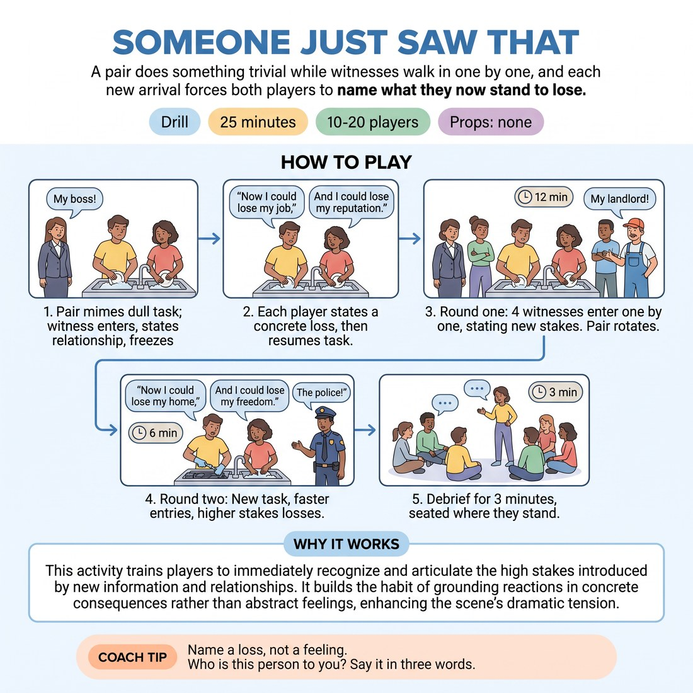

# Someone Just Saw That

{ .infographic }

> A pair does something trivial while witnesses walk in one by one, and each new arrival forces both players to name what they now stand to lose.

`Players 10–20` · `~25 min` · `Complexity 3/5` · `Energy medium` · `Contact none` · `Props: none`

## What it isolates

Raising the stakes by changing who is affected. Plot, dialogue, character voices and scene endings are stripped out — the pair only mimes a dull task and speaks one stem sentence per witness, so the only thing being practised is naming a bigger loss each time.

**Reps per person:** At 14 in two groups of seven, each person plays the pair twice and speaks four to eight stakes lines, plus six or more goes as a witness. At 20 it drops to one pair go and three lines each, so weight round two towards anyone who has not spoken.

## Setup

Clear a playing area with the rest of the group standing in a loose horseshoe around it, ready to step in. No chairs, no props — all objects are mimed. You call the tasks and the witness cues.

## How to run it

1. Explain and demo for four minutes. Two players mime a dull shared task. On your call, a witness walks in, names their relationship to one player, and freezes there, silent.
2. Teach the response. After each witness lands, Player A says one sentence: "Now I could lose…" and names a concrete loss. Player B answers: "And I could lose…" Then both resume the task.
3. Run round one, twelve minutes. Each pair gets four witnesses, roughly twenty seconds apart, all staying frozen onstage. Call "clear" and rotate the next pair in. Everyone plays once.
4. Run round two, six minutes, with escalations from Build It Up. Same pairs, new task, new witnesses. Push for faster entries and losses that cannot be undone.
5. Debrief for three minutes, seated where they stand.

## Side-coach

- *"Name a loss, not a feeling."*
- *"Who is this person to you? Say it in three words."*
- *"Keep doing the task while you say it."*
- *"Bigger than the last one — you cannot repeat a loss."*
- *"Back row needs to hear the name of the thing you lose."*

## Build it up

- Losses must now be permanent: nothing they could win back next week.
- The fourth witness gets no words — the pair must show the new cost in the body only, still doing the task.
- Witnesses arrive every ten seconds instead of twenty, and each must outrank the previous one.

## The same drill under load

Cut the interval to eight seconds and let witnesses enter unannounced rather than on your call. Add a rule that no noun may be used twice by either player across the whole round — if they repeat, the pair swaps out immediately.

## If it stalls

- Players say "now I'm embarrassed". Stop and insist on nouns you could lose: the flat, the job, the visa, custody, twenty years of friendship.
- Witnesses enter as strangers with no leverage. Rule: every witness must state a relationship to one of the two players, and must matter more than the last one.
- The pair starts inventing a plot. Cut it. They only do the task and say the one stem line — nothing else.

## Ask afterwards

1. Which witness made the situation heaviest, and what was it about that person?
2. Did your loss get bigger, or just louder?
3. What did you find yourself protecting once three people were watching?

## Scale

| Class size | What changes |
|---|---|
| 10–13 | One playing area, whole group as witnesses. Five or six pairs in round one, everyone plays once; round two covers the same pairs with new partners. Odd number: one person plays twice. |
| 14–17 | Split into two groups of seven or eight, each with its own playing area at opposite ends of the room. They run simultaneously and self-call witnesses; you move between them and time the rounds out loud for both. |
| 18–20 | Two groups of nine or ten, running simultaneously. Cut round one to three witnesses per pair so everyone still plays once, and keep round two to four pairs per group. Say plainly that reps are thinner at this size. |

## Safety & inclusion

No contact: witnesses stand at least an arm's length from the pair and stay still. Keep content fictional — do not build a witness out of a classmate's real family or real job. Anyone can say "pass" instead of entering or instead of a line, and someone else steps in without comment.

## Lineage

Built from two familiar workshop habits — ensemble walk-ons and stakes-escalation reps — pushed into one mechanic. The escalation here is who is in the room rather than how bad the consequence gets, which stops students reaching straight for death and disaster.
