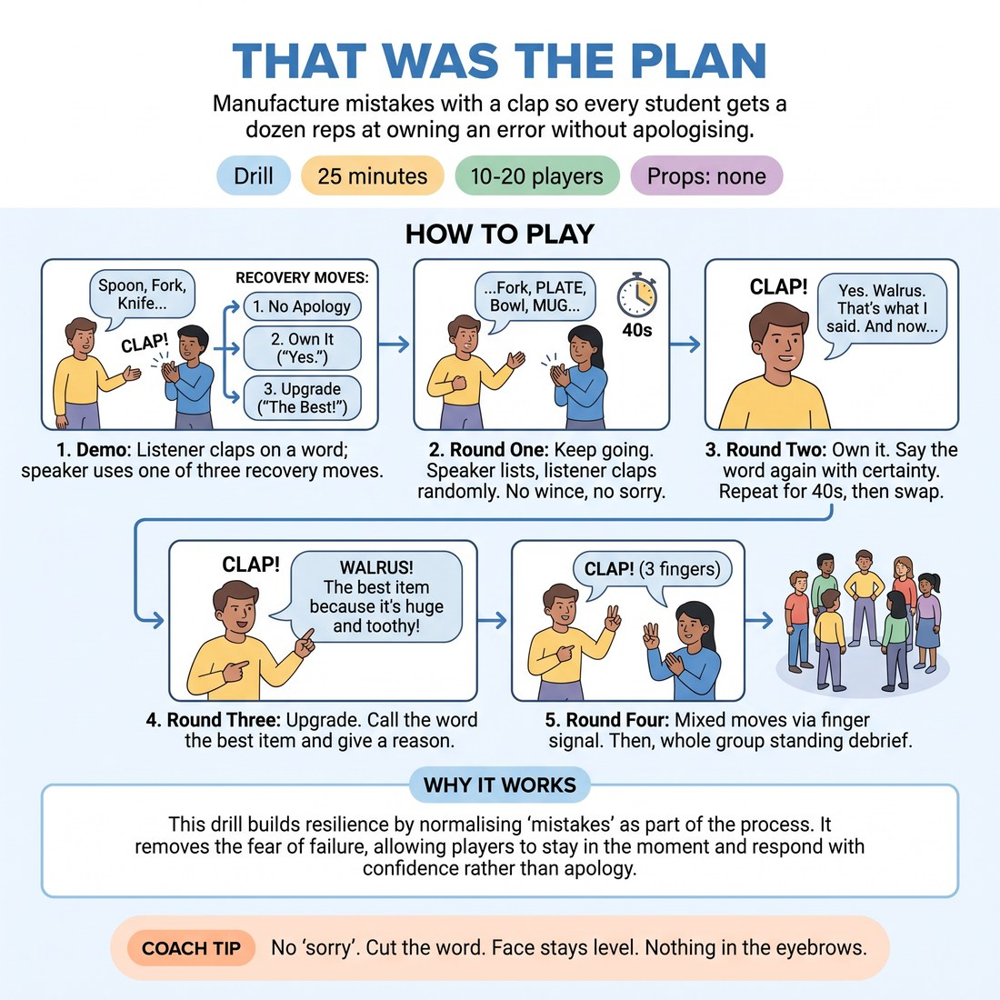

# That Was the Plan

{ .infographic }

> Manufacture mistakes with a clap so every student gets a dozen reps at owning an error without apologising.

`Players 10–20` · `~25 min` · `Complexity 2/5` · `Energy medium` · `Contact none` · `Props: none`

## What it isolates

Recovering from an error and continuing without apology. Scene, character, partner invention and any need to be funny are removed; the 'mistake' is arbitrary and imposed by a clap, so only the recovery move itself is being trained.

**Reps per person:** Rounds one to three give roughly four claps per forty-second turn, three turns each — about twelve recoveries. Round four adds four more. At 18-20 the turns shorten to thirty seconds, so budget ten to twelve each.

## Setup

Clear floor. Pairs standing, facing each other, spread to the edges of the room so claps don't cross over. No chairs, no props.

## How to run it

1. Three minutes. Pairs face off. Demo with one volunteer: they list kitchen items, you clap once, and the word they just said is now 'the mistake'. Show all three recovery moves.
2. Four minutes. Round one, keep going. Speaker lists a category for forty seconds; listener claps four or five times at random. On each clap: no apology, no wince, keep listing. Swap.
3. Five minutes. Round two, own it. On each clap the speaker says the word again, flat and certain: 'Yes. Walrus. That's what I said.' Then continues. Forty seconds each, swap, repeat.
4. Five minutes. Round three, upgrade. On each clap the speaker calls the word the best item on the list and gives one reason. Forty seconds each, swap, repeat.
5. Four minutes. Round four, mixed. Listener holds up one, two or three fingers as they clap; speaker plays that move. Forty seconds each, then swap.
6. Four minutes. Whole group in a circle. Debrief standing.

## Side-coach

- *"No 'sorry'. Cut the word."*
- *"Face stays level. Nothing in the eyebrows."*
- *"Say it like it was always the plan."*
- *"Land the recovery, then straight back to the list."*
- *"Claps are random. They are not corrections."*

## Build it up

- Speed the claps to one every four or five seconds.
- Require each recovery to be phrased differently from all previous ones in that turn.
- On the final clap the speaker must reincorporate an earlier 'mistake' word into the recovery.

## The same drill under load

Run it front of room, one pair at a time, rest of the class watching in a line. You do the clapping, faster and less predictably. Watchers applaud only recoveries with no apology tell — no flinch, no smile, no 'um'.

## If it stalls

- Speakers dry up mid-list: swap to an easier category — things in a supermarket, boys' names, animals — and let the listener call out a starting letter.
- Recoveries harden into one stock phrase said flatly: ban repeating any phrasing within a turn.
- Pairs collapse into laughter every clap: halve the speed and drop to two claps per turn until the recovery is clean.

## Ask afterwards

1. What did your body do in the half-second after the clap?
2. Which move felt honest and which felt like a trick?
3. Where in a scene would 'keep going' be enough on its own?

## Scale

| Class size | What changes |
|---|---|
| 10–13 | Five or six pairs. With an odd number make one trio: the two listeners alternate clapping duty, and the spare watches for apologies and reports one thing after each round. Speaking turns stay equal. |
| 14–17 | Seven or eight pairs running at once. Push them out to the walls so overlapping claps don't confuse anyone. Hold turns to forty seconds or the block runs over by five minutes. |
| 18–20 | Ten pairs is too loud. Split the room in half: half work, half stand at the edge as watchers. Thirty-second turns, then swap halves. Each watcher names one clean recovery per round. |

## Safety & inclusion

Say out loud that the clap is arbitrary and carries no judgement about the word. Some adults carry real shame about being wrong; let anyone stay in the listener role for a whole round without giving a reason. No contact in this drill.

## Lineage

In the Improv training on failure and error recovery tradition. The familiar version waits for a genuine flub and then asks the player to claim it, which means reps are accidental and the weakest players get the fewest. Here the mistake is manufactured by a clap, so recovery is drilled on a timer and nobody has to actually fail to practise recovering.
