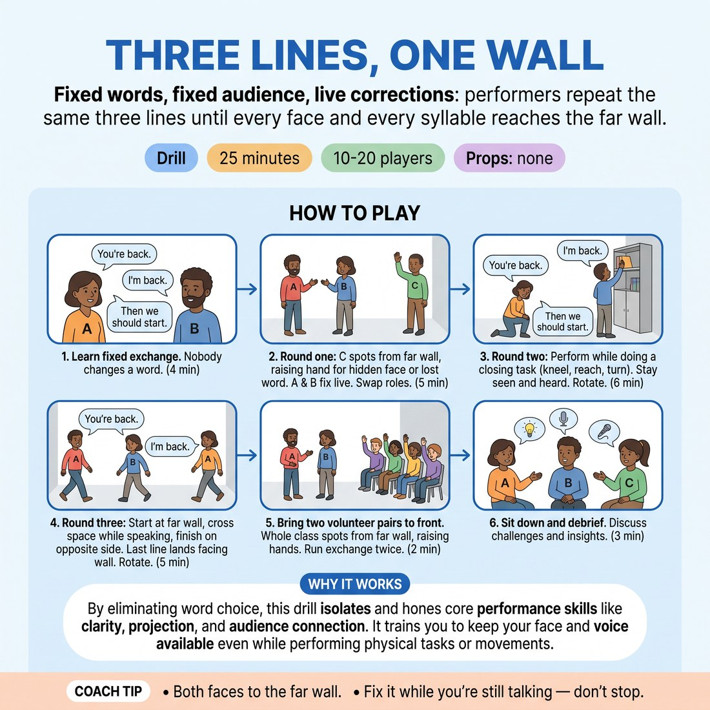

# Three Lines, One Wall

{ .infographic }

> Fixed words, fixed audience, live corrections: performers repeat the same three lines until every face and every syllable reaches the far wall.

`Players 10–20` · `~25 min` · `Complexity 2/5` · `Energy medium` · `Contact none` · `Props: none`

## What it isolates

Being seen and heard from the furthest seat. Content is removed entirely — three fixed lines every rep, no character, no story, no invention — so the only variables left are body orientation, face visibility and vocal reach.

**Reps per person:** At 15 people (five threes) each person performs twice per round across three rounds: six performing goes plus three stints as spotter. At 20, still six goes each, but only two volunteers get the front-of-room rep.

## Setup

Clear the longest wall in the room and call it the back row. Split the class into threes and spread them along the opposite side, each three with its own patch of floor. No props, no chairs.

## How to run it

1. Teach the fixed exchange all groups will use every round: A says "You're back." B says "I'm back." A says "Then we should start." Nobody changes a word. (4 min)
2. Round one: in each three, C stands at the far wall as spotter; A and B play the exchange. C raises a hand the instant a face is hidden or a word is lost, and lowers it when fixed. Swap roles every 90 seconds. (5 min)
3. Round two: same words, but each performer must do one closing task while speaking — kneel for something on the floor, look at a high shelf, turn to an imagined door. Stay seen and heard anyway. Rotate. (6 min)
4. Round three: performers start at the far wall beside their spotter, cross the whole space while speaking, and finish on the opposite side. The last line lands facing the wall. Rotate. (5 min)
5. Bring two volunteer pairs to the front. Whole class sits along the far wall as spotters and raises hands. Run the exchange twice. (2 min)
6. Sit down and debrief. (3 min)

## Side-coach

- *"Both faces to the far wall."*
- *"Fix it while you're still talking — don't stop."*
- *"Land the last word, don't drop it."*
- *"Spotters, hand up the second you lose them. Be strict."*
- *"Breath from low down. Don't push from the throat."*

## Build it up

- Spotters take one large step back before each rotation.
- Performers must deliver the middle line while facing directly away from the wall — voice alone has to carry it.
- Add a second closing task on top of the first, so both performers are low or turned for most of the exchange.

## The same drill under load

Add noise: everyone not performing hums at conversational volume. Move spotters two metres further back, outside the door if the room allows. One shot only — if a hand goes up, the pair restarts the exchange from the top.

## If it stalls

- Pairs start inventing a scene and changing the words. Cut it. The words never change; the only job is being seen and heard.
- If every hand stays up, halve the distance to the wall, get three clean reps, then move the wall back.
- If performers apologise and giggle after a hand goes up, tell spotters to keep hands raised and silent — no commentary, no reaction, just the signal.

## Ask afterwards

1. What did you physically change to bring a hand back down?
2. Which was harder to keep clear — your face or your voice?
3. What did you notice about your own habits when you had to turn away?

## Scale

| Class size | What changes |
|---|---|
| 10–13 | Four threes. With 11 or 13, make one group of four: two spotters at the wall, both with hands, and they swap in each rotation. Everyone gets the same number of goes. |
| 14–17 | Five or six threes, all spread along the same wall. Run every round as written. If a group finishes a rotation early, they repeat it rather than talk. |
| 18–20 | Six or seven threes. Split the far wall into two halves so spotters aren't crowded, and each half faces its own set of groups. Drop step five to one volunteer pair to protect the time. |

## Safety & inclusion

No contact in this drill. Volume comes from breath support, not throat pressure — stop anyone who is straining or going hoarse and have them drop to a comfortable level. Anyone who wants to stay a spotter for a round may do so without explanation.

## Lineage

In the General stage-craft training — cheating out, projection and readable choices, taught in theatre foundation classes long before improv borrowed it. tradition. Written from scratch as a drill. The usual version has a teacher shouting 'louder' from the back; here the correction is silent, peer-given and continuous, so students self-adjust mid-sentence instead of waiting for notes.
