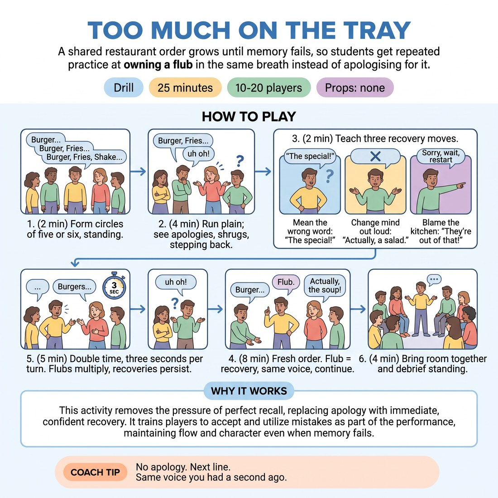

# Too Much on the Tray

{ .infographic }

> A shared restaurant order grows until memory fails, so students get repeated practice at owning a flub in the same breath instead of apologising for it.

`Players 10–20` · `~25 min` · `Complexity 2/5` · `Energy medium` · `Contact none` · `Props: none`

## What it isolates

The two seconds immediately after your own mistake. A growing memory list guarantees real errors rather than acted ones, and everything else is stripped out: no scene, no character to hide behind, no partner who can rescue you, no premise to invent. All that is left is the choice between apologising and absorbing.

**Reps per person:** In a circle of five, roughly fifteen turns each across the three rounds, of which six to ten will contain a genuine flub worth recovering from. Circles of six drop that to about twelve turns and slightly fewer flubs.

## Setup

Clear floor space for two to four standing circles of five or six, far enough apart that they do not hear each other's lists. No chairs, no props, no writing anything down.

## How to run it

1. (2 min) Form circles of five or six, standing. Explain the task: the circle builds one restaurant order. Each person repeats the whole order so far, then adds one item.
2. (4 min) Run it plain, no rules about mistakes. Let lists collapse. Stop and ask who said sorry, shrugged, laughed or stepped back. Nearly everyone did.
3. (2 min) Teach three recovery moves: mean the wrong word, change your mind out loud, or blame the kitchen. Ban sorry, wait, starting again, and stepping out.
4. (8 min) Fresh order. Any flub must be met with one recovery move, in the same voice, then the person finishes their turn. Circle continues. Collapsed lists just restart.
5. (5 min) New order at double time: three seconds per turn, keep the rhythm going. Flubs multiply. Recovery rule still applies. Nobody is ever out.
6. (4 min) Bring the room back together and debrief standing.

## Side-coach

- *"No apology. Next line."*
- *"Same voice you had a second ago."*
- *"Don't laugh it off — mean it."*
- *"Take the wrong word and keep it."*
- *"Three seconds. Go."*

## Build it up

- Adjectives required: every item needs one, and the adjective counts as part of the list.
- Double time: three seconds per turn, and keep the rhythm audible by clicking.
- Jump the order: point at anyone to take the next turn instead of going round.

## The same drill under load

Bring one circle to the front, standing in a line facing the rest of the class. Watchers stay silent — no rescue laughter. Recovery must land within three seconds of the flub; snap your fingers at three. If an apology slips out, the whole room says 'and?' and the person carries on. Two minutes per circle, then rotate.

## If it stalls

- Apologies keep slipping out: have the circle answer every sorry with a flat 'and?' so the person has to carry on.
- Memories are too good and nobody flubs: call double time, or make every item carry an adjective that also has to be repeated.
- Someone freezes hard: let them say 'pass', move the circle on with no comment, and give them the opening item of the next order.

## Ask afterwards

1. What did your body want to do the moment you lost the list, and what did you do instead?
2. Which of the three recovery moves came out most easily for you?
3. When someone recovered without apologising, what did the rest of the circle do?

## Scale

| Class size | What changes |
|---|---|
| 10–13 | Two circles of five or six. Float between them and call recovery from outside the circle. |
| 14–17 | Three circles of five or six. Appoint one student per circle as sorry-spotter, who says a flat 'and?' at any apology. Visit each circle once per round. |
| 18–20 | Four circles of five, never six, so turns come round faster. Appoint a sorry-spotter in each circle since you cannot watch them all. Cut the double-time round to three minutes and debrief with two questions only; reps drop to roughly twelve turns each. |

## Safety & inclusion

No contact in this drill. Going blank in front of a group can feel exposing, so state up front that the drill scores recovery and not memory, and that nobody is ever eliminated. Anyone may say 'pass' at their turn; the circle moves on without comment.

## Lineage

In the Parlour memory-chain games of the 'I went to the shops and bought' type, long borrowed into improv warm-ups. tradition. The traditional version rewards memory and punishes forgetting. We inverted it: the list is only a machine for generating genuine mistakes, apology is banned, and the only thing coached is the two seconds after the error.
