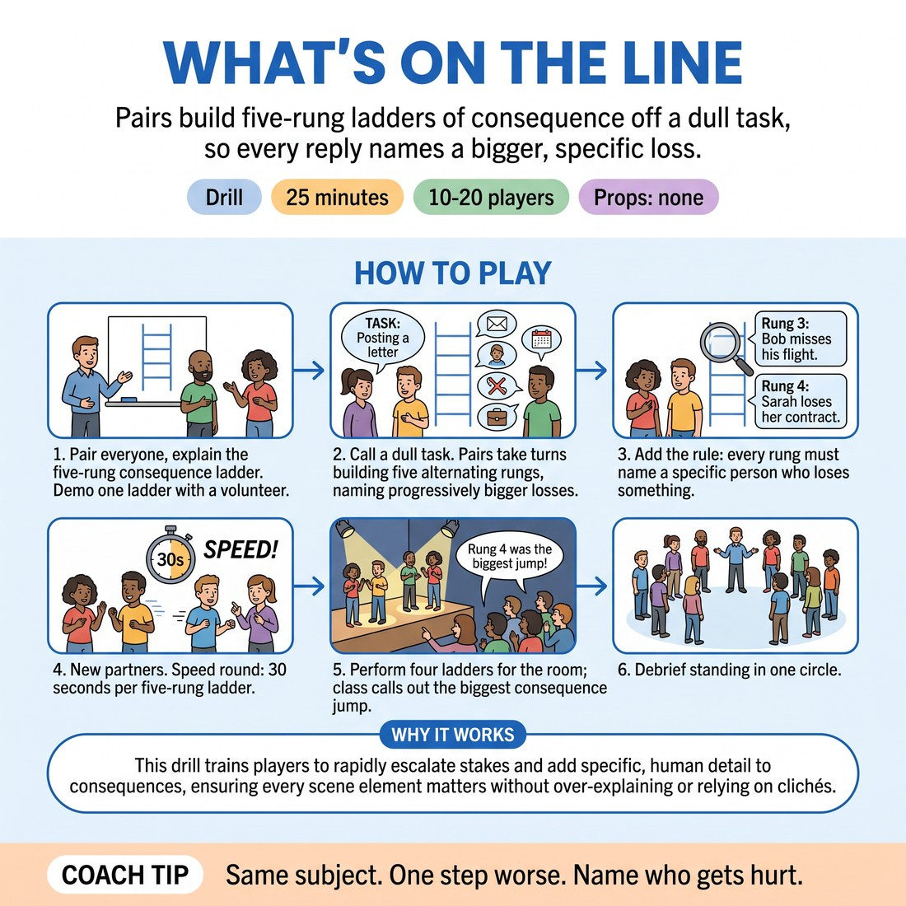

# What's On The Line

{ .infographic }

> Pairs build five-rung ladders of consequence off a dull task, so every reply names a bigger, specific loss.

`Players 10–20` · `~25 min` · `Complexity 3/5` · `Energy medium` · `Contact none` · `Props: none`

## What it isolates

Raising the stakes, and only that. There is no scene, no character, no relationship, no object work, no dialogue and nothing to justify — just five sentences per ladder, each naming a specific loss caused by the one before. Students cannot hide the escalation inside plot or jokes, so a rung that fails to climb is instantly visible to both players.

**Reps per person:** At fourteen people, each person speaks roughly fifteen rungs and hears fifteen more: five ladders led, five answered in steps two and three, plus four fast ladders. At twenty people, cut to about twelve rungs each; the fast round protects the count.

## Setup

Clear standing space. Pairs facing each other, spread around the room. You need a timer or a phone; no chairs or props required.

## How to run it

1. Pair everyone. Explain the ladder: you name a dull task, they build five rungs, each rung one sentence naming a bigger loss caused by the rung before. Demo one with a volunteer. (4 min)
2. Call a task: posting a letter. A speaks rung one, B rung two, alternating to rung five. Then swap starter, new task. Three ladders per pair. (5 min)
3. Add the rule: every rung must name a specific person who loses something. No apocalypse, no bombs, no strangers. Three more ladders, new tasks each time. (5 min)
4. New partners. Same ladders, but thirty seconds for all five rungs. Speed only — accept a rough rung and keep climbing. Four ladders. (5 min)
5. Four pairs perform one ladder each for the room, standing, projecting. Class calls out which rung was the biggest jump. (4 min)
6. Debrief standing in one circle. (2 min)

## Side-coach

- *"Same subject. One step worse."*
- *"Name who gets hurt."*
- *"Not the world — your world."*
- *"Don't explain the rung. State it."*
- *"Rung five now. Land it."*

## Build it up

- Ban the word 'because'. The loss must be stated, not argued.
- Every rung must be said as the person losing it — full emotional weight, standing, projecting to the back wall.
- Seven rungs instead of five, and rungs six and seven must be smaller and more personal than rung five.

## The same drill under load

Whole class watches one pair at a time. Clap every four seconds; a rung must land on each clap. Miss two claps and the class calls the next name in, who picks up the ladder from where it stalled. Run seven rungs, not five.

## If it stalls

- Pairs jumping straight to death or disaster: cap them at rung three and make them find three rungs between the letter and the funeral.
- Rungs that repeat rather than climb: hand each pair three categories — money, reputation, a relationship — and make them use one per rung.
- Blank pairs: give them the first two rungs yourself and let them climb from there.

## Ask afterwards

1. Which rung was hardest to find, and why?
2. What happened to the ladder when someone jumped straight to catastrophe?
3. Where in a scene would you normally have stopped climbing?

## Scale

| Class size | What changes |
|---|---|
| 10–13 | Five or six pairs. If odd, make one trio and rotate the rungs A-B-C-A-B. Three pairs perform in step five; you have time for a fifth ladder in step four. |
| 14–17 | Seven or eight pairs. Run exactly as written. Four pairs perform in step five — pick pairs who found different kinds of loss, not the four loudest. |
| 18–20 | Nine or ten pairs. Everyone still gets ten ladders, but cut step three to four minutes and step five to three minutes. Split the performing into two halves of the room showing simultaneously, one pair each, so six pairs get seen. |

## Safety & inclusion

Stakes stay fictional and stay off real bodies. Tell the room at the start: no self-harm, no sexual threat, no naming a real person in the room. Anyone who wants a different task can ask for one and gets it without explanation. No contact.

## Lineage

In the Western improv teaching on consequence and objective work tradition. Stakes-laddering is standard practice in most improv curricula, usually taught inside a scene. This version strips the scene out entirely: no characters, no dialogue, no relationship, just declarative statements of loss. Written from scratch. The rule banning apocalypse before rung five was added because beginners escalate by scale rather than by specificity, and the drill dies the moment someone says the building explodes.
