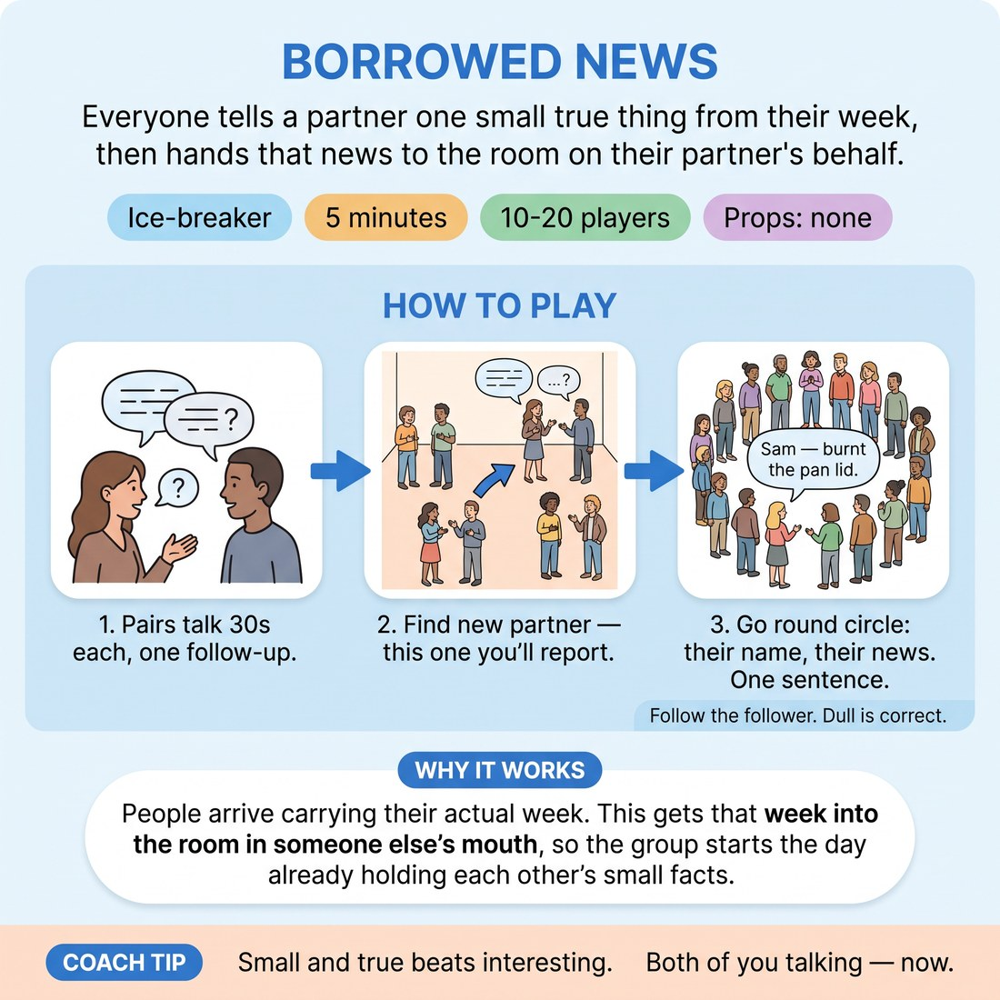

# Borrowed News

{ .infographic }

> Everyone tells a partner one small true thing from their week, then hands that news to the room on their partner's behalf.

`Players 10–20` · `~5 min` · `Complexity 2/5` · `Energy medium` · `Contact none` · `Props: none`

## The point

People arrive carrying their actual week. This gets that week into the room in someone else's mouth, so the group starts the day already holding each other's small facts.

**Everyone has spoken within 45 seconds.**

**What it reveals about the group:** Who compresses and who expands — the five-second reporters versus the ones who need a preamble. · Who actually listened: names remembered, details kept, versus vague summaries. · Who edits their partner up and who reports flatly and deadpan. · Who asks a real follow-up question and who waits politely for their turn.

## Setup

Clear floor. Get everyone standing in one big circle, then have them pair up with whoever is beside them. Odd number: you take a partner or make one trio.

## How to run it

1. (30s) Explain: in a moment you each tell your partner one small true thing from your week. Not impressive. Actual. A meal, a purchase, a text, a walk.
2. (60s) Call go. Both partners talk at once, roughly thirty seconds each. Ask one follow-up question of your partner. Call the halfway swap yourself.
3. (30s) Break the pairs. Everyone finds a new partner across the room, ideally someone they haven't spoken to today. Same prompt, new news.
4. (60s) Second round, same rules. Talk at once, one follow-up question each, you call the halfway swap. Warn them: you will be reporting your partner's news.
5. (90s) Reform the circle. Go round: each person says their most recent partner's name and their news in one sentence. Five seconds each, no commentary.
6. (30s) Close. Ask for a show of hands from anyone whose news came back sounding better than they told it. Move straight into the warm-up.

## Side-coach

- *"Small and true beats interesting."*
- *"Both of you talking — now."*
- *"One follow-up question, then stop."*
- *"Their news, their name, one sentence."*
- *"Keep it moving, five seconds each."*

## If it stalls

- If pairs go quiet, feed a narrower prompt: the last thing you ate standing up.
- If someone blanks on their partner's news, let the partner say it again in five words and move on — no apology round.
- If the harvest circle drags, stand behind the next speaker so the order is obvious and the pace stays up.

## Ask afterwards

1. Whose news did you remember without trying?
2. What did your partner add that you hadn't said about yourself?

## Scale

| Class size | What changes |
|---|---|
| 10–13 | Run exactly as written. Full harvest round takes about 70 seconds with room to spare. |
| 14–17 | Cut the second pairing round to 45 seconds and hold the harvest to a hard five seconds each. Stand in the circle and cut people off cleanly. |
| 18–20 | After the second pairing round, split into two circles of nine or ten for the harvest and run them simultaneously. Stand between them. You'll hear roughly half the news — that's fine. |

## Safety & inclusion

No contact. Anyone can decline a topic without explaining; offer the fallback prompt (what you ate most recently) to anyone who looks stuck. Nobody has to report news they were asked to keep private — they say so and pass.

## Lineage

In the Workshop pair-introduction warm-ups tradition. Standard partner-interview introductions usually run once and take ten minutes. Compressed to two fast rotations with a strictly timed one-sentence handover, so the room hears every voice inside five minutes and nobody gets a spotlight longer than five seconds.
