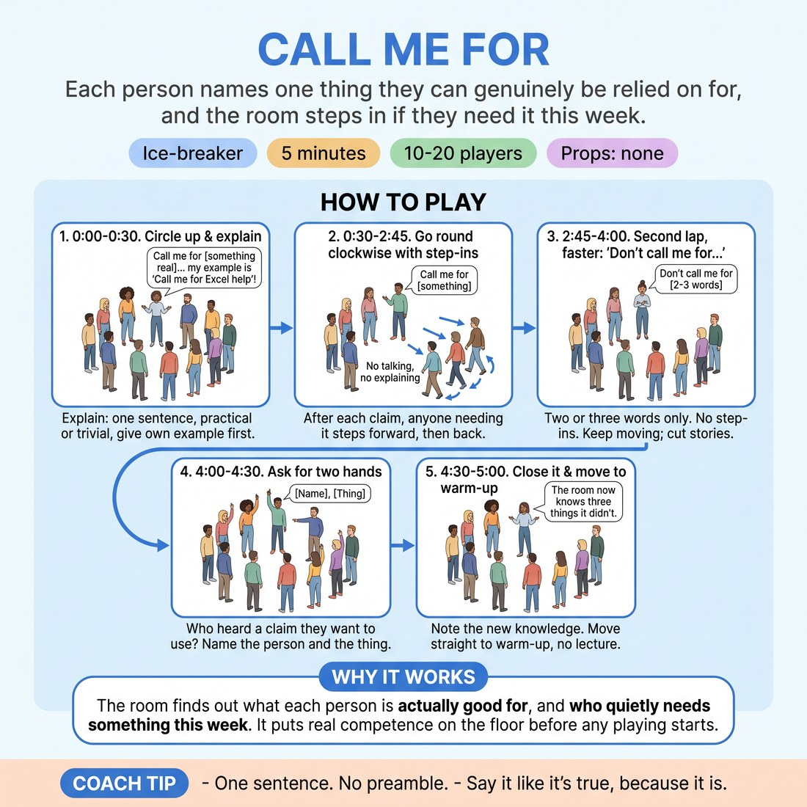

# Call Me For

{ .infographic }

> Each person names one thing they can genuinely be relied on for, and the room steps in if they need it this week.

`Players 10–20` · `~5 min` · `Complexity 1/5` · `Energy medium` · `Contact none` · `Props: none`

## The point

The room finds out what each person is actually good for, and who quietly needs something this week. It puts real competence on the floor before any playing starts.

**Everyone has spoken within 100 seconds.**

**What it reveals about the group:** Who claims big and who claims small — the difference between 'call me for a hard conversation' and 'call me for a spare charger'. · Who steps in readily and who never admits needing anything. · Deadpan versus expansive: the second lap strips the sentence down and the delivery is all that's left.

## Setup

Standing circle, arm's length apart, enough floor for one step forward each. No chairs, no props. If you have 18 or more, split into two circles at opposite ends of the room before you explain anything.

## How to run it

1. 0:00-0:30. Circle up. Explain: one sentence each, 'Call me for ___' — something real you're actually reliable for. Practical or trivial both fine. Give your own example first.
2. 0:30-2:45. Go round clockwise. After each claim, anyone who genuinely needs that thing this week takes one step forward, then back. No talking, no explaining.
3. 2:45-4:00. Second lap, same direction, faster: 'Don't call me for ___', two or three words only. No step-ins. Keep it moving; cut anyone who starts a story.
4. 4:00-4:30. Ask for two hands: who heard a claim they want to use this week? Ten seconds each, name the person and the thing.
5. 4:30-5:00. Close it. Note out loud that the room now knows three things it didn't. Move straight into the warm-up without a lecture.

## Side-coach

- *"One sentence. No preamble."*
- *"Say it like it's true, because it is."*
- *"If you need it, step in. Don't justify it."*
- *"Faster on this lap — two words is plenty."*
- *"Undersell it. We'll find out either way."*

## If it stalls

- If claims get grandiose or jokey, narrow the prompt out loud: 'Something from the last month. Something small.' Then restart the lap where it stalled.
- If nobody steps in for the first three people, step in yourself for one you honestly need. That licences the rest.
- If someone freezes, say 'come back to you' and move on immediately. Return to them at the end of the lap, not before.

## Ask afterwards

1. Whose claim surprised you?
2. Did anyone undersell something you know they're good at?

## Scale

| Class size | What changes |
|---|---|
| 10–13 | One circle, both laps as written. You will finish early; use the spare minute on the 'who wants to use this' step and take four hands instead of two. |
| 14–17 | One circle. Cap the first lap at six seconds per person — call 'next' if someone lingers. Second lap becomes two words maximum. |
| 18–20 | Two circles of nine or ten at opposite ends, running simultaneously. You float between them and call the lap changes for both. Skip the final two hands; just close. |

## Safety & inclusion

Stepping in is optional and no one has to say why. Nobody touches anybody — one step forward, one step back, in your own space. Keep claims practical; this is not a confession round, and you should say so if it starts drifting there.

## Lineage

Originally authored. Written against the usual arrival check-in circle, which only produces talk; the silent step-in adds a second channel so the group reads need without anyone having to ask for help out loud.
