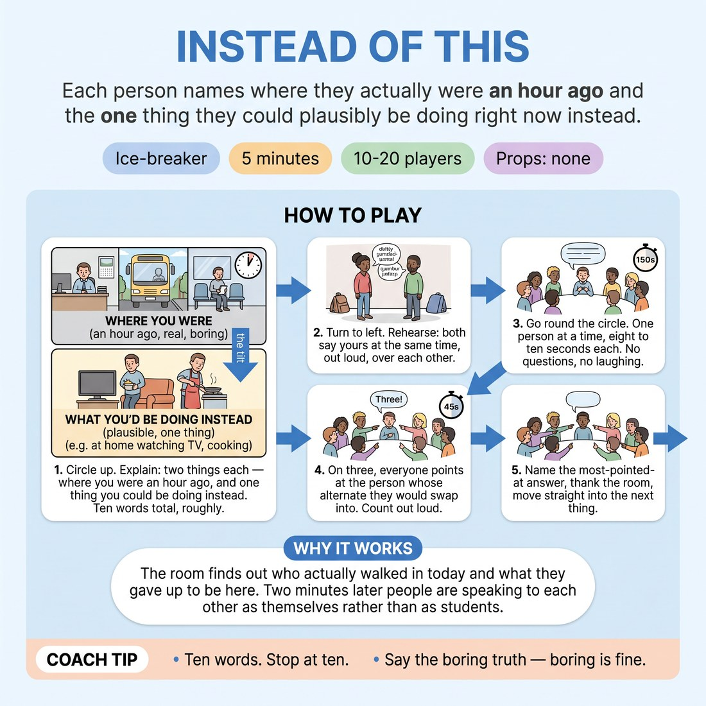

# Instead of This

{ .infographic }

> Each person names where they actually were an hour ago and the one thing they could plausibly be doing right now instead.

`Players 10–20` · `~5 min` · `Complexity 1/5` · `Energy medium` · `Contact none` · `Props: none`

## The point

The room finds out who actually walked in today and what they gave up to be here. Two minutes later people are speaking to each other as themselves rather than as students.

**Everyone has spoken within 75 seconds.**

**What it reveals about the group:** Who states a fact and stops, versus who narrates the whole morning · Whose alternate life is restful and whose is frantic · Who is already listening — they point fast and accurately · Who deflects with a joke rather than a place

## Setup

Standing circle, bags dumped at the wall. Nothing needed. If you have eighteen or more, mark two circle spots on the floor before people arrive.

## How to run it

1. (30s) Circle up. Explain: two things each — where you actually were an hour ago, and one thing you could plausibly be doing right now instead. Ten words total, roughly.
2. (45s) Turn to the person on your left. Both of you say yours at the same time, out loud, over each other. That is the rehearsal. Everyone has now spoken.
3. (150s) Go round the circle. One person at a time, eight to ten seconds each. No questions, no follow-ups, no laughing commentary between turns. Keep the lap rolling.
4. (45s) On three, everyone points at the person whose alternate they would swap into right now. Count it out loud. Look around at where the fingers landed.
5. (30s) Name the most-pointed-at answer, thank the room, move straight into the next thing.

## Side-coach

- *"Ten words. Stop at ten."*
- *"Say the boring truth — boring is fine."*
- *"No follow-up questions, keep the lap moving."*
- *"Actual place, actual activity. Nothing invented."*

## If it stalls

- If someone freezes, give them the sentence: 'I was in bed, and I could be back in bed.' Let them say it and move on.
- If the lap slows because people are explaining themselves, call 'ten words' and point at the next person without comment.
- If four people in a row say the same thing, name it out loud and let the room enjoy it — the repetition is the joke, not a failure.

## Ask afterwards

1. Whose alternate would you actually swap into?
2. Who gave you an image you can still see?

## Scale

| Class size | What changes |
|---|---|
| 10–13 | One circle. Run the lap at ten seconds each, and if you have time left, do a second pointing round for the least appealing alternate. |
| 14–17 | One circle. Cap turns at eight seconds and side-coach the pace hard. Keep the pointing round; it takes forty-five seconds regardless of size. |
| 18–20 | Split into two circles of nine or ten at your marked spots. Both run the lap simultaneously. You stand between them. Each circle does its own pointing round; no whole-group share-back. |

## Safety & inclusion

No contact. Nobody has to disclose anything real about their life — 'I was on a bus' is a complete answer, and anyone can pass with a shrug and be picked up on the pointing round.

## Lineage

In the Workshop check-in circles tradition. Standard check-in circles ask how you're feeling, which stalls beginners and invites long answers. Swapped the prompt for a factual location plus a counterfactual, capped it at ten words, and added a simultaneous pair pass so nobody's first speaking act is solo.
