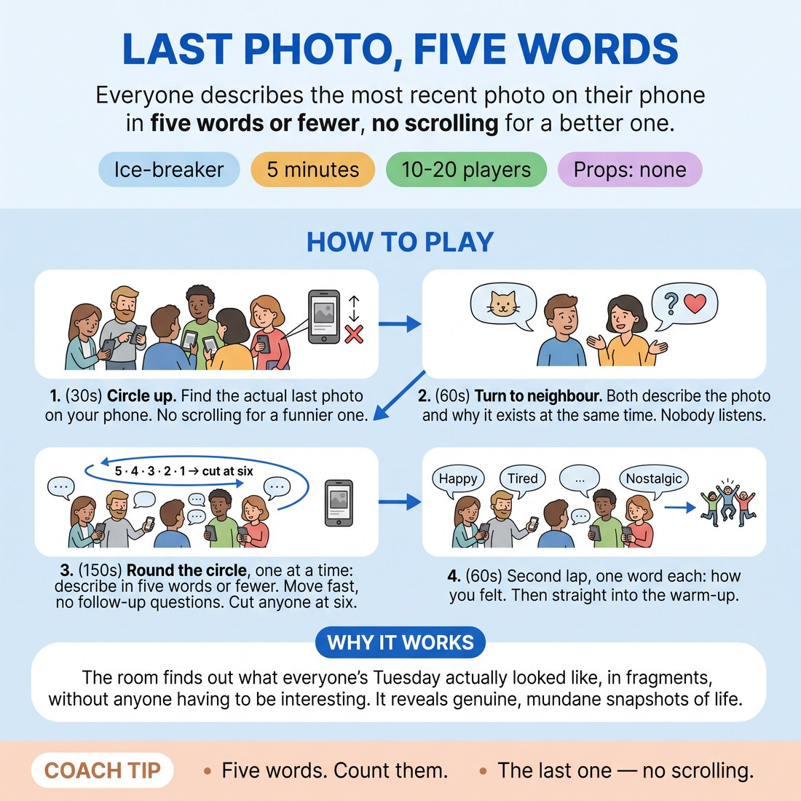

# Last Photo, Five Words

{ .infographic }

> Everyone describes the most recent photo on their phone in five words or fewer, no scrolling for a better one.

`Players 10–20` · `~5 min` · `Complexity 2/5` · `Energy medium` · `Contact none` · `Props: none`

## The point

The room finds out what everyone's Tuesday actually looked like, in fragments, without anyone having to be interesting.

**Everyone has spoken within 45 seconds.**

**What it reveals about the group:** Who edits themselves under a word limit and who blurts · Who is deadpan — three flat nouns — and who tries to smuggle in a story · Who is comfortable being mundane and who needs their photo to justify itself · Emotional range: who gives you a real feeling word in lap two and who says 'fine'

## Setup

Standing circle, no chairs. People may hold their phones but nobody shows a screen to anyone. Works fine without phones — those people use the last photo they remember taking.

## How to run it

1. (30s) Circle up. Tell them: find the most recent photo on your phone. The actual last one. No scrolling for a funnier one. If it's private, use the last one you're happy to describe out loud.
2. (60s) Turn to whoever is next to you. Both talk at the same time — describe the photo and why it exists. Nobody has to listen. Just get it out of your mouth.
3. (150s) Round the circle, one at a time: describe your photo in five words or fewer. Move fast, no follow-up questions, no explaining. Cut anyone at six words.
4. (60s) Second lap, same order, one word each: how you felt when you took it. Then straight into the warm-up.

## Side-coach

- *"Five words. Count them."*
- *"The last one — no scrolling."*
- *"Both of you talk at once. Nobody's marking it."*
- *"Next. Next. Next."*
- *"One word this time. First one that arrives."*

## If it stalls

- People apologise for having a boring photo. Say boring is the good stuff and take it as is — a screenshot of a train time is a better card than a sunset.
- Someone starts explaining the backstory. Cut them at five words with a smile and go to the next person. The cap does the work.
- If the circle drags past three minutes, drop the one-word lap entirely and move on.

## Ask afterwards

1. Whose five words are you still thinking about?
2. What did the five-word cap make you leave out?

## Scale

| Class size | What changes |
|---|---|
| 10–13 | One circle, both laps, comfortable pace. You can allow a second lap of five-word photos if you finish early. |
| 14–17 | One circle. Hold the five-word cap hard and keep the round moving; drop the one-word lap if the first lap runs past three minutes. |
| 18–20 | Split into two circles of nine or ten and run both at once. Nominate a timekeeper in the circle you're not standing in. Both laps still happen. |

## Safety & inclusion

No phone is ever passed or shown. Anyone whose most recent photo is private, medical or someone else's child simply uses the last one they're happy to describe, and nobody asks why. Opting out of the phone entirely and using a remembered photo is a normal choice, not a lesser one.

## Lineage

The 'show me your last photo' question circulates widely as a party opener. Written from scratch here as a five-minute circle: the five-word cap stops the storytellers running long, and the simultaneous pair lap guarantees every voice is used inside ninety seconds.
