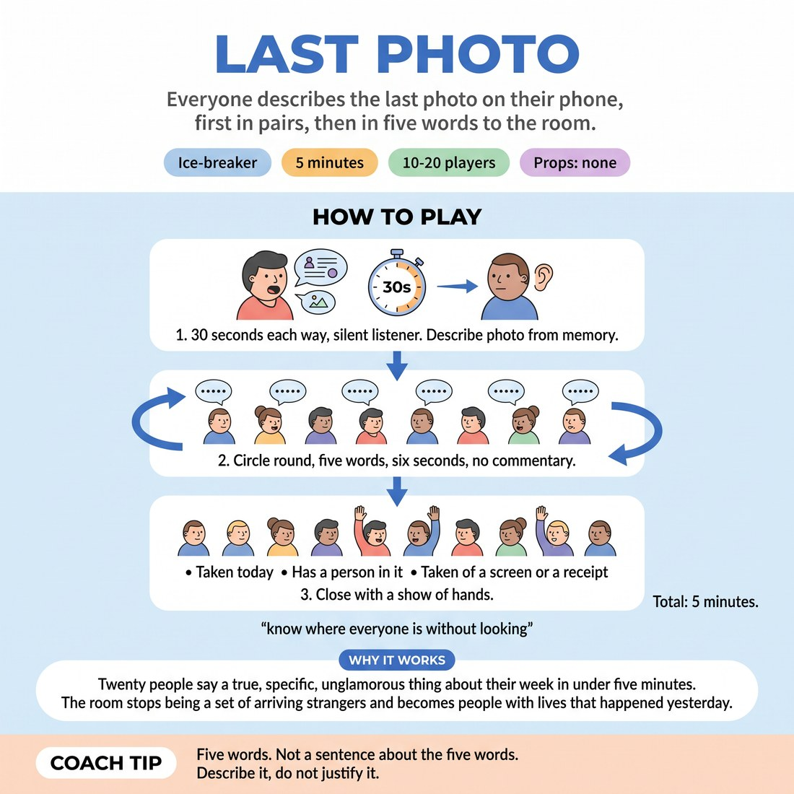

# Last Photo

{ .infographic }

> Everyone describes the last photo on their phone, first in pairs, then in five words to the room.

`Players 10–20` · `~5 min` · `Complexity 1/5` · `Energy medium` · `Contact none` · `Props: none`

## The point

Twenty people say a true, specific, unglamorous thing about their week in under five minutes. The room stops being a set of arriving strangers and becomes people with lives that happened yesterday.

**Everyone has spoken within 45 seconds.**

**What it reveals about the group:** Who compresses to five flat words and who overspills into a story · Who apologises for their own material before anyone has reacted · Who listens in the pair and who is rehearsing · Who arrives with a busy week behind them and who is already settled

## Setup

Standing circle, bags down. No props needed: phones stay in pockets, nobody shows a screen, everybody speaks from memory. Say that out loud before you start.

## How to run it

1. 0:00-0:30 Frame it. Everyone pairs up, odd number makes one three. Prompt: the last photo you took. Describe it out loud. No screens shown, no explaining why it is interesting.
2. 0:30-1:00 A describes their last photo for thirty seconds. B listens and says nothing. Call the swap.
3. 1:00-1:30 B describes theirs for thirty seconds. A listens. In a three, both partners split the thirty seconds.
4. 1:30-4:15 Back to the circle. Round the ring, each person names their own photo in five words or fewer. Six seconds each. No commentary between people.
5. 4:15-5:00 Close with a show of hands: taken today, has a person in it, taken of a screen or a receipt. Then straight into the next thing.

## Side-coach

- *"Five words. Not a sentence about the five words."*
- *"Describe it, do not justify it."*
- *"Boring photo is a good photo here."*
- *"Keep the ring moving, next."*

## If it stalls

- If someone has no photos, they name the last thing they photographed ever, or the last screenshot.
- If people start apologising for dull photos, say dull is the point and speed up the round.
- If the five-word round drags, count the words out loud for two people and the rest will tighten up.

## Ask afterwards

1. Whose photo do you still remember, and what was in it?

## Scale

| Class size | What changes |
|---|---|
| 10–13 | One circle. Thirty seconds each in pairs, one five-word lap of the ring. Timings as written. |
| 14–17 | One circle. Cut the pair descriptions to twenty seconds each and give the five-word lap the extra twenty seconds. |
| 18–20 | Split into two circles of nine or ten for the five-word lap so it stays under three minutes. You stand between them and listen to both. Keep the pairs stage whole-room. |

## Safety & inclusion

No screens are shown, so nobody is exposed to an image they did not choose. Anyone whose last photo is private, medical or unwelcome can skip to any earlier photo without saying why; state this option before the pairs start. Passing in the circle is allowed, but ask them to say "pass" out loud so they have still used their voice.

## Lineage

In the Workshop check-in circles tradition. Camera-roll check-ins circulate widely in facilitation and workshop culture with no single author. Written from scratch here. Two changes: screens stay pocketed, which removes the privacy problem and forces people to describe rather than display; and the whole-room lap is capped at five words, which guarantees a twenty-person circle finishes inside three minutes and makes each person's editing style audible.
