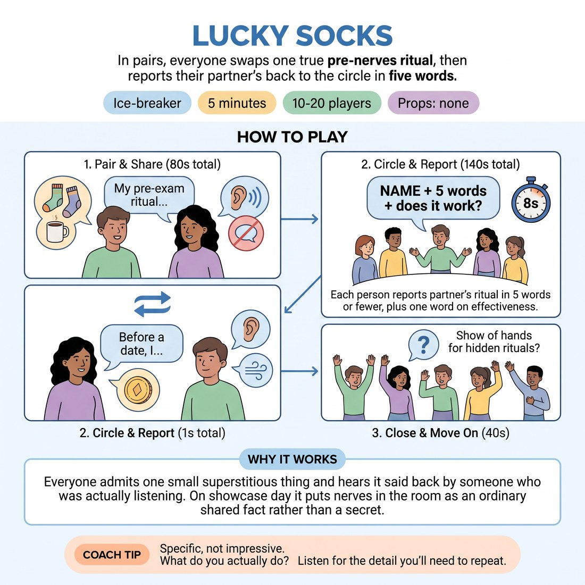

# Lucky Socks

{ .infographic }

> In pairs, everyone swaps one true pre-nerves ritual, then reports their partner's back to the circle in five words.

`Players 10–20` · `~5 min` · `Complexity 1/5` · `Energy medium` · `Contact none` · `Props: none`

## The point

Everyone admits one small superstitious thing and hears it said back by someone who was actually listening. On showcase day it puts nerves in the room as an ordinary shared fact rather than a secret.

**Everyone has spoken within 90 seconds.**

**What it reveals about the group:** Who gives you a clean detail and who gives you a paragraph · Who listened well enough to repeat their partner accurately · Who plays the verdict word deadpan and who sells it · Who is nervous today and who is buzzing

## Setup

Standing circle, enough room to turn to a neighbour. No props, no chairs needed. If the number is odd, make one group of three.

## How to run it

1. (40s) Pair everyone with the person beside them. Brief: tell your partner one true thing you do before something that makes you nervous. Exams, dates, dentists, anything. Small and specific.
2. (40s) Partner A talks. B only listens — no advice, no swapping stories yet. Call time at forty seconds.
3. (40s) Swap. Partner B talks, A listens. Warn them you will ask them to repeat it back.
4. (140s) Reform the circle. Go round: each person says their partner's name and their ritual in five words or fewer, then one word on whether it works. Cap at eight seconds each.
5. (40s) Close: ask for a show of hands for who has a ritual they didn't admit to. Move straight on.

## Side-coach

- *"Specific, not impressive. What do you actually do?"*
- *"Listen for the detail you'll need to repeat."*
- *"Five words. Name, ritual, verdict."*
- *"Keep it moving — next."*
- *"Don't fix it if you forget. Ask them."*

## If it stalls

- If someone says they have no rituals, widen it: a lucky object, the order they put their shoes on, what they eat before something scary, who they text.
- If the report round drags, say the five-word cap out loud again and take the next one yourself to set the pace.
- If a pair goes quiet early, give them a second question: what did you do before your first class here?

## Ask afterwards

1. Whose ritual are you going to steal?
2. Did hearing yours said back sound accurate?

## Scale

| Class size | What changes |
|---|---|
| 10–13 | One circle for the report round. If you finish early, let the group ask a follow-up question of two or three people. |
| 14–17 | One circle, but hold the five-word cap hard. Click your fingers on any report that runs past eight seconds. |
| 18–20 | Split into two circles of nine or ten for the report round and run them at the same time. Stand between them and keep both moving. You will not hear every answer — that's fine. |

## Safety & inclusion

No contact. Nobody has to disclose anxiety; a mundane habit is a full answer. Anyone who would rather not repeat their partner's ritual can pass with a nod and the partner says it themselves.

## Lineage

Written for this slot. The pair-share-then-report-back shape is common workshop practice; the pre-nerves prompt and the five-word cap are ours, chosen because showcase week already has enough talking about nerves in it.
