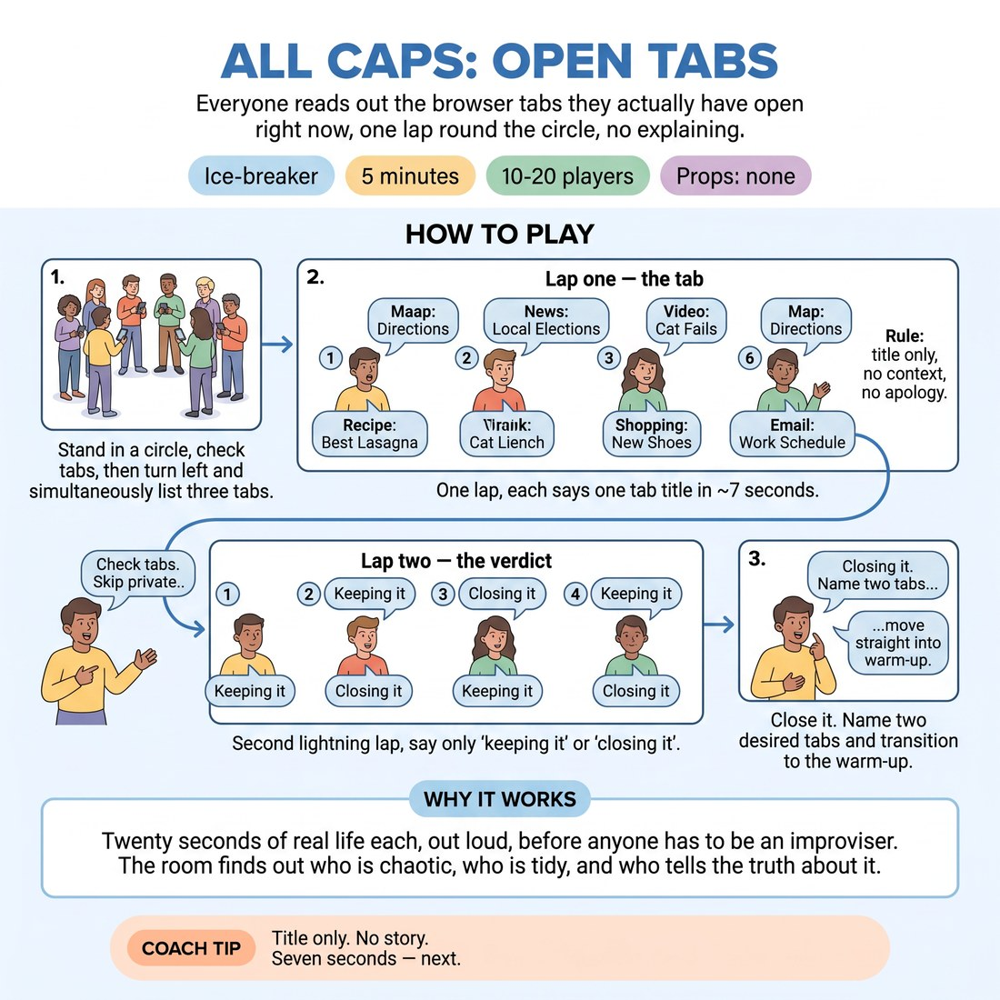

# Open Tabs

{ .infographic }

> Everyone reads out the browser tabs they actually have open right now, one lap round the circle, no explaining.

`Players 10–20` · `~5 min` · `Complexity 1/5` · `Energy medium` · `Contact none` · `Props: none`

## The point

Twenty seconds of real life each, out loud, before anyone has to be an improviser. The room finds out who is chaotic, who is tidy, and who tells the truth about it.

**Everyone has spoken within 60 seconds.**

**What it reveals about the group:** Who hoards forty tabs and who runs a clean two — and who is embarrassed by which. · Who lands one dry word and who can't resist explaining themselves. · Who volunteers the awkward tab and who curates a respectable one. · Who is listening — they'll quote someone else's tab back later.

## Setup

Standing circle, no chairs. Phones out if people have them; no phone is fine. Nobody shows a screen to anyone.

## How to run it

1. (30s) Stand in a circle. Tell them: look at the tabs open on your phone or laptop right now. Real ones. Skip anything private.
2. (60s) Turn to the person on your left and both talk at once — list three of your tabs to each other. Everyone speaks in this minute.
3. (150s) One lap of the circle. Each person says one tab, title only, about seven seconds. No context, no apology, no story. Keep it moving.
4. (45s) Second lightning lap, same order: for that tab say only 'keeping it' or 'closing it'. Two words, no more.
5. (15s) Close it. Name two tabs you'd genuinely like opened and move straight into the warm-up.

## Side-coach

- *"Title only. No story."*
- *"Seven seconds — next."*
- *"Don't tidy it up, read the ugly one."*
- *"Two words on this lap. Keeping or closing."*
- *"Keep the lap moving, no gaps."*

## If it stalls

- No phone, or a tidy person with two tabs: give them 'the last thing you searched for' or 'three things on your kitchen counter right now'.
- If people start explaining and justifying, cut in cheerfully mid-sentence and move to the next person. The speed is the game.
- If the room goes coy and everyone offers something bland, go first yourself on the second lap with a genuinely dull or embarrassing one.

## Ask afterwards

1. Whose tab do you want to ask about later?
2. Did the second lap tell you something the first lap didn't?

## Scale

| Class size | What changes |
|---|---|
| 10–13 | One circle. Run both laps as written; you'll have spare seconds, so add a third lap where each person names one tab they'd close for someone else. |
| 14–17 | One circle. Both laps as written, hold each person to five seconds on the first lap — count them down out loud if needed. |
| 18–20 | Split into two circles of nine or ten, standing well apart. Both circles run the pairs and both laps at the same time. You float between them and call the time for both. |

## Safety & inclusion

Nobody shows a screen to anyone. Reading aloud only, and anything private is skipped with no comment. Opting out of a lap is fine — say 'pass' and it moves on.

## Lineage

Originally authored. Written as a fast round-the-circle disclosure that needs no wit and no preparation — the material already exists on people's phones, so a proficient room can't perform it.
