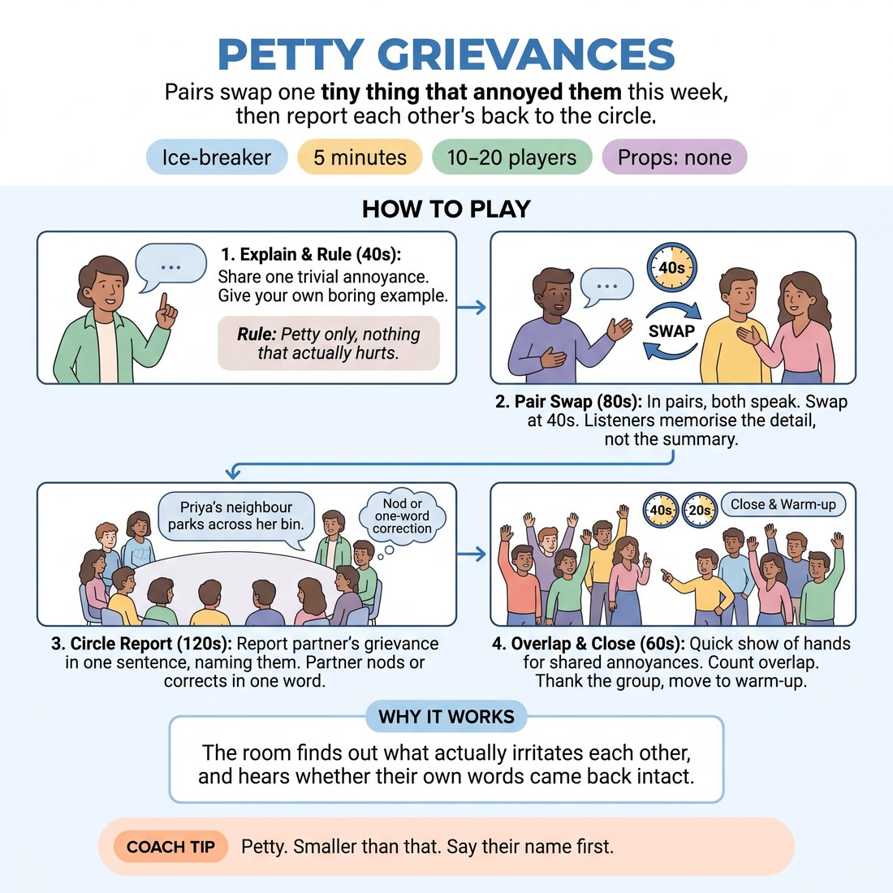

# Petty Grievances

{ .infographic }

> Pairs swap one tiny thing that annoyed them this week, then report each other's back to the circle.

`Players 10–20` · `~5 min` · `Complexity 1/5` · `Energy medium` · `Contact none` · `Props: none`

## The point

The room finds out what actually irritates each other, and hears whether their own words came back intact.

**Everyone has spoken within 90 seconds.**

**What it reveals about the group:** Who reports a partner faithfully and who improves the story · Who plays a grievance deadpan and who performs it · Who goes specific and small versus who reaches for the big general complaint

## Setup

Standing circle, no chairs. Pair everyone off; if the number is odd, make one three. No props.

## How to run it

1. (40s) Explain: each person needs one small, trivial annoyance from this week. Give your own — a real one, boring and specific. Say the rule: petty only, nothing that actually hurts.
2. (80s) In pairs, both speak. Call "swap" at forty seconds so the second person gets equal time. Tell listeners to memorise the detail, not the summary.
3. (120s) Back in the circle. Each person reports their partner's grievance in one sentence, naming them: "Priya's neighbour parks across her bin." Partner nods or corrects in one word.
4. (40s) Quick show of hands: who else has been annoyed by the same thing this week? Count the biggest overlap out loud.
5. (20s) Close. Thank the group, move straight into the warm-up.

## Side-coach

- *"Petty. Smaller than that."*
- *"Say their name first."*
- *"One sentence, then pass."*
- *"Correct in one word only — no speeches."*
- *"Keep the detail they gave you."*

## If it stalls

- If someone blanks in the pair, offer three prompts: something in your kitchen, something on your commute, something a device did.
- If reports drift into paraphrase, stop the lap and ask the next three to include one exact detail their partner said.
- If the room escalates into real complaints about work or politics, name it lightly and pull it back: "trivial only — save the big one for the pub."

## Ask afterwards

1. Whose grievance are you still thinking about?
2. Was it easier to say your own or to hand over someone else's?

## Scale

| Class size | What changes |
|---|---|
| 10–13 | Run the lap twice: first the grievance, then a second lap for one small thing that pleased them. Both laps fit the 120 seconds. |
| 14–17 | One lap only, grievance. Hold the lap to four seconds a person — cut anyone building to a punchline. |
| 18–20 | Split into two circles of nine or ten for the lap, each with a nominated timekeeper. Reconvene for the show of hands. |

## Safety & inclusion

No contact. Trivial annoyances only — anyone may pass or invent a stand-in grievance without explaining why. Nobody names another person in the room.

## Lineage

In the Partner-introduction rounds common in workshop warm-ups tradition. The usual version has people report a partner's biography, which rewards fluent talkers and takes too long. Swapping biography for one petty complaint keeps every turn under five seconds, guarantees something true, and makes accurate listening visible because the partner can correct on the spot.
