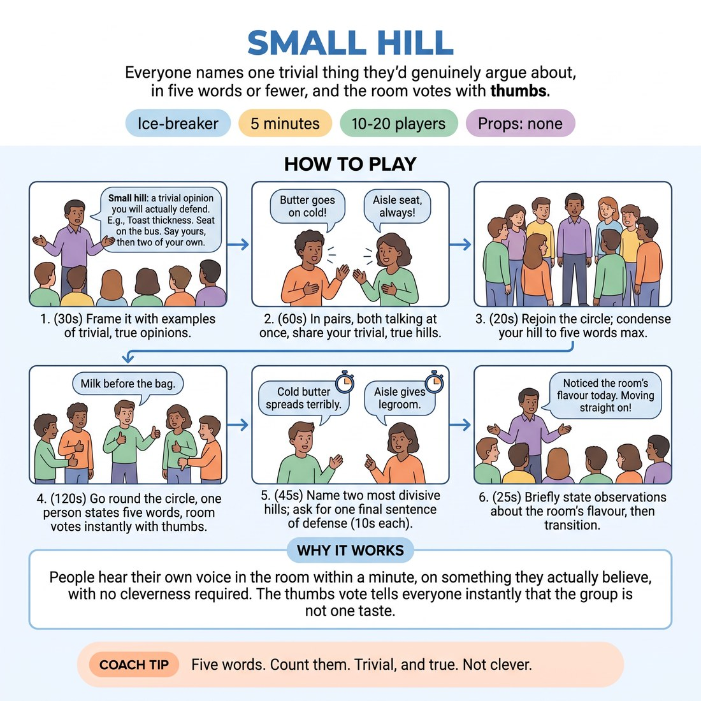

# Small Hill

{ .infographic }

> Everyone names one trivial thing they'd genuinely argue about, in five words or fewer, and the room votes with thumbs.

`Players 10–20` · `~5 min` · `Complexity 1/5` · `Energy medium` · `Contact none` · `Props: none`

## The point

People hear their own voice in the room within a minute, on something they actually believe, with no cleverness required. The thumbs vote tells everyone instantly that the group is not one taste.

**Everyone has spoken within 90 seconds.**

**What it reveals about the group:** Who is deadpan and who sells the line · Who edits themselves down and who overflows past five words · Who enjoys being disagreed with and who softens the moment thumbs go down · Who watches the whole circle and who only watches you

## Setup

Standing circle, no chairs. No props. Everyone needs a partner for one minute, so pair the odd person with you.

## How to run it

1. (30s) Frame it. Everyone has a small hill: a trivial opinion they will actually defend. Toast thickness. Seat on the bus. Say yours, then two of your own.
2. (60s) Pairs, both talking at once. Tell each other your small hill and why. Keep it trivial and true. No politics, faith or bodies.
3. (20s) Back into one circle, shoulder to shoulder. Ask each person to boil their hill down to five words maximum.
4. (120s) Go round the circle, one person at a time, five words each. After each hill the room votes instantly: thumb up to agree, thumb down to disagree.
5. (45s) Name the two hills that split the room hardest. Ask those two people only for one extra sentence of defence. Ten seconds each, no reply.
6. (25s) Close. Say what you noticed about the room's flavour today. Move straight into the next thing without discussion.

## Side-coach

- *"Five words. Count them."*
- *"Trivial, and true. Not clever."*
- *"Thumbs up or down, right away — no abstaining."*
- *"Louder — the far side of the circle needs it."*
- *"Say it, don't explain it."*

## If it stalls

- If someone freezes, offer a menu: temperature of tea, correct queueing behaviour, best crisp flavour, when to say hello to neighbours. They pick and commit.
- If hills get long and story-shaped, restate the five-word cap and demonstrate one yourself. Speed is the whole point.
- Expect a cluster of food opinions. Let it happen — the pleasure is in the delivery, not the originality.

## Ask afterwards

1. Whose hill surprised you, given how they've been in the room so far?
2. Was it easier to say it to one person or to the circle?

## Scale

| Class size | What changes |
|---|---|
| 10–13 | One circle. Run the circle lap twice — the second lap is a new hill each, three words only. |
| 14–17 | One circle, one lap, five-word cap enforced hard. Cut the extra-defence step to one person if you're running long. |
| 18–20 | Split into two circles of ten for the lap; you stand between them and call the start. Skip the defence step and instead ask each circle for its single most divisive hill. |

## Safety & inclusion

Hills stay trivial. Rule out politics, religion, health and anyone's body before you start, and cut anything that drifts there. Anyone may pass by saying 'no hill today' and still counts as having spoken. No contact.

## Lineage

In the Studio circle warm-ups; unpopular-opinion party rounds tradition. Common party-game territory rebuilt for a class start: paired talk first so nobody's first words are public, a hard five-word cap so no one holds the floor, and a thumbs vote so listeners are active rather than waiting their turn.
