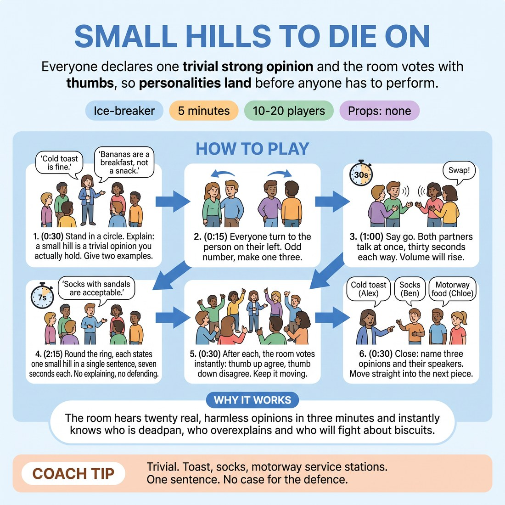

# Small Hills to Die On

{ .infographic }

> Everyone declares one trivial strong opinion and the room votes with thumbs, so personalities land before anyone has to perform.

`Players 10–20` · `~5 min` · `Complexity 1/5` · `Energy medium` · `Contact none` · `Props: none`

## The point

The room hears twenty real, harmless opinions in three minutes and instantly knows who is deadpan, who overexplains and who will fight about biscuits.

**Everyone has spoken within 45 seconds.**

**What it reveals about the group:** Who commits to a flat declaration and who softens it with apologies · Who plays deadpan and who goes big and expansive · Who needs to justify every choice before they will say it · Who reads the room and rides the vote, and who does not care about the vote at all

## Setup

Standing circle, no chairs, arms' length apart. No props. If you have 18 or more, mark two circle spots on opposite sides of the room before you start.

## How to run it

1. (0:30) Stand in a circle. Explain: a small hill is a trivial opinion you actually hold. Give two of yours: 'Cold toast is fine.' 'Bananas are a breakfast, not a snack.'
2. (0:15) Everyone turn to the person on their left. Odd number, make one three.
3. (1:00) Say go. Both partners talk at once, thirty seconds each way, swapping small hills. Call the swap at halfway. Volume will rise. Let it.
4. (2:15) Back to the circle. Round the ring clockwise, each person states one small hill in a single sentence, seven seconds each. No explaining, no defending.
5. (0:30) After each one, the room votes instantly: thumb up if they agree, thumb down if not. Keep it moving. Do not stop for laughs.
6. (0:30) Close: name three opinions you heard back to the room, and the people who said them. Move straight into the next piece.

## Side-coach

- *"Trivial. Toast, socks, motorway service stations."*
- *"One sentence. No case for the defence."*
- *"Thumbs up or down, right now — no abstaining."*
- *"Say it like you mean it, then let it go."*
- *"Keep the ring moving, seven seconds each."*

## If it stalls

- Someone freezes at their turn: hand them a category — food, weather, queues, phones — and come back to them at the end of the lap.
- People reach for shock opinions to get a laugh. Say plainly: smaller and truer is funnier, and redirect to household objects.
- Pairs go quiet in the first minute. Call out three prompts mid-round: showers, sandwiches, small talk.

## Ask afterwards

1. Whose opinion surprised you, and why?
2. Which one did the whole room agree with instantly?

## Scale

| Class size | What changes |
|---|---|
| 10–13 | One circle. Run two full laps of the ring — a second small hill each — and keep the pair phase at sixty seconds. |
| 14–17 | One circle, one lap. Cut the pair phase to forty-five seconds to protect the ring time. |
| 18–20 | Two circles of nine or ten on opposite sides of the room, each running its own lap simultaneously. Stand between them and call time. Nobody watches. |

## Safety & inclusion

Keep the subject matter domestic and trivial. Say up front: no politics, religion, bodies or diets. Anyone can pass with a shrug and get a second chance at the end of the lap. No contact at any point.

## Lineage

In the Pub and parlour 'overrated or underrated' talk, common in warm-up circles tradition. Reworked into a timed structure so nobody has to volunteer: a simultaneous pair round guarantees every voice is used inside forty-five seconds, then a fixed seven-second lap of the ring makes each person visible without a spotlight. The thumb vote was added so the group responds as one body rather than debating.
