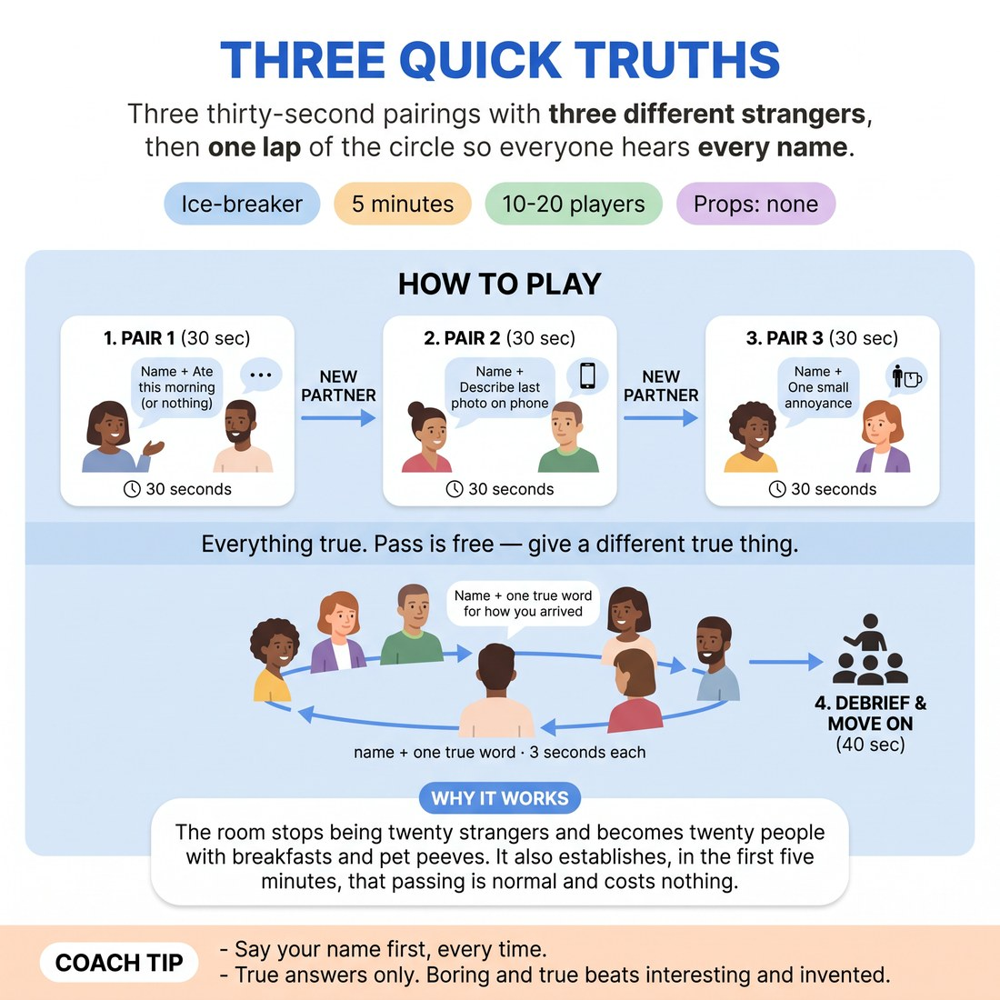

# Three Quick Truths

{ .infographic }

> Three thirty-second pairings with three different strangers, then one lap of the circle so everyone hears every name.

`Players 10–20` · `~5 min` · `Complexity 1/5` · `Energy medium` · `Contact none` · `Props: none`

## The point

The room stops being twenty strangers and becomes twenty people with breakfasts and pet peeves. It also establishes, in the first five minutes, that passing is normal and costs nothing.

**Everyone has spoken within 60 seconds.**

**What it reveals about the group:** Who elaborates and who gives four words · Who volunteers a partner and who waits to be chosen · Who plays the one-word round deadpan and who performs it · Who uses the pass early, and how the room reacts to it

## Setup

Clear floor, chairs pushed back. Everyone stands in a loose circle. No props, no writing, no contact at any point.

## How to run it

1. (0:00-0:40) Explain: three quick chats with three different people, then one lap of the circle. Every answer must be true. Anyone may pass a prompt and give a different true fact instead.
2. (0:40-1:30) Call "find someone you have never spoken to". In pairs, both say their name and what they actually ate this morning, including nothing. Both speak. Odd number makes one three.
3. (1:30-2:20) Call "new partner". Both say their name again and describe the last photo on their phone. No showing the phone, just describing it.
4. (2:20-3:10) Call "last partner". Both say their name and one small thing that reliably annoys them. Keep it small: doors, queues, mugs.
5. (3:10-4:20) Back to the circle. Go round clockwise: name, then one true word for how you arrived today. Three seconds each. No explaining, no second word.
6. (4:20-5:00) Say one thing you noticed back to the room, take the debrief question, and move straight into the next activity.

## Side-coach

- *"Say your name first, every time."*
- *"True answers only. Boring and true beats interesting and invented."*
- *"New partner. Someone you have not met."*
- *"One word. Resist the sentence."*
- *"Pass is a full answer. Swap in another truth."*

## If it stalls

- Give your own answer out loud first. Strangers copy a model faster than they follow an instruction.
- If the pairings freeze, point and pair people yourself for round two rather than waiting.
- If the circle lap slows down, name the next three people in order so nobody is deciding whether to go.

## Ask afterwards

1. Whose name do you already remember, and what did they say?
2. Who found the one-word round harder than the chatting?

## Scale

| Class size | What changes |
|---|---|
| 10–13 | One circle. Run all three pair rounds at fifty seconds each. The final lap takes about forty seconds, so give people the full three seconds each and do not rush it. |
| 14–17 | One circle. Keep all three pair rounds but cut each to forty seconds. Hold the final lap to three seconds a person; call \"next\" if someone starts explaining their word. |
| 18–20 | Drop to two pair rounds (breakfast, then annoyance) to protect the clock. Split into two circles of nine or ten for the final lap and run them at the same time. Stand between them. You will miss some names; the group still hears its own half. |

## Safety & inclusion

No physical contact at any stage. Any prompt can be passed and replaced with another true fact, no reason given. Anyone who prefers not to move around stays where they are and partners come to them.

## Lineage

In the Standard studio mingle and speed-meet warm-ups. tradition. Mingles usually stay in pairs, so half the room never hears the other half. Added the closing one-word lap so every name lands in the whole circle, and built in an explicit pass so the first instruction of the programme is also a boundary.
