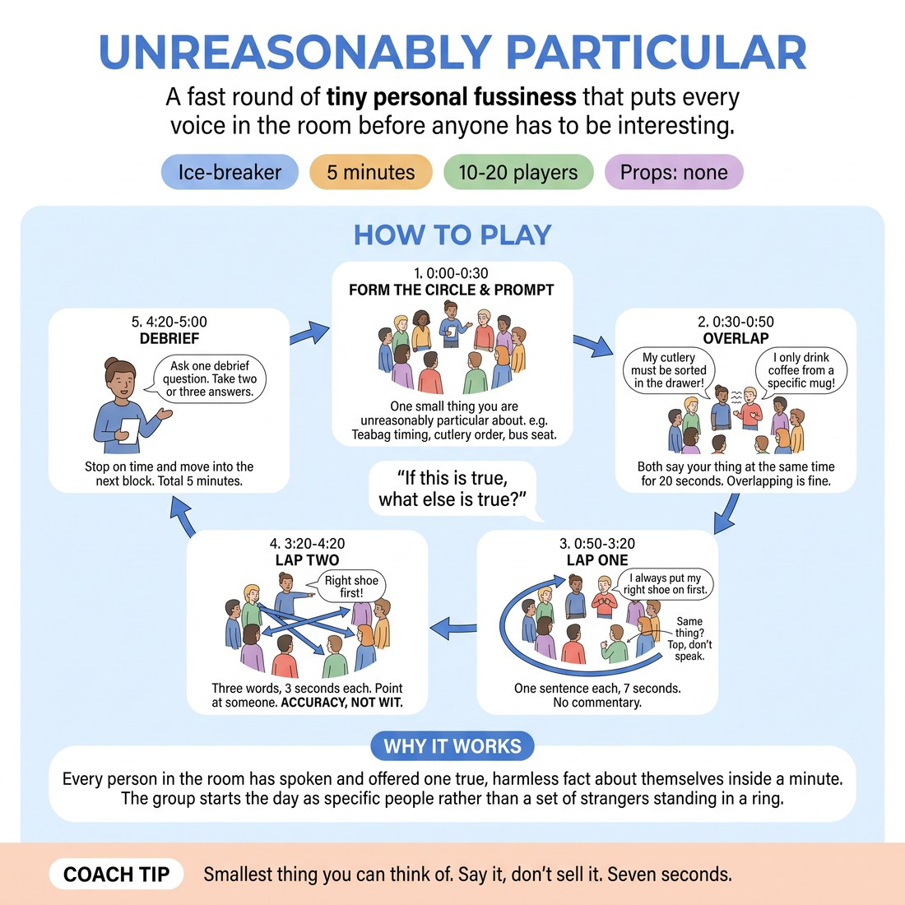

# Unreasonably Particular

{ .infographic }

> A fast round of tiny personal fussiness that puts every voice in the room before anyone has to be interesting.

`Players 10–20` · `~5 min` · `Complexity 2/5` · `Energy medium` · `Contact none` · `Props: none`

## The point

Every person in the room has spoken and offered one true, harmless fact about themselves inside a minute. The group starts the day as specific people rather than a set of strangers standing in a ring.

**Everyone has spoken within 50 seconds.**

**What it reveals about the group:** Who lands a tiny grievance deadpan and gets the laugh without chasing it · Who inflates a small thing into a story and needs the seven-second cap · Who picks something bland to stay out of the room · Who listened well enough on lap two to give someone else's thing back accurately

## Setup

Standing circles, no chairs, bags dumped at the wall. No props. You stand in the circle for ten to thirteen people, or between the two circles for larger groups.

## How to run it

1. 0:00-0:30. Form the circle. Give the prompt: one small thing you are unreasonably particular about. Give your own example first. Teabag timing, cutlery order, which seat on the bus.
2. 0:30-0:50. Everyone turns to the person on their left. On your go, both people say their thing at the same time for twenty seconds. Overlapping is fine. Voices are in the room.
3. 0:50-3:20. Lap one. Round the circle, one sentence each, seven seconds. No questions, no commentary. Anyone particular about the same thing taps their own chest instead of speaking.
4. 3:20-4:20. Lap two, same direction, three seconds each. Point at one other person and say their thing back in three words. Accuracy, not wit. Repeats are allowed.
5. 4:20-5:00. Ask one debrief question. Take two or three answers. Stop on time and move into the next block.

## Side-coach

- *"Smallest thing you can think of."*
- *"Say it, don't sell it. Seven seconds."*
- *"Tap your chest, don't talk."*
- *"Next. Keep the beat."*
- *"First thought is fine here."*

## If it stalls

- People reach for big, worthy answers. Cut in with another trivial one of your own and say the bar is low on purpose.
- The overlapping lap sounds like mush and some people mumble. Say that is expected; it exists to get sound out, not to be heard.
- A circle drifts slow. Call 'next' yourself every seven seconds until it finds the rhythm.

## Ask afterwards

1. Whose fussiness did you also recognise in yourself?
2. What did you nearly say and swap out for something safer?

## Scale

| Class size | What changes |
|---|---|
| 10–13 | One circle. Seven seconds each on lap one, three on lap two. You stand in the circle and take a turn. |
| 14–17 | Two circles of seven to nine, running both laps at the same time. Stand between them and call the time for both. Name who starts in each and which way it goes. |
| 18–20 | Two circles of nine or ten. Cut lap one to five words each and hold five seconds. Appoint one person per circle to say "next" so you are not shouting across two rings. |

## Safety & inclusion

Keep it trivial and say so out loud: this is teabags, not therapy. Anyone who would rather not disclose can be particular about an object instead — their bag, their mug, their notebook. No contact at any point.

## Lineage

Built from the ordinary round-the-circle check-in. Added a hard word ration, a silent chest-tap for agreement so nobody has to interrupt, and an overlapping pair lap at the front so every voice is out before the pressure of a solo turn arrives.
