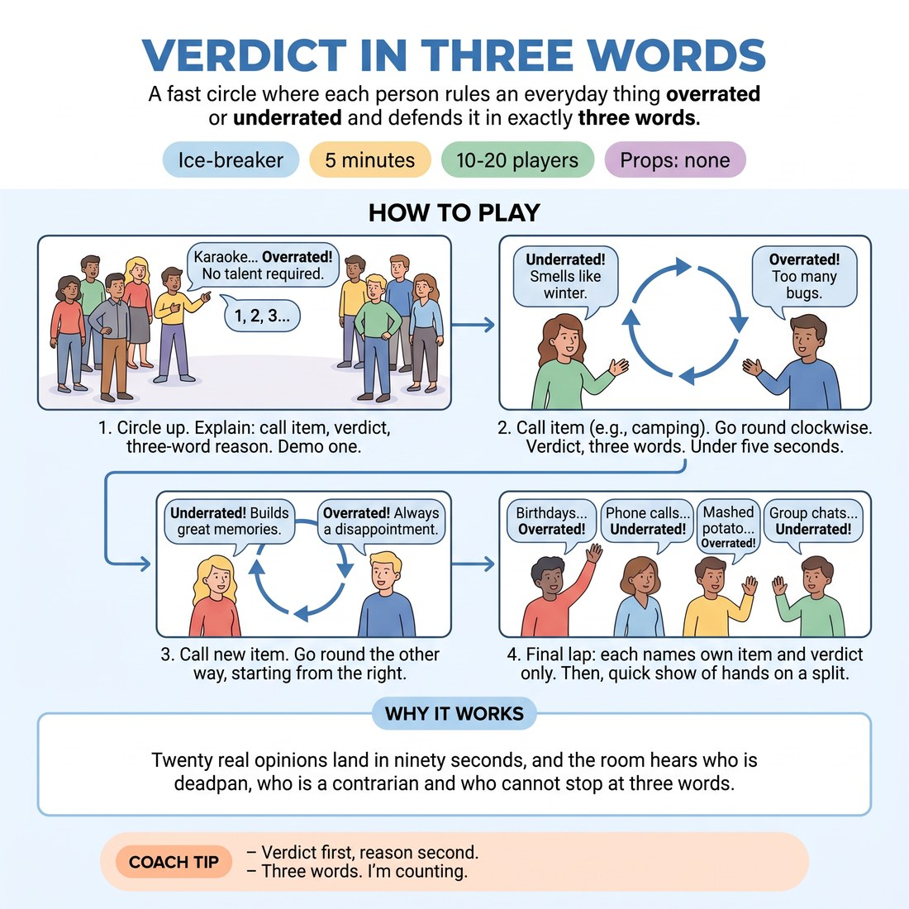

# Verdict in Three Words

{ .infographic }

> A fast circle where each person rules an everyday thing overrated or underrated and defends it in exactly three words.

`Players 10–20` · `~5 min` · `Complexity 1/5` · `Energy medium` · `Contact none` · `Props: none`

## The point

Twenty real opinions land in ninety seconds, and the room hears who is deadpan, who is a contrarian and who cannot stop at three words.

**Everyone has spoken within 110 seconds.**

**What it reveals about the group:** Who commits to a flat verdict with no hedging, and who softens everything into 'well, both'. · Who overruns the three-word cap every time. · Who plays contrarian for sport and who genuinely means it. · Who listens across the circle and calls back to someone else's verdict.

## Setup

Standing circle, no chairs, everyone able to see across. No props. Have five or six trivial items ready to call out: karaoke, camping, birthdays, phone calls, mashed potato, group chats.

## How to run it

1. (40s) Circle up. Explain: you call an item, each person says 'overrated' or 'underrated', then a reason of exactly three words. Demo one yourself.
2. (100s) Call the first item. Go round clockwise. Verdict, three words, next. Keep it under five seconds a head. No debate.
3. (60s) Call a second item. Go round the other way, starting with the person to your right.
4. (60s) Final lap: each person names their own item and its verdict, no reason. Three seconds each.
5. (40s) Ask for a show of hands on the verdict the room split hardest on. Note the split out loud, then move straight into the warm-up.

## Side-coach

- *"Verdict first, reason second."*
- *"Three words. I'm counting."*
- *"No arguing — next person."*
- *"Say it to the far side of the circle."*
- *"Any verdict is a fine verdict."*

## If it stalls

- If someone freezes, take 'no verdict' and move on immediately — never wait.
- If everyone says underrated, call something genuinely divisive: camping, karaoke, or hot weather.
- If reasons balloon into speeches, hold up three fingers and drop them one by one.

## Ask afterwards

1. Whose verdict surprised you?
2. Which one did you want to argue with and didn't?

## Scale

| Class size | What changes |
|---|---|
| 10–13 | One circle. Run all three laps as written. |
| 14–17 | One circle. Cut reasons to two words in the first lap and drop the second item — go straight from lap one to the own-item lap. |
| 18–20 | Split into two circles of nine or ten. Give each a caller from the group and the same item list. You float between them and run the show of hands with both circles together. |

## Safety & inclusion

Keep items trivial — food, weather, small habits. Rule out politics, religion, bodies and anything about people in the room. Anyone may say 'no verdict' and pass without explaining.

## Lineage

In the Parlour opinion games and the overrated/underrated segment familiar from radio and podcasts. tradition. Added the three-word cap and a fixed circle order so nobody talks for long and nobody gets skipped, and moved the choice of item from the players to the facilitator so the first lap starts instantly.
