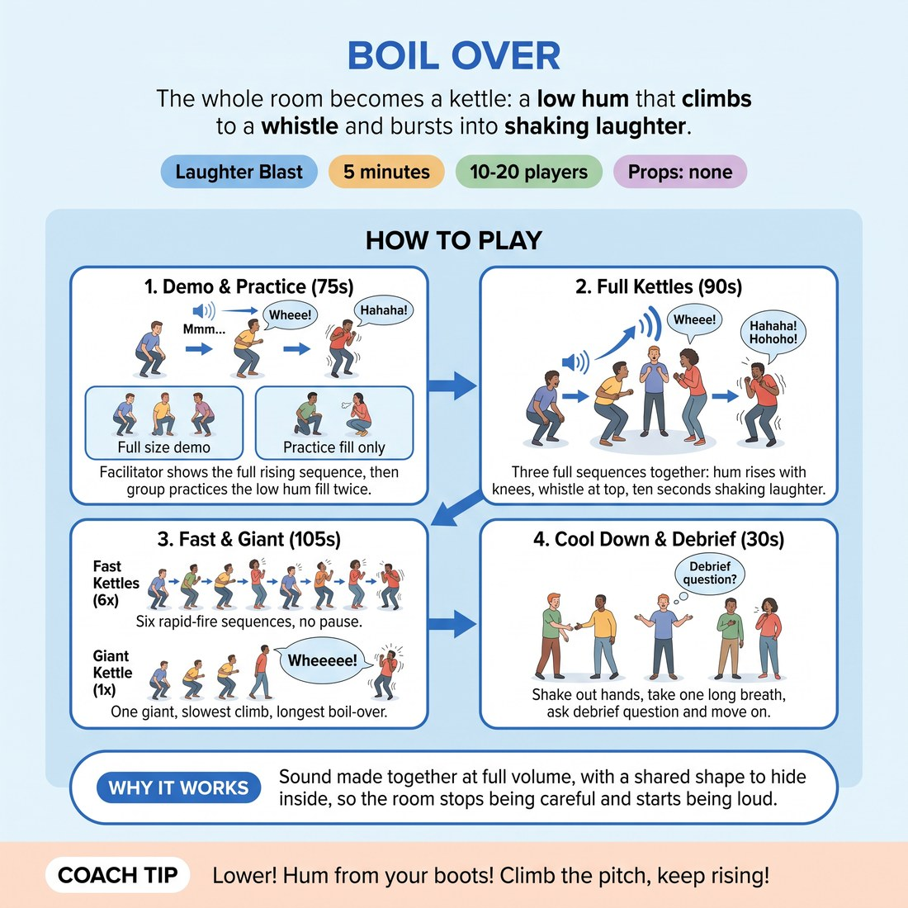

# Boil Over

{ .infographic }

> The whole room becomes a kettle: low hum, rising whistle, then a full-body laugh that spills everywhere at once.

`Players 10–20` · `~5 min` · `Complexity 1/5` · `Energy high` · `Contact none` · `Props: none`

## The point

Adults arrive holding their voices in. Rising sound plus a ten-second forced laugh gets the breath low, the shoulders down and the room loud before anyone has to speak a sentence.

**Childhood borrow:** Making machine noises with your mouth for no reason — the siren, the rocket, the kettle — and going up until it breaks.

## Setup

One loose circle, standing, arms' length apart. No props. Push bags and chairs to the wall so nobody knocks a knee on the way up.

## How to run it

1. (40s) Circle up. Demonstrate one full kettle yourself, alone, at full volume: crouch, hum low, rise, whistle high, then laugh. Do it bigger than you want to.
2. (50s) Round one together. Crouch. Low hum. Rise over ten slow counts as the hum climbs. On your call of 'BOIL', arms up and everyone laughs out loud for ten seconds.
3. (45s) Round two, twice as fast. Five counts up, then boil. Laugh for ten seconds again. Do not let the laughing stop early — keep yours going loudest.
4. (45s) Round three, faster still. Three counts, boil, laugh. Then straight back down into the crouch without a break.
5. (60s) Chaos round. Everyone boils at their own speed, over and over, whenever they like. No counting. Just kettles going off around the room.
6. (30s) Call one last crouch. Silence. Long slow rise, ten counts, then one final synchronised boil and laugh.
7. (30s) Hands down, breathe. Ask the single debrief question, take two answers, move on.

## Side-coach

- *"Start lower than you think. Knees soft."*
- *"Let the hum climb with your body — don't jump to the top."*
- *"Keep laughing. Ten full seconds. Don't stop at three."*
- *"Arms all the way up. Fingers too."*
- *"Boil whenever you want now. Nobody's watching you."*

## Getting past the cringe

Do the whole first kettle alone, before you explain it, and be louder and lower and sillier than anyone else will be. Don't grin apologetically or say 'I know, bear with me'. Finish the laugh, hold the arms up an extra beat, then say 'right, everyone.' The room copies your commitment level exactly, so set it high.

## Opt-down

Stay standing, hum instead of whistle, and laugh under your breath with a small arm lift. Still in the circle, still on the count, just at a quarter of the volume.

## If it stalls

- Adults often go quiet on the whistle. Drop the pitch requirement — tell them any rising noise counts, kazoo, siren, bagpipe.
- If the laugh dies at three seconds, count the ten out loud yourself while laughing. They will follow the count.

## Ask afterwards

1. Where in your body do you feel that? One word each, quick.

## Scale

| Class size | What changes |
|---|---|
| 10–13 | One circle. Run all rounds as written. |
| 14–17 | One wider circle. Add a second chaos round of 30 seconds instead of lengthening the counts. |
| 18–20 | Split into two circles of nine or ten, side by side, both boiling at the same time. On the final boil, circle A rises while circle B stays crouched, then swap — each circle boils twice, and both are still making noise throughout. |

## Safety & inclusion

No screaming — the whistle rides on breath, not on the throat. Anyone with knee, back or hip issues stays standing and rises onto the balls of the feet instead of crouching. A chair version works fine. Warn anyone who is pregnant or recovering from abdominal surgery to keep the laugh gentle. No contact at any point.

## Lineage

In the Laughter yoga tradition. Laughter yoga clubs use gradient exercises where a sound builds and then breaks into laughter on a cue. Rewritten from scratch as a kettle so adults have a concrete household image to hide behind, with a chaos round added because self-timed boils remove the last of the self-consciousness.
