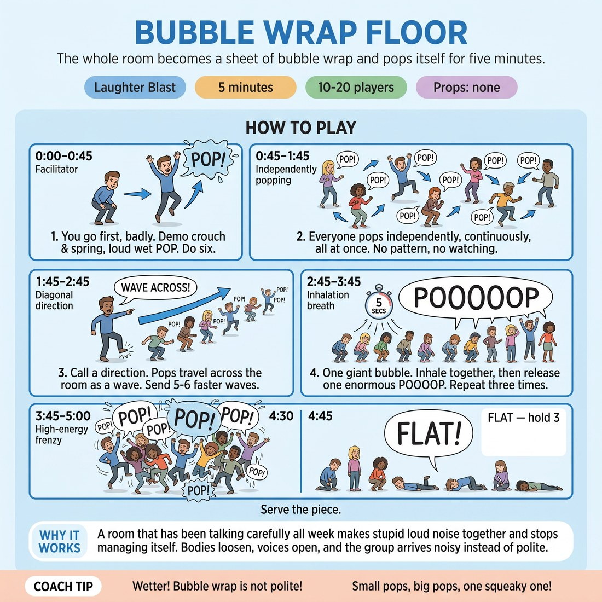

# Bubble Wrap Floor

{ .infographic }

> The whole room becomes a sheet of bubble wrap and pops itself for five minutes.

`Players 10–20` · `~5 min` · `Complexity 1/5` · `Energy high` · `Contact none` · `Props: none`

## The point

A room that has been talking carefully all week makes stupid loud noise together and stops managing itself. Bodies loosen, voices open, and the group arrives noisy instead of polite.

**Childhood borrow:** Compulsively popping every bubble on a sheet of bubble wrap until it is completely flat.

## Setup

Stand everyone in a loose circle with an arm's length of space each. Chairs and bags pushed to the walls. No props.

## How to run it

1. 0:00–0:45. Tell them the floor is bubble wrap and so are they. Demonstrate: small crouch, spring up, loud wet "POP!". Do six yourself, badly and loudly, before anyone joins.
2. 0:45–1:45. Everyone pops at their own speed, continuously, all at once. No pattern, no watching. Keep your own popping going the entire minute so nobody is the loudest.
3. 1:45–2:45. Stamp one foot and call a direction. The pops travel across the room as a wave, everyone popping as it reaches them. Send five or six waves, faster each time.
4. 2:45–3:45. One giant bubble. Everyone crouches low, inhales together for five slow seconds, then rises and releases one enormous drawn-out "POOOOP". Repeat three times, sillier each round.
5. 3:45–4:30. Fifteen seconds of all-out frenzy popping — every bubble at once, maximum noise. Then call "FLAT" and everyone drops to stillness and silence. Hold three seconds. Repeat once.
6. 4:30–5:00. One question, thirty seconds, no discussion. Move straight on.

## Side-coach

- *"Wetter! Bubble wrap is not polite!"*
- *"Small pops, big pops, one squeaky one!"*
- *"Wave coming at you — pop as it hits!"*
- *"Fill your lungs for the big one!"*
- *"FLAT. Nothing. Now.'"*

## Getting past the cringe

Do six pops alone, at full volume, before you give any further instruction. Do not look around for buy-in and do not explain why it works. If you are the wettest, loudest, ugliest pop in the room, the first row of resisters becomes the second row within ten seconds.

## Opt-down

Pop with fingers and voice only — no crouch, no spring. Standing still and making the sound counts fully; the noise is the whole job.

## If it stalls

- Drop the wave structure and just pop harder yourself for twenty seconds. Volume from the front pulls the room in faster than instruction does.
- If the pops go quiet and thin, switch to the giant bubble early — the shared inhale gets everyone breathing together and the noise comes back.

## Ask afterwards

1. Where in your body did the last big pop land?

## Scale

| Class size | What changes |
|---|---|
| 10–13 | One circle. Waves cross the whole circle in one pass. Four or five waves in the wave minute. |
| 14–17 | One circle, still. Send waves in both directions at once so two crossing waves collide in the middle — expect a mess, that's the point. |
| 18–20 | Split into two facing lines about three metres apart. Lines trade waves back and forth. Both lines do the giant bubble and the frenzy together, no split. |

## Safety & inclusion

Crouching and springing is optional. Anyone with knees, back or balance concerns pops standing, or pops with fingers and voice only. Say this before the demo, not after. No contact at any point — keep an arm's length so nobody gets elbowed during the frenzy.

## Lineage

In the Laughter yoga and playground sound games tradition. Borrows the sustained-shared-sound principle from laughter yoga, but replaces breath-laughter with an object sound every adult already knows how to make. Written from scratch; the wave and the giant bubble are ours, added so the noise has shape without anyone needing to be clever.
