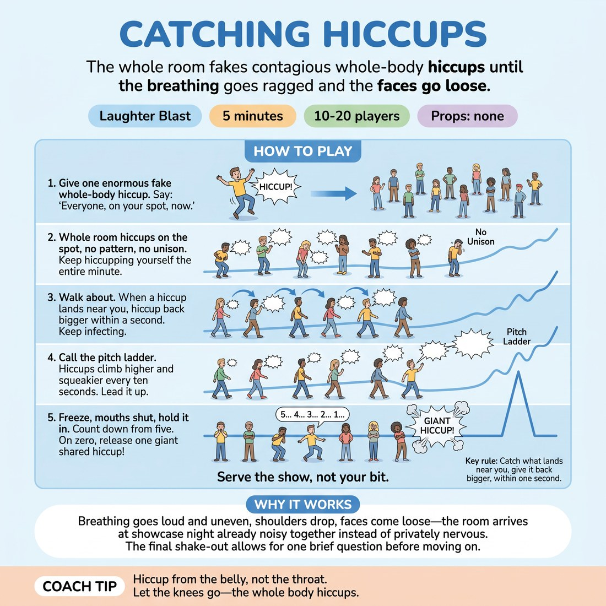

# Catching Hiccups

{ .infographic }

> The whole room fakes contagious whole-body hiccups until the breathing goes ragged and the faces go loose.

`Players 10–20` · `~5 min` · `Complexity 1/5` · `Energy high` · `Contact none` · `Props: none`

## The point

Breathing goes loud and uneven, shoulders drop, faces come loose — the room arrives at showcase night already noisy together instead of privately nervous.

**Childhood borrow:** Faking hiccups at each other until nobody can stop and everyone is wheezing.

## Setup

Clear the floor so everyone can walk about without bumping. Everyone stands, no shoes off, no props. You stand in the middle where all of them can see you.

## How to run it

1. 0:00-0:30 — You go first. Give one enormous fake hiccup: knees buckle, elbows fly, sound comes out of the chest. Do three more, bigger. Say: everyone, on your spot, now.
2. 0:30-1:30 — Whole room hiccups on the spot, one every two seconds, whole body each time. No pattern, no unison. Keep hiccupping yourself the entire minute.
3. 1:30-2:45 — Walk about. Hiccups are catching: when one lands near you, hiccup back bigger within a second. Stay an arm's length from everyone. Keep moving, keep infecting.
4. 2:45-3:45 — Call the pitch ladder. Hiccups climb higher and squeakier every ten seconds until the room sounds like a shed full of mice. Lead it up there yourself.
5. 3:45-4:30 — The cure. Everyone shuts the mouth and freezes, holding it in. Count down from five out loud. On zero the room releases one giant hiccup and lets it collapse into laughing.
6. 4:30-5:00 — Shake the arms out. One question, thirty seconds, then straight on.

## Side-coach

- *"Hiccup from the belly, not the throat."*
- *"Let the knees go — the whole body hiccups."*
- *"Catch the one next to you. Bigger than they gave it."*
- *"Higher. Squeakier. Ridiculous."*
- *"Hold it in… hold it in… and go."*

## Getting past the cringe

Do not explain it. Give one huge, undignified hiccup that folds you in half before you have said a word, then three more while they are still deciding. Keep hiccupping through your own instructions. The room copies what you do, not what you ask for.

## Opt-down

Stand at the edge with the group and hiccup at half volume with just a shoulder drop, no knees, no walking. Skip the breath-hold and just close your mouth for the countdown.

## If it stalls

- If it stays polite and quiet, stop walking and put the room in one tight circle so the sound bounces. Hiccup twice as hard yourself for fifteen seconds.
- If people are watching each other instead of doing it, call the pitch ladder early — chasing a silly pitch stops anyone spectating.

## Ask afterwards

1. Where in your body do you feel that? One word each, fast.

## Scale

| Class size | What changes |
|---|---|
| 10–13 | One roaming group, whole floor. Run the contagion phase as written for the full 75 seconds. |
| 14–17 | Split into two facing lines two metres apart for the contagion phase — volley hiccups across the gap, both lines going at once, no waiting. |
| 18–20 | Two circles of roughly ten, working simultaneously in opposite corners. Run the pitch ladder as a race: whichever circle gets squeakiest first, both circles then join into one for the cure. |

## Safety & inclusion

No contact — keep an arm's length while walking. Hiccup from the belly, never by jerking the neck. Anyone who feels light-headed stops holding the breath and simply closes the mouth for the countdown. Anyone with a voice, chest, back or pregnancy concern uses the quiet version.

## Lineage

In the Laughter yoga contagion drills; playground fake-hiccup games tradition. Laughter-yoga work builds deliberate sound that turns real; children fake hiccups to make each other collapse. Combined the two and added a pitch ladder and a held-breath release so the whole room lands the same beat together. Rewritten from scratch.
