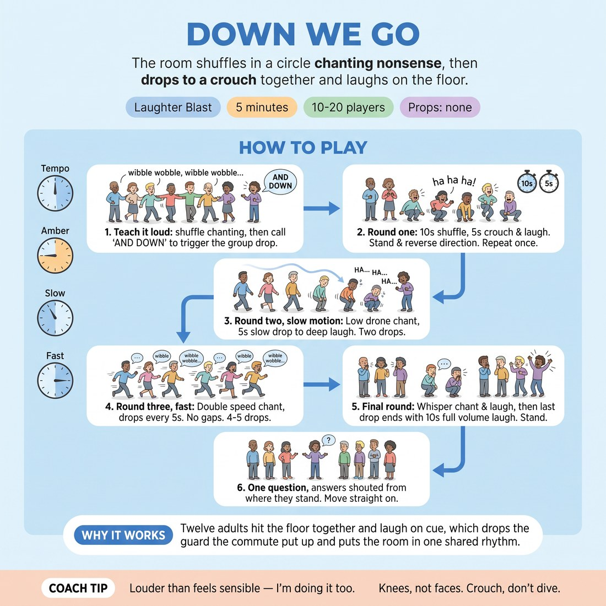

# Down We Go

{ .infographic }

> The room shuffles in a circle chanting nonsense, then drops to a crouch together and laughs on the floor.

`Players 10–20` · `~5 min` · `Complexity 1/5` · `Energy high` · `Contact none` · `Props: none`

## The point

Twelve adults hit the floor together and laugh on cue, which drops the guard the commute put up and puts the room in one shared rhythm.

**Childhood borrow:** The playground ring game where everyone chants, circles, and deliberately falls over at the same moment.

## Setup

Clear the floor. One standing circle, arm's length apart, no hand-holding. You stand in the circle with them, not outside it.

## How to run it

1. (45s) Teach it yourself, loudly, before they try: shuffle sideways chanting "wibble wobble" on repeat. When you call "AND DOWN", everyone drops to a crouch and laughs out loud.
2. (45s) Round one. Shuffle left, chant together, call "AND DOWN" after ten seconds. Crouch, laugh "ha ha ha" for five seconds, stand, reverse direction. Repeat once.
3. (60s) Round two, slow motion. Chant in a low drone, drop over a count of five, land in a crouch and laugh slow and deep. Two drops.
4. (60s) Round three, fast. Chant double speed, high voices, drops every five seconds. Four or five drops, no gap between landing, laughing and standing.
5. (60s) Final round. Whisper the chant, whisper-laugh in the crouch, then on your last call everyone drops and laughs at full volume for ten seconds. Stand.
6. (30s) One question, answers shouted from where they stand. Move straight on.

## Side-coach

- *"Louder than feels sensible — I'm doing it too."*
- *"Knees, not faces. Crouch, don't dive."*
- *"Keep the laugh going after you land."*
- *"Sillier voices on the chant."*
- *"Stand up fast, straight back into it."*

## Getting past the cringe

Start chanting and shuffling before you finish explaining, at full volume, with a stupid voice. Drop first and laugh loudest from the crouch. Do not look around to check who is joining in and do not ask anyone to commit — carry the first fifteen seconds on your own noise.

## Opt-down

Stay standing and bend at the waist on the call instead of crouching, or sit in a chair inside the circle, chant with everyone and drop your head and hands on "AND DOWN". Same rhythm, same noise, no knees.

## If it stalls

- The chant dies before the first drop. Chant alone at double volume for four beats and call the drop early — the collapse restarts it.
- If nobody laughs in the crouch, stay down an extra beat and laugh on your own until they join. Do not comment on the silence.

## Ask afterwards

1. One word for how the room feels now — shout it.

## Scale

| Class size | What changes |
|---|---|
| 10–13 | One circle. Run all four rounds as written. |
| 14–17 | One wider circle. Stand in the middle so everyone can hear the call; cut round three to three drops so the timing holds. |
| 18–20 | Two concentric circles, inner shuffling left, outer shuffling right. Same chant, same calls, everyone drops together. Cut round two to one slow drop. |

## Safety & inclusion

No contact and no hand-holding — dropping while linked pulls people over. Crouch only; nobody goes fully to the floor. Check the floor for bags and shoes first. Anyone with knees, back, hips or dizziness bends at the waist instead, or does it seated. Say this before round one, not after.

## Lineage

In the Playground ring games and laughter yoga tradition. Built from the shape of children's circle rhymes that end in a collective collapse, with the rhyme replaced by nonsense syllables and the fall replaced by a controlled crouch. A held deliberate laugh is added at the bottom of each drop so the release comes from the mechanic rather than from anyone being funny.
