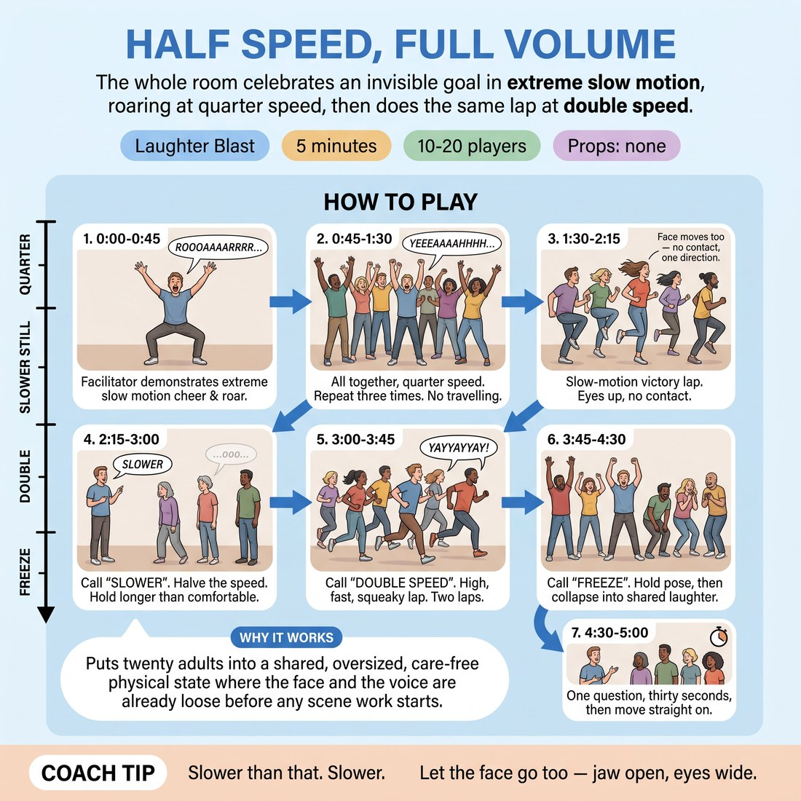

# Half Speed, Full Volume

{ .infographic }

> The whole room celebrates an invisible goal in extreme slow motion, roaring at quarter speed, then does the same lap at double speed.

`Players 10–20` · `~5 min` · `Complexity 1/5` · `Energy high` · `Contact none` · `Props: none`

## The point

Puts twenty adults into a shared, oversized, care-free physical state where the face and the voice are already loose before any scene work starts.

**Childhood borrow:** Playground slow-motion replays after scoring a goal — arms up, mouth open, roaring at half speed.

## Setup

Clear the floor. Everyone spreads out with an arm's length in every direction, facing no one in particular. No chairs, no props.

## How to run it

1. 0:00-0:45 Tell them: something wonderful has just happened and we are watching the replay. Demonstrate yourself first — slow-motion arms up, slow, low, stretched roar. Go bigger than you want to.
2. 0:45-1:30 All together, quarter speed. Everyone raises both arms and lets out one long, low, dragged-out cheer. Faces stretch too. No travelling yet. Repeat three times.
3. 1:30-2:15 Add the lap. Everyone runs a slow-motion victory lap around the room — knees high, hair flying, jaw slack, sound still dragging. Eyes up, no contact.
4. 2:15-3:00 Halve the speed again. Call "slower". Now the sound is barely a note and one step takes five seconds. Hold this longer than feels comfortable.
5. 3:00-3:45 Call "double speed". Same lap, same cheer, now high and fast and squeaky. Everyone jogs, no sprinting. Two laps.
6. 3:45-4:30 Call "freeze". Hold the pose, faces included, for five seconds. Then one final shared slow-motion roar together, arms up, and let it collapse into whatever laugh arrives.
7. 4:30-5:00 One question, thirty seconds, then move straight on.

## Side-coach

- *"Slower than that. Slower."*
- *"Let the face go too — jaw open, eyes wide."*
- *"Sound all the way down, like a tape dragging."*
- *"Eyes up, keep the space between you."*
- *"Freeze. Hold it. Hold it."*

## Getting past the cringe

Do not explain it twice. Go first, at full size, before anyone has decided how they feel — arms up, jaw slack, dragging roar, one lap straight through the middle of the room. Keep your own commitment louder than the hesitation and say nothing about how silly it is.

## Opt-down

Stay standing where you are and do arms and voice only, no travelling, at whatever volume suits. The slow-motion face alone is the whole activity.

## If it stalls

- The room stays polite and small. Stop calling instructions and just do a huge slow lap yourself, roaring, straight through the middle of them. Committed demonstration works faster than a note.
- If the sound stays thin, drop the movement entirely and do three stationary quarter-speed roars together before adding the lap back.

## Ask afterwards

1. What speed did your body want to go at?

## Scale

| Class size | What changes |
|---|---|
| 10–13 | One open floor, everyone travels freely in any direction for the laps. |
| 14–17 | Everyone travels the same way round the room, anticlockwise, so nobody has to dodge. Two laps at fast speed rather than three. |
| 18–20 | Cut the travelling. All laps happen on the spot — running motion, knees high, staying inside your own arm's radius. Keep every other beat identical. |

## Safety & inclusion

Fast lap is a jog, not a sprint; call it as such. Eyes up and no contact at any speed. Anyone with knee, back or balance concerns does the whole thing on the spot with arms only — say this out loud before you start, not as an afterthought.

## Lineage

In the Physical theatre and clown warm-ups; playground slow-motion replays tradition. Slow-motion action is a long-standing physical warm-up. Stripped out the audience, the scene content and any narrative so nobody is watched or judged, then bolted on the vocal drag and the double-speed reversal so the laugh comes from everyone's face doing the same ridiculous thing at once.
