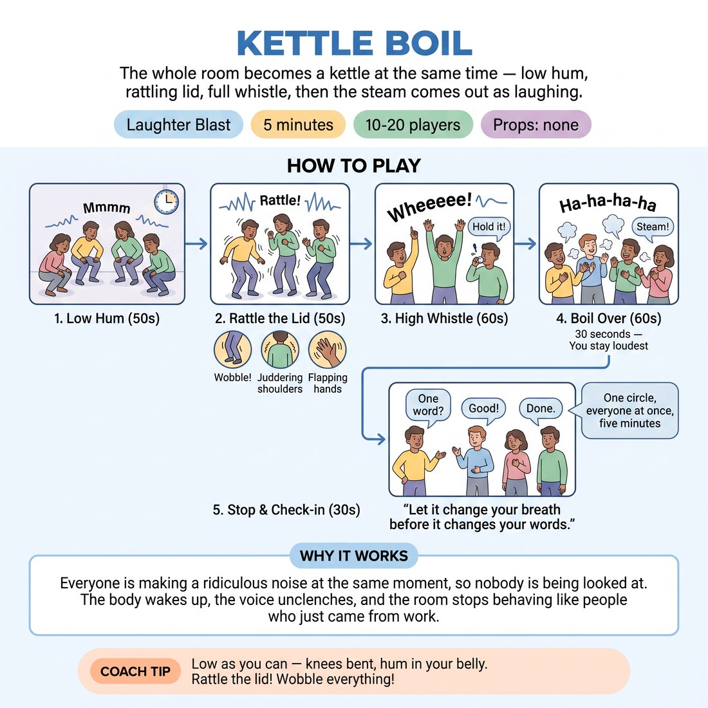

# Kettle Boil

{ .infographic }

> The whole room becomes a kettle at the same time — low hum, rattling lid, full whistle, then the steam comes out as laughing.

`Players 10–20` · `~5 min` · `Complexity 1/5` · `Energy high` · `Contact none` · `Props: none`

## The point

Everyone is making a ridiculous noise at the same moment, so nobody is being looked at. The body wakes up, the voice unclenches, and the room stops behaving like people who just came from work.

**Childhood borrow:** Being a machine — kids making engine, siren and kettle noises with their whole body for no reason at all.

## Setup

Loose circle, arm's length apart, everyone standing. No props. Push chairs back so people can crouch and shake without knocking anything.

## How to run it

1. (50s) Stand in the circle. Say: we are all kettles. Demonstrate the whole thing yourself, full volume — crouch, hum low, rise, rattle, whistle. Do not apologise for it.
2. (50s) Round one, everyone together. Crouch low, hum a low 'mmmm', rise slowly over ten seconds, let the hum climb into a breathy 'wheeeee' at the top. Shake it out.
3. (50s) Round two, add the lid. Same climb, but from halfway up everyone rattles — knees bouncing, shoulders juddering, hands flapping. Hum wobbles with the shaking.
4. (60s) Round three, slow boil. Twenty seconds climbing from the floor, rattling hard, then hold the whistle until your breath runs out. Everyone finishes at their own moment.
5. (60s) Boil over. Straight from the whistle, everyone puffs 'ha-ha-ha-ha' like steam, hands paddling the steam upward. Keep it going a full thirty seconds. You keep going loudest.
6. (30s) Stop. One question, quick answers, then move on.

## Side-coach

- *"Low as you can — knees bent, hum in your belly."*
- *"Rattle the lid! Wobble everything!"*
- *"Whistle until you're empty."*
- *"Steam out — ha ha ha ha — keep it coming."*
- *"Don't watch anyone, you're a kettle."*

## Getting past the cringe

Do the entire kettle yourself before you finish explaining it — crouch to the floor, hum, rattle, whistle at full volume, no grin, no wink. Keep your eyes up and off individual faces. Then say 'that's it' and start round one immediately, before anyone has time to decide whether they're doing it.

## Opt-down

Stay standing tall and hum the climb quietly with hands only — fingers rising and flapping for the rattle, palms pushing steam upward at the top. Same rhythm, same moment, a tenth of the volume.

## If it stalls

- Volume is on you. Get twice as loud and twice as low to the floor; the room follows within one round.
- If the whistle stays polite, drop round three and go straight to the steam-laugh — the puffing works even when the hum doesn't.

## Ask afterwards

1. Where in your body did that land? One word each, fast.

## Scale

| Class size | What changes |
|---|---|
| 10–13 | One circle. Run all three climbs as written. |
| 14–17 | One wide circle. Same three climbs, but give an extra five seconds to each rise — a bigger circle takes longer to sync — and cut the steam-laugh to twenty-five seconds. |
| 18–20 | Two circles of nine or ten in opposite corners, both boiling at the same time so nobody watches. Stand between them and cue both. Drop round three's slow boil to keep to five minutes. |

## Safety & inclusion

No screaming — the whistle is breathy, not a shriek; stop anyone pushing their voice. Big breaths can make people light-headed, so stay standing, keep feet planted, and say up front that anyone dizzy should stop and breathe normally. No contact; keep an arm's length so rattling doesn't collide.

## Lineage

In the Laughter yoga breathing patterns; group machine-noise warm-ups from physical theatre. tradition. Machine warm-ups usually build a shared contraption where each person adds a distinct part, which makes people watch each other and worry about their contribution. We made everyone the same single object, boiling at once, and ended on a sustained deliberate laugh rather than a clever noise.
