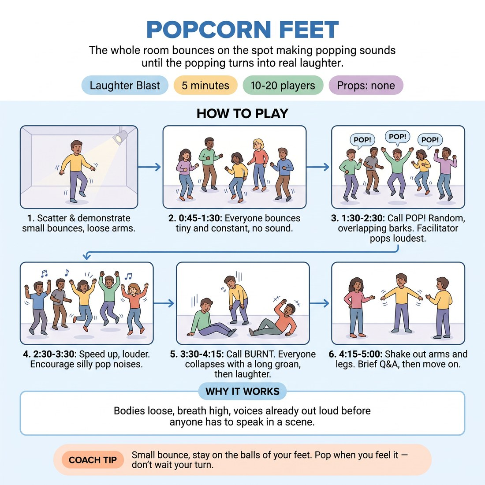

# Popcorn Feet

{ .infographic }

> The whole room bounces on the spot making popping sounds until the popping turns into real laughter.

`Players 10–20` · `~5 min` · `Complexity 1/5` · `Energy high` · `Contact none` · `Props: none`

## The point

Bodies loose, breath high, voices already out loud before anyone has to speak in a scene.

**Childhood borrow:** Jumping on the spot making explosion noises for no reason.

## Setup

Clear a space so everyone can stand with arms' width around them. No circle needed — a loose scatter facing you. Nothing in hands, shoes on.

## How to run it

1. 0:00-0:45 Scatter the room. Say: we are kernels in a pan. Demonstrate first — small bounces on the balls of your feet, arms loose, going hardest in the room.
2. 0:45-1:30 Everyone bounces small and quiet, no sound yet. Call it warming up. Keep the bounce tiny and constant. You bounce throughout, never stop to watch.
3. 1:30-2:30 Call POP. Anyone may jump slightly higher and bark a loud POP whenever they feel it. Popping is random and overlapping. You pop loudest and most often.
4. 2:30-3:30 Speed up. Call faster and louder. The room becomes continuous popping, jumping, arms flying. Encourage silly pop noises — squeaks, honks, whatever comes out.
5. 3:30-4:15 Call BURNT. Everyone collapses the sound into a long sagging groan, sinking towards the floor, then flops loose. Laughter usually arrives here.
6. 4:15-5:00 Shake out arms and legs. One question, thirty seconds, then move straight on.

## Side-coach

- *"Small bounce, stay on the balls of your feet."*
- *"Pop when you feel it — don't wait your turn."*
- *"Louder pops, sillier pops."*
- *"Everyone at once, nobody's watching."*
- *"Now burnt — sink and groan."*

## Getting past the cringe

Start bouncing and popping before you finish explaining. Do not look around checking who has joined. Be the loudest and stupidest kernel in the pan for the full five minutes — adults copy commitment, not instructions.

## Opt-down

Stay standing in the scatter and rock heel-to-toe instead of bouncing, popping under your breath. Same place, same timing, quarter of the volume.

## If it stalls

- If the popping stays polite, stop calling and just pop enormously yourself for fifteen seconds; volume is contagious.
- If people bounce but stay silent, count them in: three, two, one, POP — everyone together twice, then release back to random.

## Ask afterwards

1. Where in your body do you feel it right now?

## Scale

| Class size | What changes |
|---|---|
| 10–13 | One scatter, run exactly as written. You pop alongside them the whole time. |
| 14–17 | One scatter, but split the popping phase: left half pops for twenty seconds while the right half bounces, then swap, then both together. |
| 18–20 | Two scatters at opposite ends of the room, each with a nominated loud starter. Run the same timings; both groups burn out together on your BURNT call. |

## Safety & inclusion

No contact. Bounces stay small — knees soft, no big jumps. Anyone with knee, back or pregnancy concerns bounces from the ankles only or rocks heel-to-toe. Watch spacing so flying arms don't connect.

## Lineage

In the Laughter yoga and children's movement warm-ups tradition. Laughter yoga uses sustained deliberate sound to trigger genuine laughter. We borrowed the sustained-sound principle and hung it on the popcorn image children use in movement classes, adding the burnt-popcorn collapse because the sag downwards is where the real laughter reliably lands.
