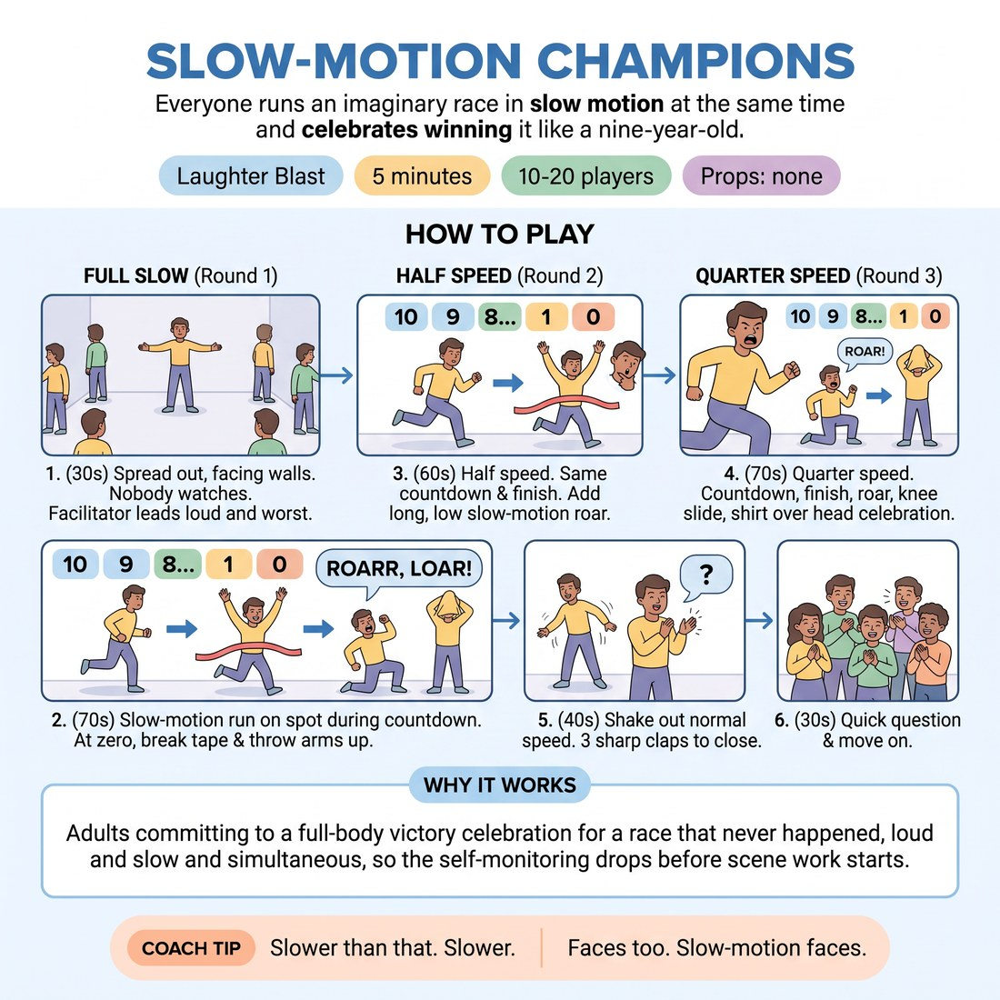

# Slow-Motion Champions

{ .infographic }

> Everyone runs an imaginary race in slow motion at the same time and celebrates winning it like a nine-year-old.

`Players 10–20` · `~5 min` · `Complexity 1/5` · `Energy high` · `Contact none` · `Props: none`

## The point

Adults committing to a full-body victory celebration for a race that never happened, loud and slow and simultaneous, so the self-monitoring drops before scene work starts.

**Childhood borrow:** Celebrating a playground goal like a televised striker, and running in slow motion because slow motion is funnier.

## Setup

Clear the floor. Everyone spreads out at more than arm's length and faces a wall, so nobody is looking at anybody. You stand in the middle where all of them can hear you and none of them are facing you.

## How to run it

1. (30s) Spread the room out, all facing outward to the walls. Tell them nobody watches anybody. Say you will go loudest and worst, and mean it.
2. (70s) Round one: slow-motion running on the spot while you count down from ten. On zero, everyone breaks the tape and throws both arms up in slow motion.
3. (60s) Round two: half that speed. Same countdown, same finish, and add a long low slow-motion roar that lasts the whole arms-up moment.
4. (70s) Round three: quarter speed. Countdown, finish, roar, then a mimed knee slide, shirt pulled over the head, whole body celebrating one imaginary win.
5. (40s) Shake it out at full normal speed. Arms, legs, face. Three sharp claps together to close it.
6. (30s) One question, quick answers, then move straight on.

## Side-coach

- *"Slower than that. Slower."*
- *"Faces too. Slow-motion faces."*
- *"Louder roar, longer roar, no words in it."*
- *"You already won. Celebrate like it mattered."*
- *"Nobody is looking at you. Go bigger."*

## Getting past the cringe

Start moving before you finish explaining. Be the slowest and the loudest in the room from the first countdown, arms up, roaring, face fully committed. Do not look at anyone to check. If you hold back, they will hold back.

## Opt-down

Stay facing the wall and do it from the waist up only: slow arms, slow face, quiet breath instead of a roar. From behind it reads identical to everyone else.

## If it stalls

- Drop the speed again. Ridiculous is easier at quarter speed than at half speed, and the room usually goes at the third countdown.
- If the roar stays polite, do one round where you count down and only you roar. Then run it again.

## Ask afterwards

1. Hands up if you forgot you were at a class for ten seconds.

## Scale

| Class size | What changes |
|---|---|
| 10–13 | One spread of the room facing outward, three rounds as written. |
| 14–17 | Same single spread, but push people right to the walls so there is a clear metre each. Three rounds, keep the countdown to eight. |
| 18–20 | Split into two halves in opposite ends of the room, both running at once, both facing their own wall. You stand between them and count for both. Three rounds, countdown from six. |

## Safety & inclusion

Everything happens on the spot: no running across the room, no jumping, no going to the floor. The knee slide is mimed standing up. Anyone with knee, back or neck issues does the arms and the roar only, which looks the same from behind.

## Lineage

In the Physical comedy warm-ups and playground slow-motion play tradition. Slow-motion running and goal celebrations are common floor material. Written fresh here as a simultaneous, outward-facing block with no observers and no winner, so there is nothing to be good at.
