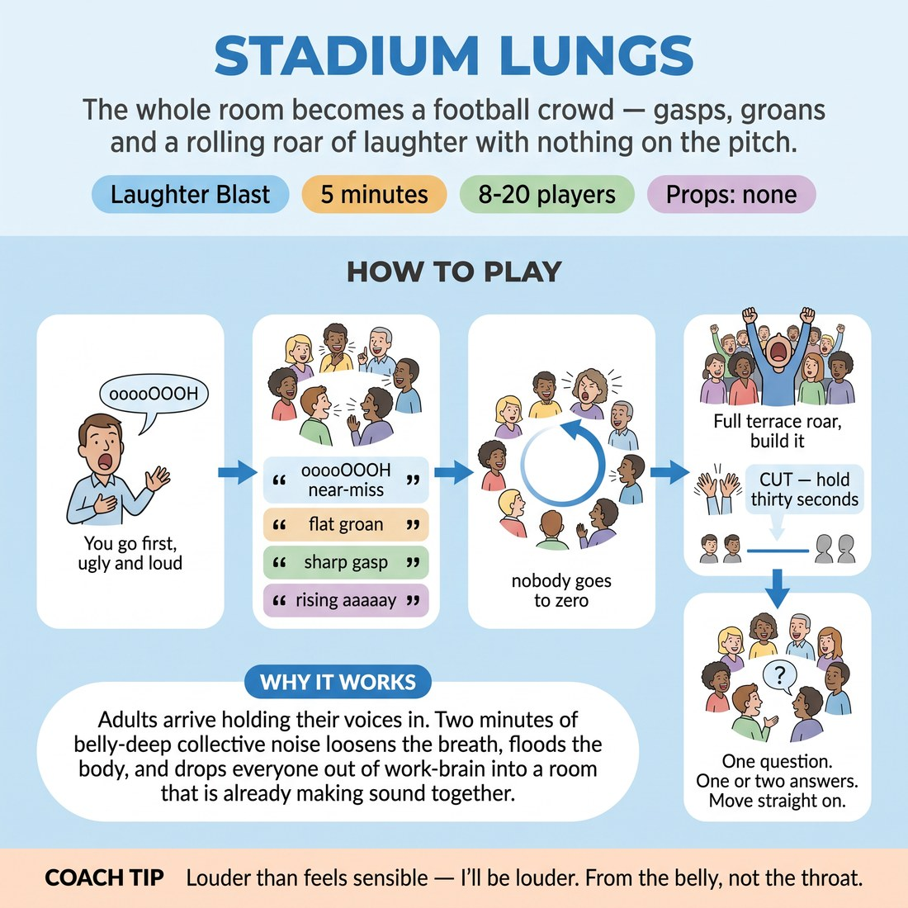

# Stadium Lungs

{ .infographic }

> The whole room becomes a football crowd — gasps, groans and a rolling roar of laughter with nothing on the pitch.

`Players 8–20` · `~5 min` · `Complexity 1/5` · `Energy high` · `Contact none` · `Props: none`

## The point

Adults arrive holding their voices in. Two minutes of belly-deep collective noise loosens the breath, floods the body, and drops everyone out of work-brain into a room that is already making sound together.

**Childhood borrow:** Yelling as part of a crowd at a match — the licence a stadium gives you to make an enormous ugly noise about nothing, with everyone else doing it too.

## Setup

One standing circle, arms' length apart, chairs pushed back. No props. Everyone faces in; you stand in the circle with them, not outside it.

## How to run it

1. (30s) Frame it: we are a crowd of sixty thousand watching nothing. Demonstrate the near-miss 'ooooOOOH' at full volume yourself first. Loud, ugly, committed. Then hands up.
2. (60s) Call the crowd sounds. Everyone together: the near-miss 'ooooh', the disappointed groan, the sharp intake of breath, the slow rising 'aaaaay'. Two goes at each.
3. (90s) Laughter wave. Everyone laughs out loud continuously. Point around the circle; as your hand passes, that section goes loudest, then drops to a chuckle. Two full laps.
4. (90s) Full terrace. Everyone roars, laughs, bounces on the spot, arms overhead. Build it for sixty seconds, then throw both hands down and cut to total silence for thirty.
5. (30s) Stay in the circle. One question. One or two answers. Move straight on.

## Side-coach

- *"Louder than feels sensible — I'll be louder."*
- *"From the belly, not the throat."*
- *"Nobody's watching you, we're all doing it."*
- *"Hands in the air, bounce with it."*
- *"And — silence. Hold it. Breathe."*

## Getting past the cringe

Do the first 'ooooOOOH' yourself, at full volume, before you finish explaining. Don't ask if they're ready. Your own commitment is the permission slip — if you hedge, they hedge. Keep your eyes moving round the circle rather than fixing on anyone, so no one feels inspected.

## Opt-down

Half volume, feet planted, arms only. Or hum the crowd noise with a closed mouth — you still feel the vibration and you're still in the circle.

## If it stalls

- If the wave goes limp, drop it and go straight to the full terrace roar — sustained collective noise recovers faster than a structure.
- If the laughter stays polite, laugh harder yourself for ten seconds without instructing anyone. It usually catches. If it doesn't, call the cut and move on; a short honest version beats a long forced one.

## Ask afterwards

1. Where in your body do you feel that? One word.

## Scale

| Class size | What changes |
|---|---|
| 10–13 | One circle. Two laps of the wave. Full terrace 60 seconds as written. |
| 14–17 | One circle. Three laps of the wave, third lap at double speed. Everything else identical. |
| 18–20 | Split into two facing lines about three metres apart. Crowd sounds together; the wave runs down one line and back up the other; the terrace roar becomes two rival ends roaring across the gap. Nobody sits out or watches. |

## Safety & inclusion

Loud vocal work: push from the belly, never scrape the throat, and drop to half volume if your voice tires. Bouncing is optional — stand still and use your arms instead. Warn the room before the sudden cut to silence if anyone is noise-sensitive, and flag the volume to neighbouring rooms first.

## Lineage

In the Laughter yoga tradition. Source: *Laugh For No Reason (2002)*. Borrows the core laughter-yoga idea that deliberate sustained laughter becomes real laughter without any cause. We swapped the yogic framing for a football-crowd frame, added collective crowd sounds and a volume wave so nobody ever laughs alone, and capped it at five minutes.
