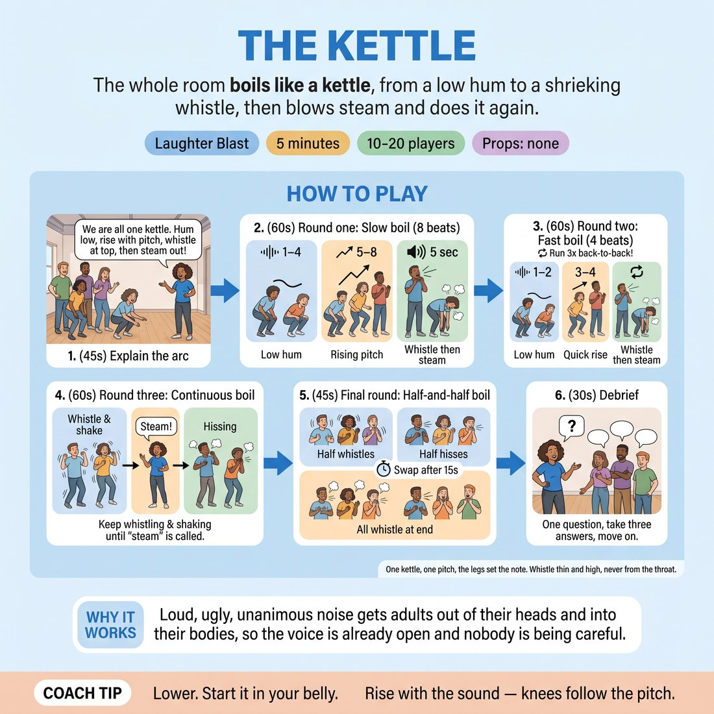

# The Kettle

{ .infographic }

> The whole room boils like a kettle, from a low hum to a shrieking whistle, then blows steam and does it again.

`Players 10–20` · `~5 min` · `Complexity 1/5` · `Energy high` · `Contact none` · `Props: none`

## The point

Loud, ugly, unanimous noise gets adults out of their heads and into their bodies, so the voice is already open and nobody is being careful.

**Childhood borrow:** Making a stupid noise together and pushing it as loud as you can just to see what happens.

## Setup

Everyone stands in one loose circle with arm's length between people. No chairs, no props. You stand in the circle too, not outside it.

## How to run it

1. (45s) Explain: we are all one kettle. Low hum on a low crouch, rising pitch as we rise, a full whistle at the top, then steam out. Demonstrate the whole arc yourself, loudly.
2. (60s) Round one. Everyone crouches and hums low. You count the rise over eight slow beats. At the top, everyone whistles or shrieks for five seconds, then flops forward and hisses the steam out.
3. (60s) Round two, twice as fast. Four beats up, whistle, hiss. Run it three times back to back so nobody has room to think.
4. (60s) Round three: the kettle keeps boiling over. Everyone whistles, then shakes the whole body while whistling, and keeps whistling until you call 'steam'. Shake harder than anyone.
5. (45s) Final round: half the room boils while the other half hisses steam continuously underneath. Swap after fifteen seconds. Both halves whistle together at the end.
6. (30s) Debrief. One question, take three answers, move on.

## Side-coach

- *"Lower. Start it in your belly."*
- *"Rise with the sound — knees follow the pitch."*
- *"Ugly whistle. Ugly is correct."*
- *"Shake it out, all the way to the fingers."*
- *"Steam! Empty your lungs."*

## Getting past the cringe

Go first and go worse. Make the ugliest whistle in the room before anyone has been asked to make a sound, and keep your own volume above everyone else's for the whole first round. Do not comment on anyone's reluctance — just be louder than it.

## Opt-down

Hum the whole arc instead of whistling — same rise, same crouch, same shake, no shriek. Standing still and humming at any volume is full participation.

## If it stalls

- Drop your own volume to nothing and let one person's noise be heard for two seconds, then come back in louder than before — the room follows the loudest kettle.
- If the whistling stays polite, run one round where the only instruction is 'be a bad kettle' and make a genuinely unpleasant noise yourself first.

## Ask afterwards

1. Where in your body is your voice sitting now, compared to five minutes ago?

## Scale

| Class size | What changes |
|---|---|
| 10–13 | One circle, run all five rounds as written. In the final round split six and six; odd person out joins the boiling half. |
| 14–17 | One circle, but widen it — arm's length plus a step. Cut round two to two repetitions so the timing holds. |
| 18–20 | Two circles of nine to ten, side by side, running simultaneously. You stand between them and count for both. For the final round, one whole circle boils while the other steams, then swap. |

## Safety & inclusion

No contact. Shrieking strains cold voices — tell people to whistle from breath, not from a squeezed throat, and to drop to a hum if it scratches. Crouching is optional; bend the knees only as far as is comfortable, or do the whole arc standing with the arms rising instead.

## Lineage

In the Laughter yoga and group vocal warm-ups tradition. Laughter yoga uses graduated group sound that builds to involuntary laughter. Choral warm-ups use sirens for pitch range. We fused the two into a single absurd image — a kettle — so nobody is thinking about their voice, and added the body-shake boil-over because the physical shaking is what tips the whistling into real laughter.
