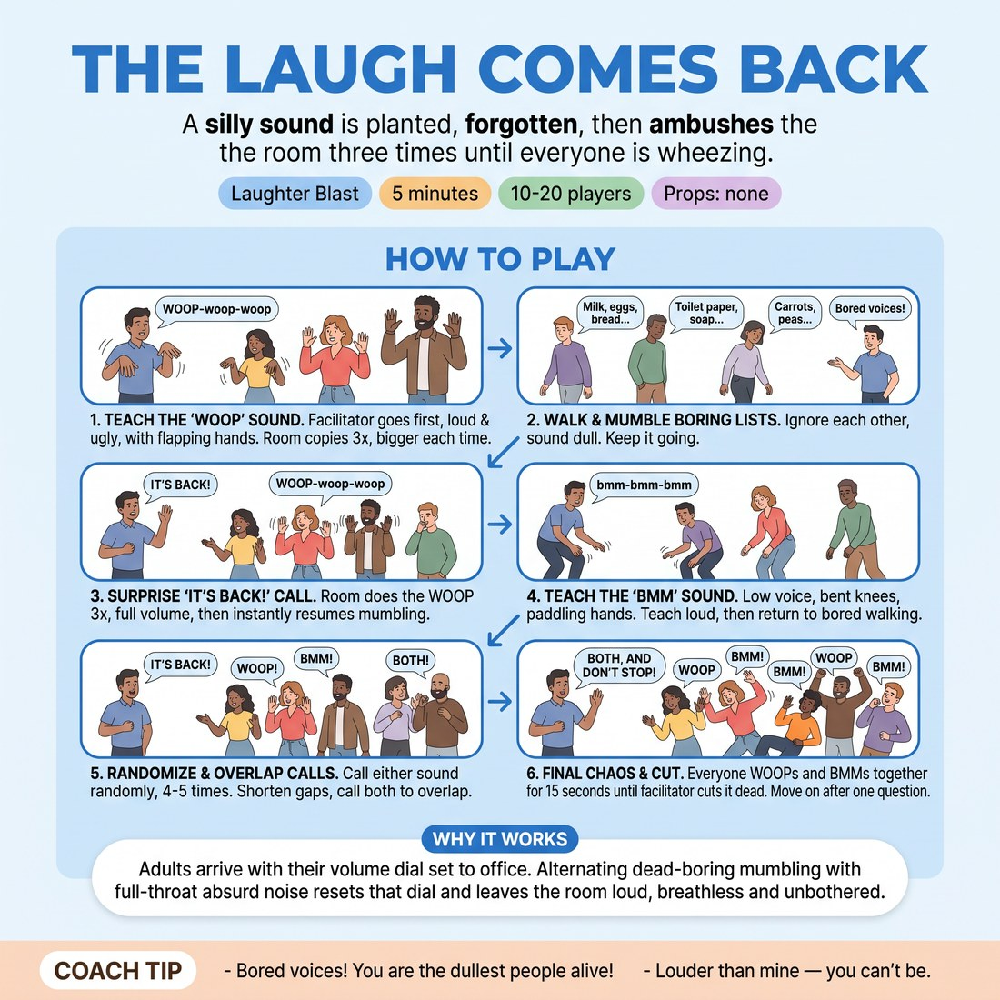

# The Laugh Comes Back

{ .infographic }

> A silly sound is planted, forgotten, then ambushes the room three times until everyone is wheezing.

`Players 10–20` · `~5 min` · `Complexity 2/5` · `Energy high` · `Contact none` · `Props: none`

## The point

Adults arrive with their volume dial set to office. Alternating dead-boring mumbling with full-throat absurd noise resets that dial and leaves the room loud, breathless and unbothered.

**Childhood borrow:** The classroom game where a signal makes everyone shriek at once, then pretend nothing happened.

## Setup

Everyone stands in a loose circle with arm's length between them. No chairs, no props. You stand in the circle too, not outside it.

## How to run it

1. 0:00-0:45 Teach the sound. You go first, loud and ugly: a rising "WOOP-woop-woop" with both hands flapping down your sides. Whole room copies three times. Bigger each time.
2. 0:45-1:30 Everyone walks around the room, mumbling their shopping list out loud, ignoring each other. Deliberately dull. Keep it going. Tell them to sound as bored as possible.
3. 1:30-2:15 With no warning, shout "IT'S BACK!" Everyone stops and does the WOOP three times at full volume, then resumes mumbling immediately as if nothing happened.
4. 2:15-3:00 Add a second sound: a low "bmm-bmm-bmm" with knees bent, hands paddling. Teach it loud. Then back to bored mumbling and walking.
5. 3:00-4:15 Call "IT'S BACK!" for either sound, at random, four or five times. Shorten the gaps. Overlap them: call both, room does both at once.
6. 4:15-4:45 Final call: "BOTH, AND DON'T STOP." Everyone WOOPs and bmms simultaneously for fifteen seconds, then you cut it dead with a raised hand.
7. 4:45-5:00 One question, thirty seconds, then move on.

## Side-coach

- *"Bored voices! You are the dullest people alive!"*
- *"Louder than mine — you can't be."*
- *"Don't look at anyone. Just make the noise."*
- *"Straight back to boring. Nothing happened."*
- *"Both sounds! Mess it up!"*

## Getting past the cringe

Do the WOOP once at full ugly volume before you explain anything. Don't apologise, don't grin sheepishly, don't say "I know this is silly". Then say "copy me" and do it again. Your unembarrassed second go is what gives them permission.

## Opt-down

Stay in the circle, keep walking and mumbling, and do the arm movements with a quiet voice or no voice at all. The flapping is the whole point; the noise is optional.

## If it stalls

- If the mumbling stays polite, drop to a whisper yourself and then blast the WOOP louder than before — the gap does the work.
- If the sounds come out thin, stop everything and do ten seconds of just you, at maximum volume, then start again without comment.

## Ask afterwards

1. Hands up if your face hurts.

## Scale

| Class size | What changes |
|---|---|
| 10–13 | One circle. Five "IT'S BACK!" calls in the middle section. |
| 14–17 | One circle, spread wider. Six calls. Add one call where you point at half the room only and they answer alone — swap immediately so nobody is watched twice. |
| 18–20 | Split into two mingling clumps at opposite ends of the room. Alternate calls between clumps so each hears the other erupt, then call both together for the finish. |

## Safety & inclusion

No contact. Walking is at normal pace only — say so, since sudden stops cause collisions. Anyone with voice strain or a chest condition should mouth the sounds and flap the arms instead.

## Lineage

In the Laughter yoga call-and-response, crossed with playground ambush games tradition. Laughter yoga typically sustains one sound continuously. We interrupt with deliberately dull activity so the sound returns as an ambush, which produces surprise laughter without anyone needing to be funny.
