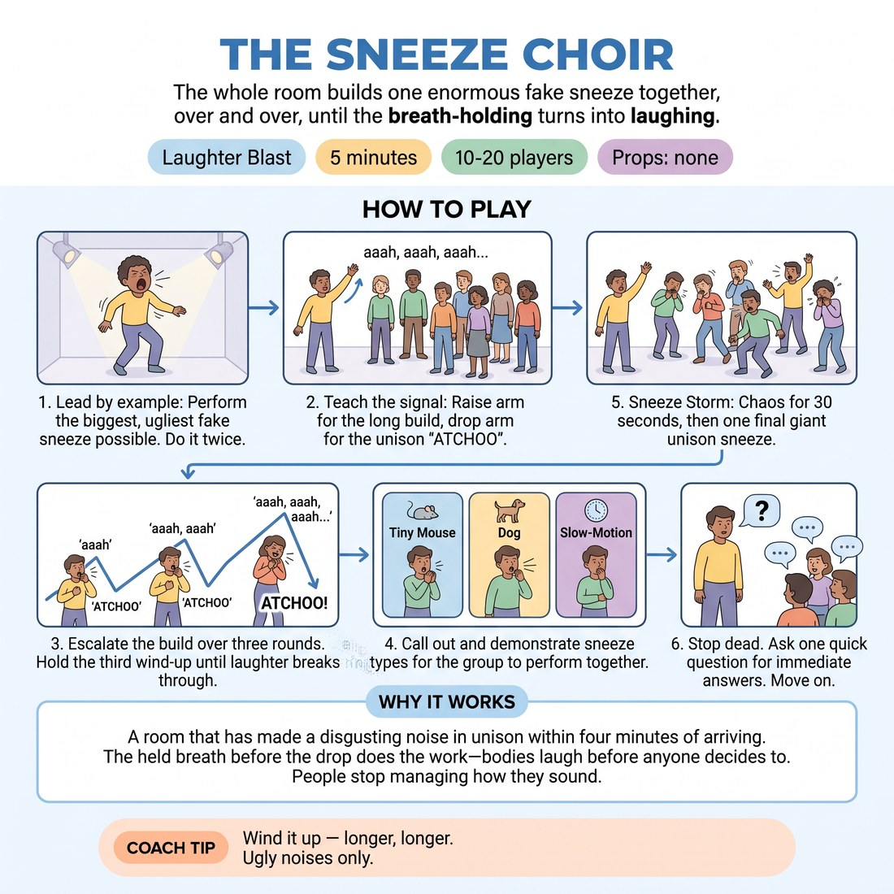

# The Sneeze Choir

{ .infographic }

> The whole room builds one enormous fake sneeze together, over and over, until the breath-holding turns into laughing.

`Players 10–20` · `~5 min` · `Complexity 1/5` · `Energy high` · `Contact none` · `Props: none`

## The point

A room that has made a disgusting noise in unison within four minutes of arriving. The held breath before the drop does the work — bodies laugh before anyone decides to. People stop managing how they sound.

**Childhood borrow:** Kids faking enormous sneezes at the back of class, competing to be the most revolting.

## Setup

Loose circle, arm's length apart, no chairs. You stand in the circle with them, not outside it. Nothing to hold, nothing to hand out.

## How to run it

1. (30s) Do not explain first. Do the biggest, ugliest fake sneeze you can — long wind-up, huge release. Do a second one. Then say: everyone, that, together.
2. (45s) Teach the signal. Raise your arm slowly for the build — everyone breathes in on 'aaah, aaah, aaah'. Drop your arm — everyone sneezes at once. Run it twice.
3. (75s) Three rounds, each build longer than the last. Stretch the third wind-up until people are laughing before the drop. That wait is the whole engine — hold it.
4. (60s) Call sneeze types, all together, one build each: tiny mouse sneeze, opera sneeze, dog sneeze, slow-motion sneeze. You demonstrate each one loudest.
5. (60s) Sneeze storm. Everyone sneezes freely, own rhythm, no signal, thirty seconds of chaos. Then raise your arm — one final giant unison sneeze on the drop.
6. (30s) Stop dead. One question, quick answers, no discussion. Move straight on.

## Side-coach

- *"Wind it up — longer, longer."*
- *"Ugly noises only."*
- *"Wait for my arm. Wait. Wait."*
- *"Sneeze from the knees."*
- *"Louder than the person next to you."*

## Getting past the cringe

Sneeze before you speak. Two huge ones, no framing, no apology. Then ask for it. If the first group attempt is thin, do not comment on it and do not ask anyone to try harder — just make your own next one twice as big and run the round again. The room copies your commitment, not your instruction.

## Opt-down

Do the build with everyone — the 'aaah, aaah' breath — and on the drop just exhale sharply, or clap once instead of sneezing. Same circle, same rhythm, quieter release.

## If it stalls

- Your build is too short. Stretch the wind-up to eight seconds and let the anticipation do the work.
- Drop your own volume by half and the room goes quiet with you — go bigger instead, every single round.
- Skip straight to the sneeze types. Naming a mouse or an opera singer gives permission that an open instruction doesn't.

## Ask afterwards

1. Where in your body did the laugh actually start?

## Scale

| Class size | What changes |
|---|---|
| 10–13 | One circle, all rounds as written. Keep the circle tight so the sound stacks. |
| 14–17 | One circle. For the storm, split the room down the middle and let the halves sneeze across at each other for the thirty seconds. |
| 18–20 | Two circles side by side, each with a nominated arm-raiser (you take one, pick a volunteer for the other). Run the same rounds. Bring both circles together for the final unison sneeze. |

## Safety & inclusion

Sound only, no spray — tell people to sneeze into an elbow or turn their head outward. Anyone with a cold uses the opt-down. Loud sound in short bursts: no throat-scraping, drop the volume if a voice feels rough. Big head-snap on the release can jar a neck or back — keep the drop gentle and say so.

## Lineage

In the Laughter yoga group-breath rounds tradition. Laughter yoga uses a conductor building a group breath to a shared release. We swapped the release for a fake sneeze, because a sneeze is a noise every adult already knows how to make badly and nobody can perform it well. The sneeze-type round was added so the facilitator, not the participant, supplies the silliness.
